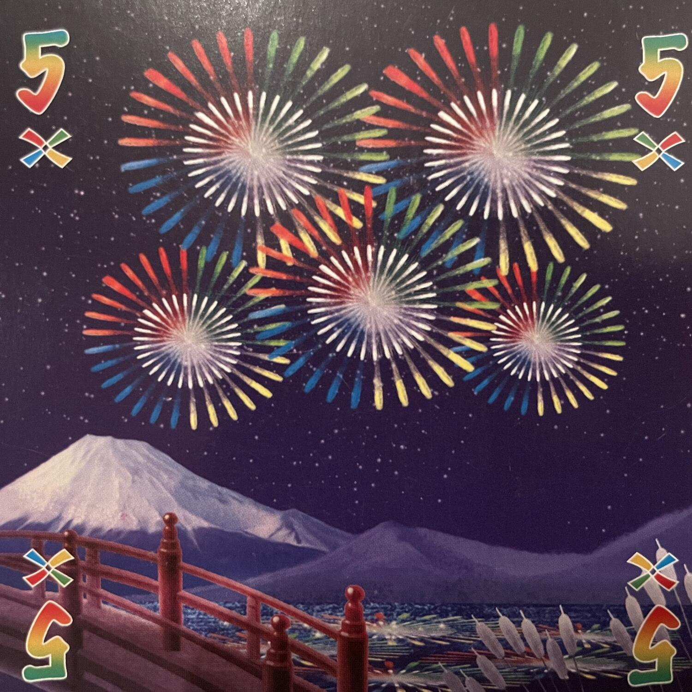
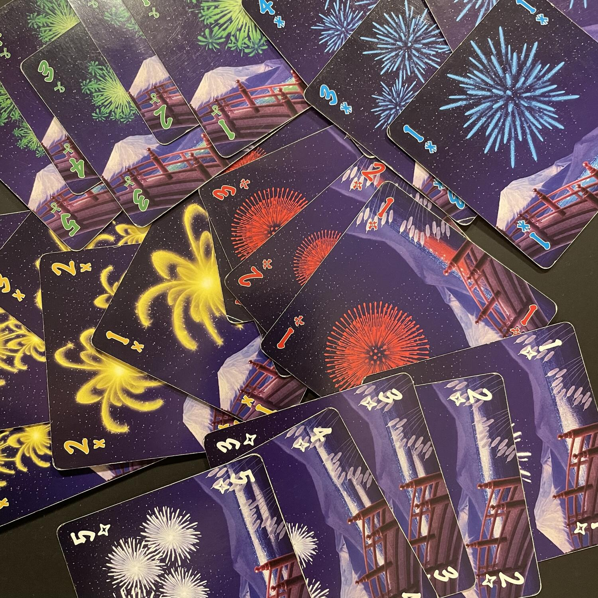

<Setting>

  Siete gli <strong>artificieri (distratti)</strong> di una fabbrica di fuochi
  d’artificio e avete mescolato polveri, micce e razzi del prossimo imminente
  spettacolo: si scatena il panico! Dovrete aiutarvi per impedire il disastro e
  realizzare per il rotto della cuffia{" "}
  <strong>lo spettacolo più indimenticabile di sempre</strong>! Preparatevi a
  una sfida all’ultima miccia, dove l’intesa silenziosa con i compagni di gioco
  si costruirà faticosamente, botto su botto, in una <em>valanga di colori</em>,
  fino al <em>gran finale</em>!

</Setting>

<Rules>

  L’obiettivo del gioco è quello di{" "}
  <strong>assemblare 5 fuochi d’artificio</strong> (uno per colore) creando
  delle serie di numeri crescenti da 1 a 5 con carte dello stesso colore (la
  variante <em>Valanga di colori</em> usa anche le carte multicolore che, di
  fatto, costituiscono un sesto set). Dopo aver assegnato 4 o 5 carte a seconda
  del numero di giocatori e disposti i gettoni blu e rossi in due riserve
  separate, si può cominciare. Ogni giocatore tiene{" "}
  <strong>le carte della propria mano rivolte verso gli altri</strong>, in modo
  che tutti possano vederle, tranne appunto chi le tiene in mano.
   
  Ogni turno, un giocatore può effettuare <strong>    una e una sola azione</strong>{" "}
  tra le seguenti:
   
  <ol>
    <li>      <strong>Dare un’informazione</strong>: il giocatore di turno, se può ancora essere speso un gettone blu dalla riserva comune, punta il dito su una o più carte di un altro giocatore, rivelandone o il colore o il valore. L’informazione deve essere completa: vanno cioè indicate tutte le carte di quel colore o di quel valore.</li>
    <li>      <strong>Scartare una carta</strong>: il giocatore di turno sostituisce una carta dalla propria mano, riponendola nella pila degli scarti, con una nuova carta presa dal mazzo di pesca; in cambio, uno dei gettoni blu spesi (se ce ne sono) viene reso nuovamente disponibile nella riserva comune.</li>
    <li>      <strong>Giocare una carta</strong>: il giocatore di turno colloca davanti a sé una delle carte della propria mano; se la carta inizia, continua o completa un fuoco d’artificio, si avvia la stringa del colore corrispondente o la si aggiunge alla medesima; se la carta non è utile a iniziare, continuare o completare nessuna stringa di fuochi d’artificio, la si scarta e si aggiunge un gettone rosso alla riserva comune.</li>
  </ol>
       
      Alcune <strong>precisazioni</strong>: (i) ci può essere una sola stringa
      per ogni colore, le carte vanno disposte in ordine crescente e in ogni
      stringa ci può essere solo una carta di ciascun colore; (ii) completare un
      fuoco d’artificio consente di recuperare gratuitamente un gettone blu
      speso; (iii) durante il turno di un altro giocatore non è possibile
      commentare o influenzare le azioni di quel giocatore.
       
      La partita termina con la <strong>vittoria</strong> dei giocatori al
      completamento delle 5 stringhe dei fuochi d’artificio prima che il mazzo
      di carte si esaurisca, oppure termina con la <strong>sconfitta</strong>{" "}
      dei giocatori all’aggiunta del terzo gettone rosso alla riserva comune.
      Nel caso in cui il mazzo di pesca si esaurisca prima del realizzarsi di
      una delle due condizioni di fine partita, tutti i giocatori hanno un
      ultimo turno a disposizione, dopo il quale si procede al calcolo del
      punteggio finale sommando le carte di valore più alto per ognuna delle 5
      stringhe di fuochi artificiali: in questo caso, la{" "}
      <strong>vittoria</strong> è <strong>relativa</strong> alla capacità del
      gruppo di migliorare il proprio punteggio di partita in partita.

</Rules>

<Feedback>

  Cercavate un <strong>filler collaborativo</strong>,{" "}
  <strong>all’apparenza sempliciotto</strong>, quel tanto che basta ad
  avviluppare nella vostra rete i neofiti di turno, ma{" "}
  <strong>in realtà profondo e stimolante</strong>? Con Hanabi avrete di che
  gongolare. Le <strong>varianti di gioco</strong> vi consentiranno di regolare
  al meglio la difficoltà, intensificando o abbassando il rischio di
  cortocircuiti neuronali al tavolo.
   I <strong>materiali di gioco</strong> (per la verità di non eccelsa fattura,
  anche se la riedizione *Hanabi – Grandi Fuochi* promette bene) allieteranno con
  i loro colori sgargianti la vostra tavolata. Le <strong>    meccaniche originali e interessanti</strong>, marchio di fabbrica della premiata ditta “Antoine Bauza”, vi stupiranno
  in modo accattivante, anche se dopo un po’ ad alcuni potranno sembrare <strong>    ripetitive</strong>.
   
  Sarebbe ingiusto dire che in questo titolo la fortuna ha un peso eccessivo, dal
  momento che <strong>tutto ruota attorno all’intesa tra giocatori</strong>, alla
  loro capacità di darsi le informazioni giuste al momento giusto: la fortuna diventa
  un fattore punitivo solo in quei gruppi che non sanno parlarsi dicendo l’indispensabile,
  speculando sulla loro naturale tendenza a fare invece la scelta sbagliata al momento
  sbagliato. Non ha senso, pertanto, lamentarsi del fattore fortuna: anche con un
  gruppo particolarmente affiatato <strong>    sarà sempre difficile vincere prima che il mazzo si esaurisca</strong>. Non ci rassegniamo perciò all’idea che lo scopo dell’autore fosse quello
  di rendere accessibile a chiunque il sospirato miraggio del massimo punteggio.
   
  In definitiva, Hanabi sarà una <strong>    deliziosa aggiunta alla vostra collezione</strong> per serate leggere e astratte.
   
  Ah ma forse voi… cercavate un gioco sui fuochi d’artificio? Beh, mai come in questo
  caso non mi dispiace affatto ricordarvi che la cosa importante, quando si gioca,
  non è quello a cui si gioca (tranne se avendo la possibilità di giocare a <Link to="/reviews/arkham-horror-lcg/">
    Arkham Horror LCG
  </Link> vi rifiutate di farlo: brutti cultisti!), ma divertirsi, possibilmente
  insieme alle persone che si amano.

</Feedback>

