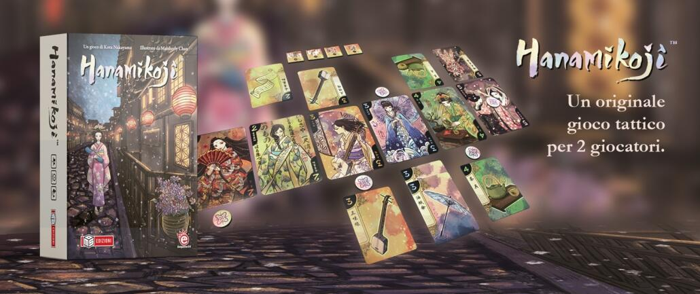
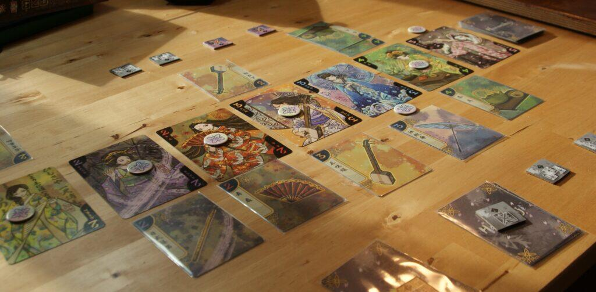

<Setting>

  Per chi non lo sapesse le Geisha (dal giapponese <strong>gei</strong>, "arte",
  e <strong>sha</strong>, "persona") sono donne eleganti, con raffinati e
  spiccati talenti come l'arte, la musica e la danza. Sono vere e proprie
  maestre dell'intrattenimento. In Hanamikoji due giocatori dovranno competere
  per ottenere il favore di sette illustri Geisha collezionando i loro{" "}
  <strong>oggetti di scena</strong> preferiti.

</Setting>

<Rules>

  Hanamikoji è un gioco di <strong>furbizia e pianificazione</strong>. Nel corso
  dei round i giocatori dovranno ottenere il favore di varie Geisha
  collezionando il maggior numero di strumenti a loro cari. Il fulcro del gioco
  sta nella <strong>fase Azioni</strong>, durante la quale i giocatori a turno
  dovranno prima pescare una carta e poi effettuare una delle quattro ancora
  disponibili. Durante due di queste azioni potrete avere il controllo sulla
  scelta delle carte, come ad esempio nasconderne una per poi riverarla a fine
  round o scarterne due. Con le altre due azioni invece, dovrete mettere di
  fronte al giocatore avversario delle carte scelte da voi, e quest’ultimo,
  dovrà decidere quali tenere per sé e quali restituirvi. Le carte Geisha
  giocate andranno poste nella vostra area di gioco, a simboleggiare la vostra
  influenza. Più una Geisha è importante, più varrà{" "}
  <strong>punti Fascino</strong> e più carte saranno legate alla sua arte. Una
  volta effettuate tutte le azioni, entrambi i giocatori scoprono la carta
  Geisha nascosta, e la posizionano nella fila corrispondente. Il giocatore con
  più carte Oggetto dal proprio lato ottiene il favore della Geisha, spostando
  il segnalino Favore dalla sua parte. In caso di pareggio il segnalino non si
  muove. Una volta spostato ogni segnalino Favore i giocatori contano i punti
  Fascino di ogni Geisha di cui hanno il favore. Se un giocatore ha ottenuto il
  favore di <strong>4 Geisha</strong> o ha ottenuto almeno{" "}
  <strong>11 punti Fascino</strong> è dichiarato vincitore.

</Rules>

<Feedback>

  Hanamikoji fin dalla prima partita mi ha davvero colpito. Semplice,{" "}
  <strong>elegante</strong> e davvero profondo per essere una scatola così
  piccola. Il gioco dura poco meno di 20 minuti, ma è una sfida all'ultimo
  inganno in cui i giocatori dovranno pianificare ogni singola mossa e decifrare
  i progetti dell'avversario. La caratteristica più simpatica di questo gioco è
  che non saremo noi a decidere le carte Oggetto che doneremo alle Geisha, ma il
  nostro avversario. Starà quindi a noi porre scelte sempre più difficili ed
  esche appetitose al nostro avversario per ingannarlo e ottenere il favore di
  quattro Geisha prima di lui. In un piccolo cofanetto è racchiusa piccola perla
  per due giocatori, un filler che a mio parere dovrebbe essere citato un po'
  più spesso nelle liste dei migliori <strong>giochi da tavolo light</strong>{" "}
  per due giocatori.

</Feedback>

