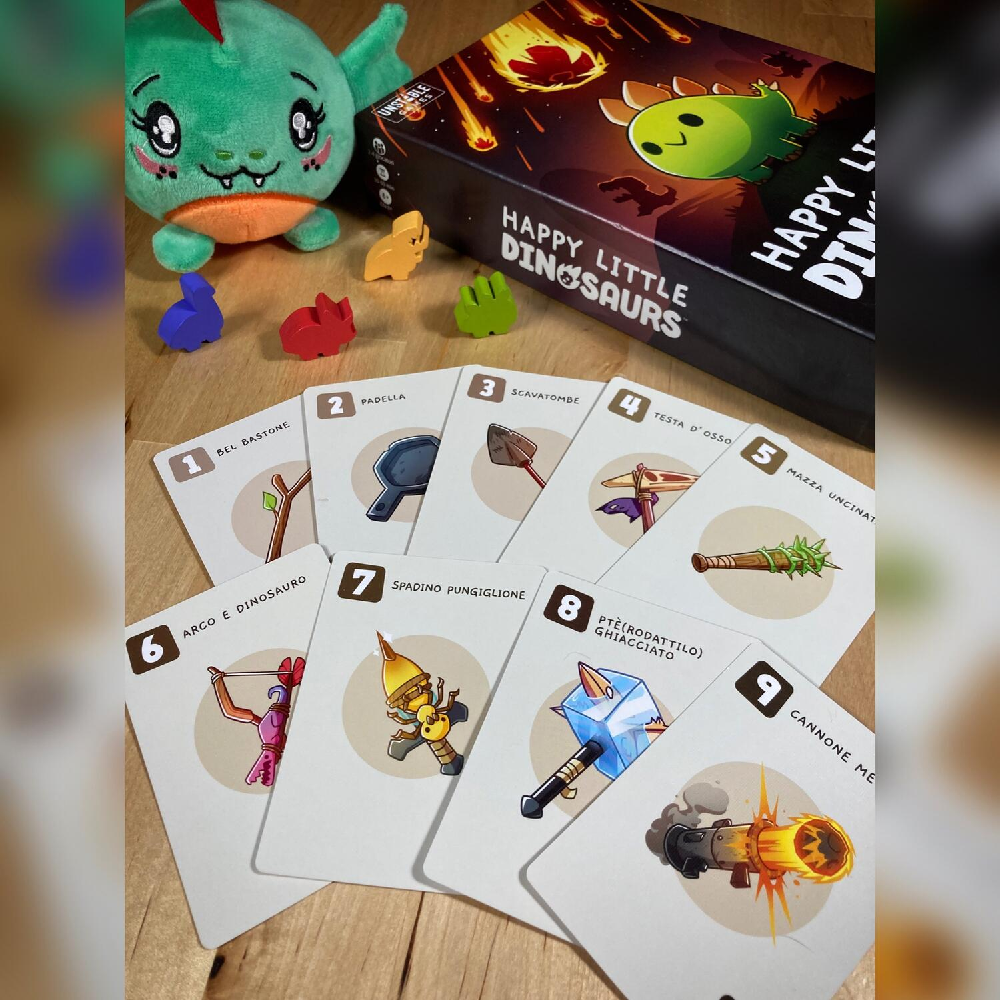
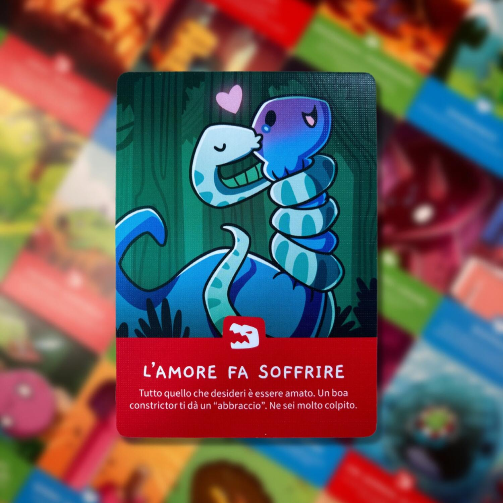

<Setting>

  Inutile negarlo, quando pensiamo ai dinosauri la nostra mente vola diretta
  verso Jurassic Park, ma in questo caso dobbiamo andare un po’ più indietro,
  per l’esattezza nel 1989, quando uscì “Alla ricerca della Valle Incantata”.
   
  Ebbene sì perché i nostri protagonisti sono dei dinosauri teneri e pucciosi
  che, come Piedino e i suoi amici, cercano di sfuggire alla fine più terribile
  di tutte: l’estinzione!
   
  L’arduo compito dei giocatori sarà quello di aiutarli in questa difficile
  impresa stando al loro fianco quando vedranno un meteorite sfrecciare sulle
  loro teste, aiutarli se verranno attaccati dalle formiche rosse preistoriche e
  offrir loro una spalla su cui piangere se verranno scaricati al primo
  appuntamento.

</Setting>

<Rules>

  Scegliete una plancia dinosauro a testa, separate i due mazzi di carte, date
  cinque carte ad ogni giocatore dal mazzo principale (dorso beige) e poi
  poneteli entrambi al centro del tavolo. Ogni giocatore controlla di avere tra
  le proprie almeno una Carta Punto (quelle numerate da 0 a 9); se così non
  fosse, le scarta e ne pesca altrettante. Questo controllo dovrà esser fatto
  all’inizio di ogni round.
   
  Ora siete pronti per iniziare!
   
  Per prima cosa girate un Disastro dal relativo mazzo (dorso viola)
   I Disastri possono essere tre… più uno:
  <ul>
    <li>ROSSI -&gt; Disastri Predatori</li>
    <li>BLU -&gt; Disastri Emotivi</li>
    <li>VERDI -&gt; Disastri Naturali</li>
    <li>METEORITE -&gt; funzionerà come un jolly</li>
  </ul>
  Essendo l’obiettivo del gioco far sopravvivere il proprio dinosauro accumulando
  punti, le Carte Punto saranno il fulcro di ogni turno: simultaneamente sceglietene
  una e ponetela coperta davanti a voi; poi, quando tutti i giocatori saranno pronti,
  scopritele; il punteggio di quella carta sarà la base di partenza per determinare
  il vincitore del turno e potrà aumentare o diminuire in base ai bonus dati dai
  Tratti Dinosauro, ad eventuali effetti delle Carte Punto e agli effetti delle Carte
  istantanee.
   
  Le Carte Istantanee sono quelle identificate con dei punti esclamativi colorati:
  non c’è un limite numerico di carte giocabili in ogni round e avranno degli effetti
  particolari per cui i punteggi dei giocatori potranno cambiare.
   
  NB: QUALSIASI effetto sarà applicato in base alla dicitura riportata sulla carta
  e partendo dalla più bassa, prima delle Carte Punto e poi di quelle Istantanee.
   
  Quando ogni giocatore non potrà o non vorrà più giocare carte, si passerà al calcolo
  dei punteggi: SOLO il giocatore che avrà totalizzato il maggior numero di punti
  potrà far progredire il suo dinosauro sul proprio tracciato Via di Fuga, mentre
  colui che avrà ottenuto il punteggio più basso sarà costretto a prendere la carta
  Disastro e porla a fianco della sua plancia.
   
  Ricordate che, per tutti i giocatori, ciascuna Carta Disastro ottenuta durante
  il gioco fornirà, alla fine di ogni round, un punto a prescindere dal risultato
  del turno appena terminato.
   
  Prima di iniziare il round successivo sarà necessario rimpinguare la propria mano
  fino ad avere nuovamente cinque carte.
   
  Il Dinosauro che per primo raggiungerà i 50 punti sarà il vincitore, mentre il
  primo Dinosauro a raccogliere tre Disastri dello stesso tipo (oppure uno per tipologia)
  sarà estinto e quindi eliminato dal gioco.

</Rules>

<Feedback>

  Impossibile negare che la grafica è il vero punto forte di questo gioco:
  semplice, fumettistica, kawaii… insomma la ricetta perfetta per attrarre
  subito lo sguardo del pubblico.
   
  Il gioco è davvero semplice e veloce, quindi perfetto da intavolare in un
  momento qualsiasi di pausa, come filler prima di un cinghialone o anche mentre
  si aspetta la pizza con gli amici; le regole sono davvero immediate, quindi è
  ottimo anche da proporre in famiglia peri più piccoli.
   
  La giocabilità è ottimale in quattro: si rischia di allungare notevolmente le
  tempistiche di gioco, ma la presenza di un’interazione decisamente più elevata
  tra i giocatori fa pendere il piatto della bilancia a favore di questa scelta,
  rendendo così il gioco meno noioso e statico! Si percepisce maggiormente la
  sfida a suon di Disastri sperimentando a fondo gli effetti simpatici delle
  varie carte e godendo nell’infrangere i sogni del dinosauro di un avversario
  (ebbene sì è un gioco truce, quindi bisogna esser pronti emotivamente a
  sostenere la dipartita di qualche cucciolo). È, invece, pressoché ingiocabile
  in due, nonostante le regole ad hoc.
   
  L’impatto della fortuna, infine, è evidente e può essere a tratti fastidioso,
  soprattutto se si è soggetti a un’ondata di sfortuna, ma prendendola con
  filosofia, considerata la natura del gioco, la cosa è sopportabile.
   
  Concludendo, nonostante la bellezza delle illustrazioni, a parità di
  pucciosità e semplicità delle regole, è molto più entusiasmante{" "}
  <Link to="/reviews/here-to-slay/">Here to Slay</Link>.

</Feedback>
