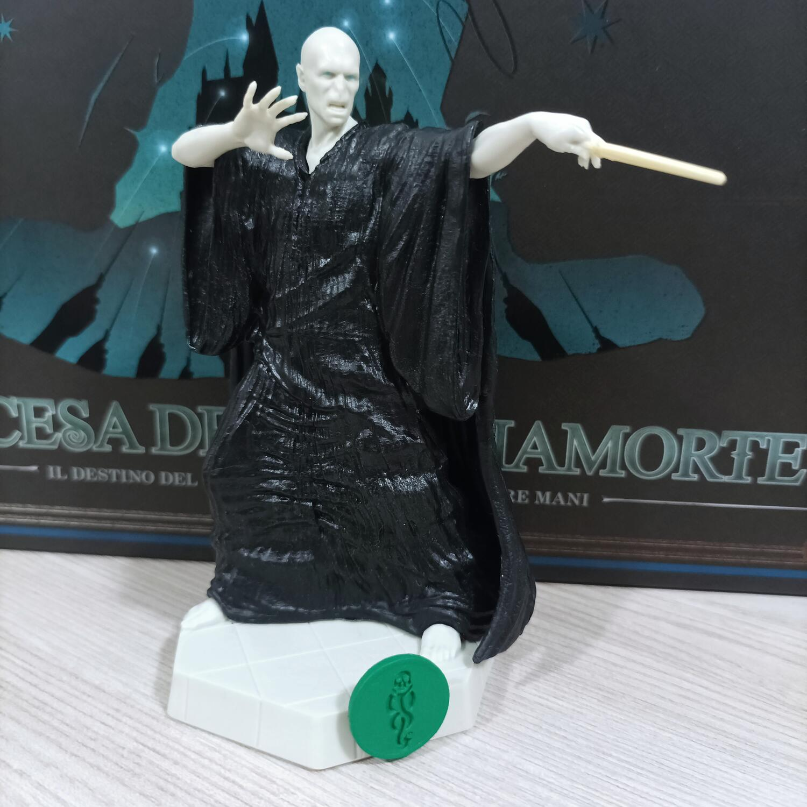

<Setting>

Il panorama è quello in cui Colui-Che-Non-Deve-Essere-Nominato ha fatto ritorno e si sta preparando a raccogliere attorno a sé i suoi più fedeli servitori per portare guerra e distruzione alla scuola di magia e stregoneria di Hogwarts.  
Durante il quinto anno di Harry Potter alla scuola di maghi, gli eventi narrati sono quelli dell’Ordine Della Fenice.  
In Harry Potter - L’ascesa Dei Mangiamorte i giocatori dovranno tentare il tutto per tutto per arruolare più maghi possibili nei propri ranghi e combattere i Mangiamorte fino a scovare Voldemort e porre fine al suo oscuro dominio sul mondo magico.  
Le fazioni in gioco sono 3: L’esercito di Silente, Hogwarts e i suoi insegnanti e L’ordine Della Fenice. Tra i personaggi più importanti che saranno presenti nel gioco si annovera Albus Silente, Severus Piton, il trio Harry, Hermione e Ron, mentre i Mangiamorte che daranno filo da torcere ai protagonisti sono Bellatrix Lestrange, Draco Malfoy, Peter Minus e lo stesso Voldemort. Ovviamente sono presenti molti più personaggi per cui le strategie di gioco varieranno di partita in partita.  
Una lotta tra Bene e Male che deciderà le sorti delle generazioni future di maghi e streghe famosi.  
Preparatevi dunque, bacchette alla mano pronti per dare la caccia ai mangiamorte, reclutare maghi e streghe di cui ci si può fidare, scagliare potenti incantesimi e porre fine al regno di terrore del Signore Oscuro Lord Voldemort!

</Setting>

<Rules>

  Harry Potter - L’ascesa dei Mangiamorte si svolge in un numero non definito di
  round. Durante ogni Round i giocatori eseguiranno 4 fasi, la prima delle quali
  è VIAGGIARE VERSO UN LUOGO, per fare ciò il giocatore attivo piazza sul
  tabellone nel settore (luogo) prescelto il suo segnalino fazione ad indicare
  che la sua intera squadra si trova in quel luogo. Successivamente si ha la
  fase di VOLDEMORT e i suoi MANGIAMORTE, nella quale il giocatore attivo
  effettua un tiro col dado VOLDEMORT di colore verde ed esegue l’azione
  rappresentata dal simbolo ottenuto dal tiro (grazie ad esempio alla quale
  l’Oscuro Signore potrà muoversi di un luogo verso destra, verso sinistra o
  attivare il potente potere del simbolo MARCHIO NERO). Ogni volta che Voldemort
  si muove verso un luogo lo corrompe ed arreca danno a tutti i “maghi buoni”
  presenti in quel luogo compresi eventualmente i maghi del Giocatore attivo se
  presente anche lui nello stesso luogo, poi attiva i poteri base dei
  Mangiamorte presenti in quel luogo specifico. Il Marchio Nero invece fa
  rimanere fermo Voldemort (che corrompe e fa danni come nel caso precedente)
  poi attiva tutti i poteri speciali di ogni Mangiamorte in gioco. La terza fase
  riguarda il TURNO DEL GIOCATORE, il quale tirerà i dadi della sua carta
  quartier generale più eventuali altri dadi bonus conquistati arruolando maghi
  buoni o da gettoni incantesimo; una volta tirati potrà assegnare i dadi alle
  carte mago o mangiamorte del suo settore per svolgere una determinata azione,
  attivare capacità speciali della sua carta affiliazione o infine assegnare i
  dadi alle abilità speciali dei personaggi arruolati.  
  L’ultima fase, quella di Fine Turno risolve gli effetti di tutti i dadi assegnati
  COMPLETAMENTE ad ognuna delle situazioni precedentemente descritte, grazie alle
  quali si può ad esempio arruolare nuovi maghi nel proprio esercito, arrecare danni
  ai mangiamorte in gioco o a Voldemort se già uscito allo scoperto ecc…  
  Una volta risolti gli effetti dei dadi assegnati prima di passare la mano al
  giocatore successivo in ordine di turno se uno o più luoghi sono stati
  completamente corrotti e maghi/mangiamorte uccisi arrecando il numero massimo
  di punti ferita, essi vanno scartati e nel solo caso dei maghi/mangiamorte
  vanno rimpiazzati con un’altro personaggio pescato a caso dal mazzo
  personaggi.

</Rules>

<Feedback>

  Il Gioco è avvincente, capace di coinvolgere il Giocatore e farlo restare
  concentrato per studiare una strategia via via sempre diversa volta ad avere
  la supremazia nello scontro finale. Infatti è molto facile ritrovarsi con uno
  o più luoghi corrotti all’inverosimile e con tanti Mangiamorte in gioco sul
  tabellone pronti a sferrare i loro incantesimi maligni, fare attenzione a
  “curare” la corruzione dai luoghi presenti, arruolare sufficienti maghi che
  riescano ad instaurare un buon motore di turno in base alla fazione scelta ed
  eliminare abbastanza Mangiamorte da poter ferire mortalmente il Signore Oscura
  una volta che si sarà palesato ai giocatori NON è affatto un gioco da ragazzi
  se non si scelgono le mosse che ogni membro del party dovrà fare in un
  determinato round di gioco.  
  Le strategie possono cambiare in base a quale carta personaggio viene rivelata
  di volta in volta, in base alla fazione scelta, ai luoghi corrotti da Voldemort,
  al tiro di dado, ai personaggi eventualmente arruolati nei propri ranghi ecc ecc.
  Da questo si evince che sebbene Harry Potter - L’ascesa dei Mangiamorte non sia
  un gioco del tutto completo e privo di “errori”, grazie all’alea che è presente
  nel gioco e nelle sue meccaniche farà divertire i giocatori fornendo situazioni
  sempre differenti.  
  La cooperazione tra i membri al tavolo è parte integrante e fondamentale del
  sistema di gioco, creare combo con i personaggi di partenza, le fazioni e
  quelli via via arruolati durante la partita garantisce di “customizzare” il
  proprio ruolo all’interno del party.  
  Il gioco in questo aiuta grazie alla sua semplicità e durata.  
  Vero è che l’obiettivo da raggiungere è sempre quello: Sconfiggere Lord
  Voldemort prima che corrompa troppi luoghi del mondo magico o che elimini
  troppi “maghi buoni” alleati dei giocatori, tuttavia in questo titolo
  l’importanza non deve essere data a quale obiettivo devo raggiungere, ma a
  come lo raggiungo e di quali “strumenti” ho bisogno per raggiungerlo.  
  Una nota di merito ai materiali: Le carte sono ben fatte, come anche i dadi sia
  dei giocatori sia il dado Voldemort a 8 facce, peccato per il cartoncino delle
  schede fazione che a nostro avviso è troppo sottile e leggero, si imbarca dopo
  qualche partita.  
  La miniatura di Colui-Che-Non-Deve-Essere-Nominato (anzi la “statua” data la
  sua imponenza) è solida e fa la sua figura al centro del tabellone… Un piacere
  per gli occhi insomma!

</Feedback>
