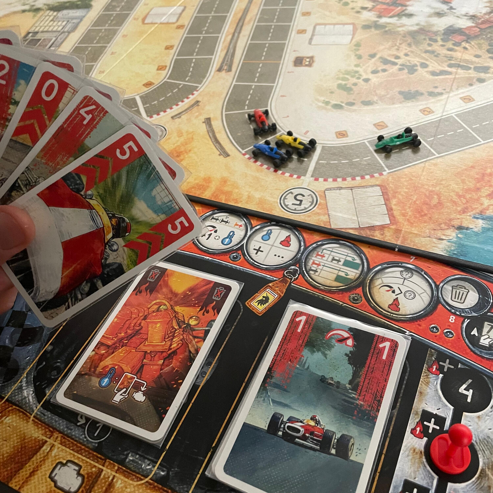

<Setting>

  Le onde di calore brillano sulla pista, oscurando la prima curva.  
  Indossate i guanti e gli occhiali di protezione mentre il sole luccica sulle cromature delle vostre auto che vengono lentamente
  spinte nella griglia di partenza.
   
  Il mormorio della folla, il movimento delle bandiere nel vento, il leggero rombo del vostro motore. Un cielo blu estivo,
  calmo e tranquillo nella vostra pole position.
   
  Inizia il conto alla rovescia e un improvviso e profondo ruggito fende l'aria mentre tutte le auto si allontanano dalla
  linea di partenza: il Gran Premio è iniziato. Polvere e vento passano tra mani e casco mentre si imbocca la prima curva.
  Spingendo il motore al limite, si rischia di andare in testacoda, ma stringendo la presa sul volante si scivola attraverso
  l'apice della curva ancora in prima posizione. Ce l'avete fatta!
   
  Per rimanere in testa al gruppo, dovrete spingere la vostra auto al limite. Riuscirete a resistere ai lunghi rettilinei
  o il vostro motore cederà all'ultima curva perché avete spinto troppo?

</Setting>

<Rules>

  In <em>Heat: Pedal to the Metal</em> i giocatori gareggiano per il titolo di <strong>miglior pilota</strong> con
  un'auto su una pista per un certo numero di giri.
   
  All'inizio di ogni turno è possibile <strong>cambiare marcia</strong>, il che determinerà il{" "}
  <strong>numero di carte</strong> da giocare in quel turno (in prima si gioca una carta, in seconda due, e così via).
  La velocità, ovvero la quantità di spazi che l'auto percorrerà sulla pista, corrisponderà alla{" "}
  <strong>somma dei valori delle carte giocate</strong>. 
  Tutto il gioco ruota attorno al concetto del <strong>calore</strong> (heat) che impedirà al vostro motore di spingere proprio
  quando più ne avrete più bisogno.  
  Ogni giocatore ha una plancia composta da tre aree: il mazzo di pesca, la riserva di heat e la pila degli scarti, che
  verrà trasformata in mazzo di pesca quando questo finirà. A inizio partita, nella parte centrale della plancia verrà
  posizionato un certo numero di carte heat: ogni volta che bisognerà generare calore, una di queste carte sarà spostata
  nella pila degli scarti.
   
  Prendete una curva troppo velocemente? HEAT!
   
  Spingete troppo su un rettone? HEAT!  
  Scalate troppo rapidamente? HEAT!
   
  Queste carte non potranno mai lasciare la vostra mano, a meno che non siate in fase di <strong>cooldown</strong>, ovvero
  utilizzando marce basse o essendo momentaneamente ultimi: solo allora potrete scartarle nella parte centrale della plancia
  in modo da averle in seguito nuovamente a disposizione per fare i brillanti.
   
  Ma attenti! Se prenderete una curva troppo velocemente e non avrete abbastanza heat da poter spostare negli scarti andrete
  in <strong>testa-coda</strong> e incrociare la bandiera a scacchi prima degli altri sarà molto difficile.  
  Tra i giocatori che taglieranno il traguardo nello stesso turno, quello che riuscirà ad allontanarsi di più dalla
  linea del traguardo stesso, sarà considerato il vincitore.

</Rules>

<Feedback>

  Non ci sono molte parole per definire il feeling che si prova stando in 6 al tavolo a gareggiare fino all'ultima
  curva: questo gioco lascia con il <strong>fiato sospeso</strong>, come se ci foste davvero voi sull'auto ai 180
  all'ora prima di imboccare la curva a gomito.  
  Sapere quando salire con le marce e quando scalarle, sapere quando poter chiedere di più alla vostra auto e quando sacrificare
  qualche secondo: saranno questi i dettagli che porteranno il miglior pilota a festeggiare con la bottiglia di spumante
  dal gradino più alto del podio.  
  Se pensate che non avrete mai possibilità di intavolare Heat per via del numero di giocatori consigliati, non temete:
  nella scatola è presente un <strong>bot</strong> tanto semplice da utilizzare quanto efficace, che vi darà molto filo
  da torcere e che, volendo, potrete rendere sempre più sfidante. Sarà possibile sia arrivare a 6 concorrenti, sia
  giocarlo in solitario (cosa che ho fatto e che rifarò!). È molto importante arrivare a <strong>6 auto</strong> per via
  della quantità di scie che vengono generate ogni turno, che daranno vita a meravigliosi sorpassi.
   
  Sempre nella scatola base, sono presenti alcuni moduli che renderanno il gioco vario, come le{" "}
  <strong>condizioni climatiche</strong> o la "<strong>modalità campagna</strong>", che vi permetterà di migliorare il
  motore, l'aerodinamicità, i freni… insomma, le carte che utilizzerete per correre quando dovrete correre e per frenare
  quando dovrete frenare.
   I materiali sono davvero bellissimi: le macchinine e i <strong>4 tracciati</strong>, in particolare, sono spettacolari.
   
  Nella storia dei giochi da tavolo a tema c'è un prima Heat e un dopo Heat: questo gioco vi spettinerà… altro che vento
  nei capelli!

</Feedback>

