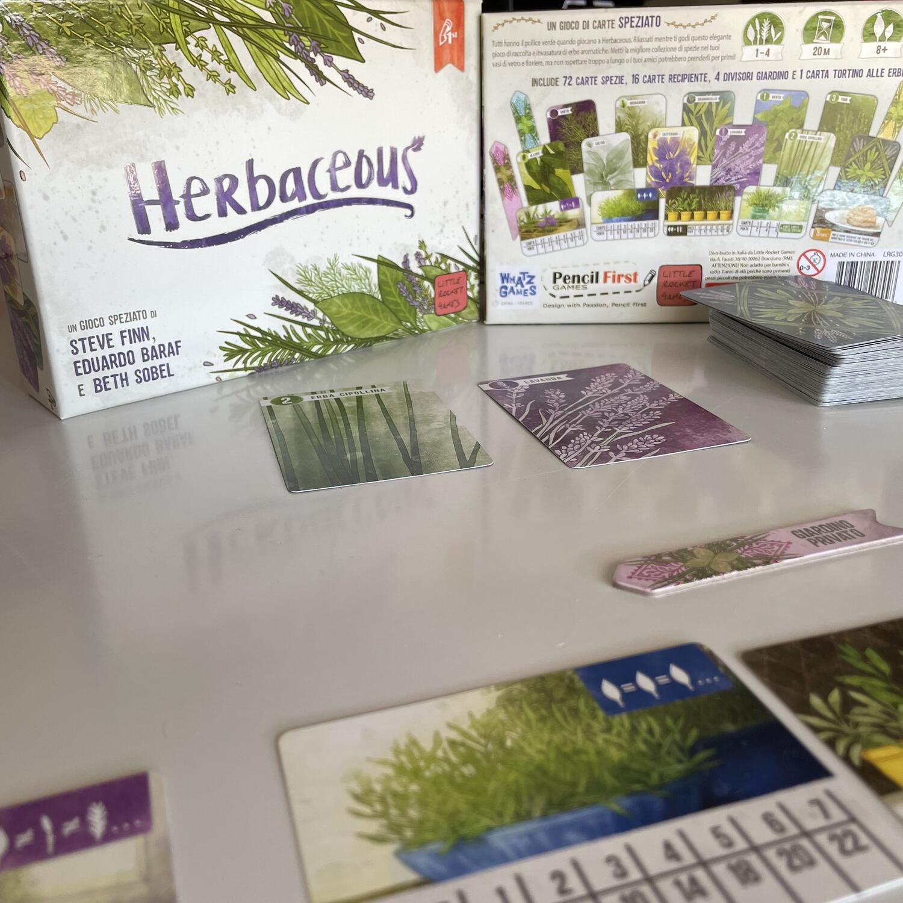
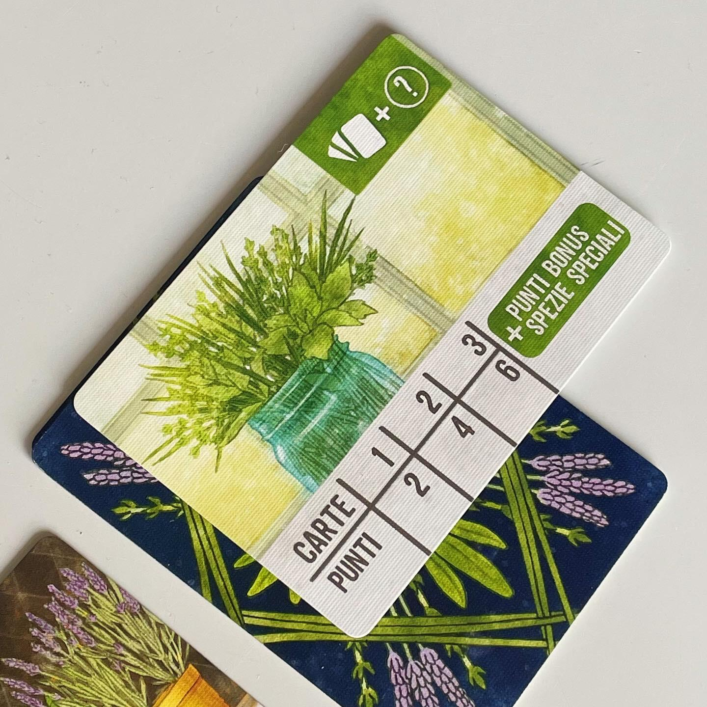

<Setting>

  Coltivare piante aromatiche è un hobby molto rilassante: salvia, lavanda,
  rosmarino, aneto, alloro, zafferano… Non sentite che magnifici profumi? Mano
  alle cesoie e ai guanti da giardinaggio: raccogliete le spezie più pregiate e
  diventate i coltivatori più esperti tra tutti!

</Setting>

<Rules>

  In Herbaceous il vostro scopo sarà quello di accumulare più punti possibili
  attraverso la meccanica del set collection. Il gioco dura all'incirca 20
  minuti, durante i quali i giocatori potranno effettuare due azioni. Un'azione,
  obbligatoria, sarà quella di pescare una carta coperta dal mazzo e decidere in
  quale area di gioco posizionarla: nel proprio giardino o nel giardino comune,
  a disposizione di tutti i giocatori. Poi verrà pescata una seconda carta che
  andrà nell'area di gioco non scelta. All'inizio del proprio turno i giocatori
  possono anche svolgere l'azione facoltativa di invasare, ovvero scegliere una
  delle quattro carte recipiente per raccogliere un set di carte spezie
  (specificate dalla carta recipiente) tra quelle presenti nel giardino comune e
  nel proprio giardino privato. Una volta utilizzata, la carta recipiente non
  potrà essere riutilizzata per collezionare nuove carte spezie. La conclusione
  del gioco prende avvio nel momento in cui il mazzo di pesca si esaurisce: a
  quel punto tutti i giocatori continuano a giocare finché tutte le carte
  recipiente non sono state riempite. Si ottengono punti in base al numero di
  carte raccolte in ciascun recipiente e il giocatore con il maggior numero di
  punti è il vincitore.

</Rules>

<Feedback>

  Questo titolo è passato quasi inosservato alla pubblicazione, ma si tratta
  davvero di un gioiellino che non dovrebbe sfuggire al vostro radar.  
  Il gioco gira bene in qualsiasi numero di giocatori, comprese le varianti a squadre
  e quella in solitario.
   
  L'unico inconveniente nel giocare in meno di 4 è che in fase di set up viene scartato
  un numero variabile di carte in base al numero di giocatori, con il rischio di
  eliminare le carte spezie speciali che fanno ottenere punti bonus a fine partita.
   
  Le illustrazioni sono bellissime e aiutano ad immergersi all'interno del gioco.
  I materiali sono molto buoni: anche dopo svariate partite e in assenza di bustine
  le carte non si rovinano facilmente.
   
  La meccanica di set collection, unita a un pizzico di push your luck, rende Herbaceous
  un filler perfetto per tutta la famiglia.

</Feedback>

