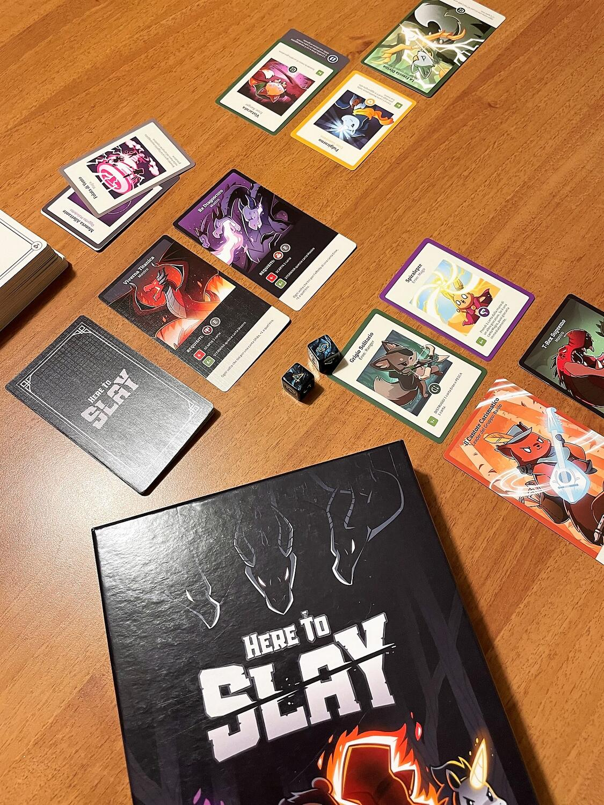
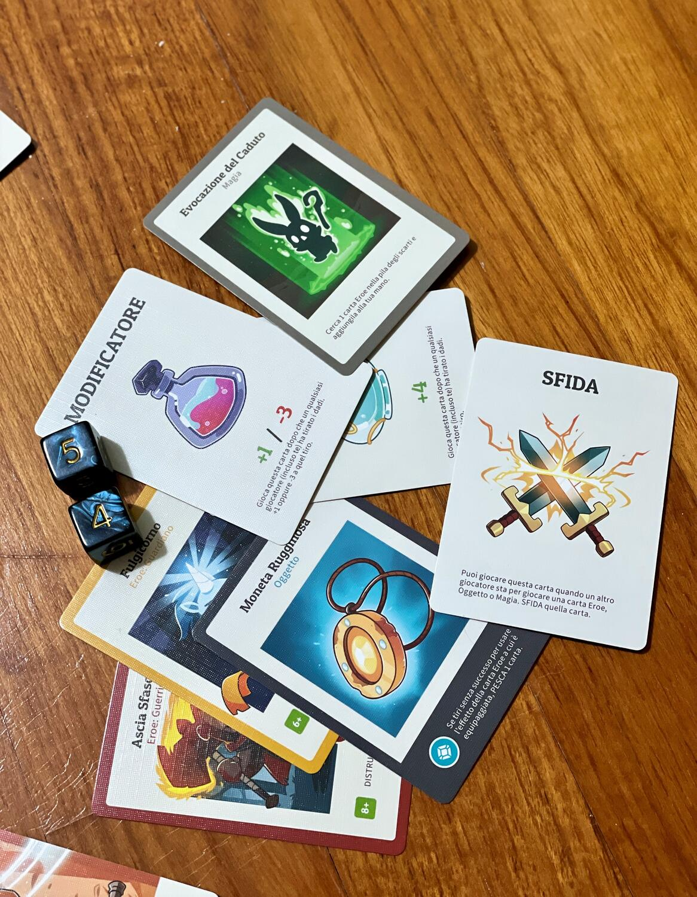

<Setting>

  <em>Here to Slay</em> è un gioco di <strong>carte</strong> strategico a tema{" "}
  <strong>fantasy</strong> che riprende la stessa grafica del forse più famoso{" "}
  <em>Unstable Unicorns</em>. 
  Dovrete radunare un gruppo di Eroi super pucciosi per sterminare Mostri, cercando
  allo stesso tempo di evitare i sabotaggi dei vostri amici/nemici.

</Setting>

<Rules>

  Le regole di <em>Here to Slay</em> sono molto semplici:{" "}
  <strong>    il primo giocatore che stermina 3 Mostri o che raduna di fronte a sé un
    Gruppo di Eroi completo delle 6 Classi vince</strong>
  . 
  Ciascun giocatore parte con una Carta Leader del Gruppo, che gli darà
  un’abilità speciale esclusiva (asimmetria tra giocatori) e 5 carte in mano. In
  particolare, ci sono 5 tipi di carte:
   
  <ul>
    <li>      <em>Eroe</em>: le carte principali del gioco, ciascuna con una specifica Classe e un Effetto da poter attivare mediante il lancio dei dadi</li>
    <li>      <em>Oggetto</em>: carte che si possono equipaggiare alle carte Eroe già giocate per ottenere dei bonus</li>
    <li>      <em>Magia</em>: come gli Oggetti, offrono dei benefici ma si attiva il loro effetto immediatamente quando vengono giocate e poi si scartano</li>
    <li>      <em>Modificatore</em>: si possono giocare a seguito di un lancio dei dadi per variare il risultato del tiro sia per agevolare sé stessi sia per rovinare i piani degli avversari</li>
    <li>      <em>Sfida</em>: si può “sfidare” la carta appena giocata di un altro giocatore per impedirgli di concludere l’azione.</li>
  </ul>
  Durante il proprio turno ciascun giocatore ha 3 Punti Azione da poter spendere nel seguente modo:
   
  Al costo di 1 Punto Azione si può:
      <ul>
        <li>pescare una carta</li>
        <li>giocare una carta Eroe, Oggetto o Magia</li>
        <li>          tirare i dadi per provare ad attivare l’effetto di una carta Eroe già giocata</li>
      </ul>
       
    Al costo di 2 Punti Azione si può attaccare 1 Carta Mostro; per sconfiggere i Mostri serve innanzitutto rispettare dei particolari requisiti, che consistono nell’aver già radunato un certo numero e/o un certo tipo di Eroi nella propria area di gioco; fatto ciò, si può tentare di sconfiggere il Mostro attraverso il lancio dei dadi.
       
       Al costo di 3 Punti Azione si può scartare tutte le carte nella propria mano e pescare 5 nuove carte.

</Rules>

<Feedback>

  <em>Here to Slay</em> è un ottimo <strong>party game</strong> da proporre agli
  amici per passare delle serate divertenti, a patto che siano disposti ad
  accettare il possibile clima di tensione che si genera a seguito dei vari
  sgambetti che si possono fare con le carte (il gioco non è propriamente adatto
  a persone troppo permalose).
   
  Si può certamente ritenere la{" "}
  <strong>versione meno caciarona e più strategica di Unstable Unicorns</strong>
  , quindi diventa tutto sommato piacevole anche in soli 2 giocatori.
   
  Infine, vale la pena averlo o almeno provarlo se in generale si amano le <strong>    grafiche pucciose e cartonate</strong>.

</Feedback>

