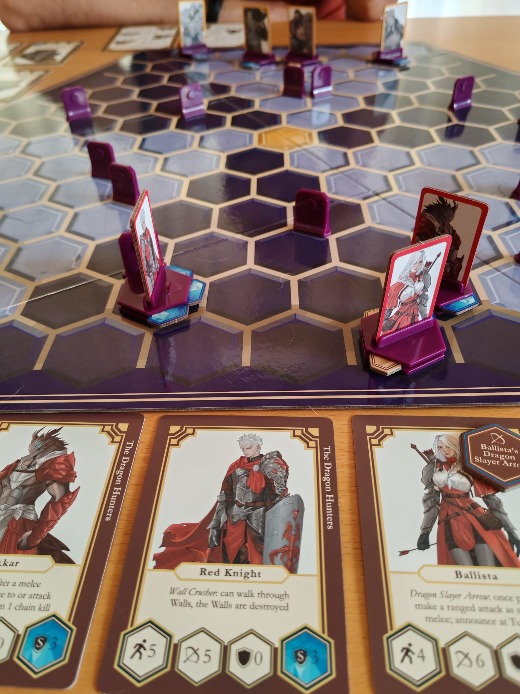
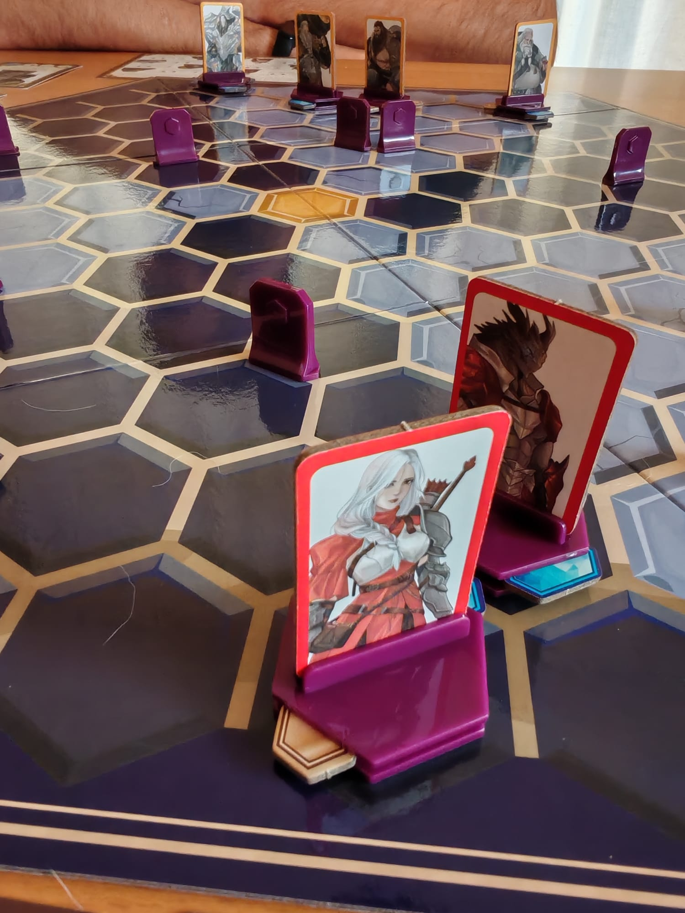
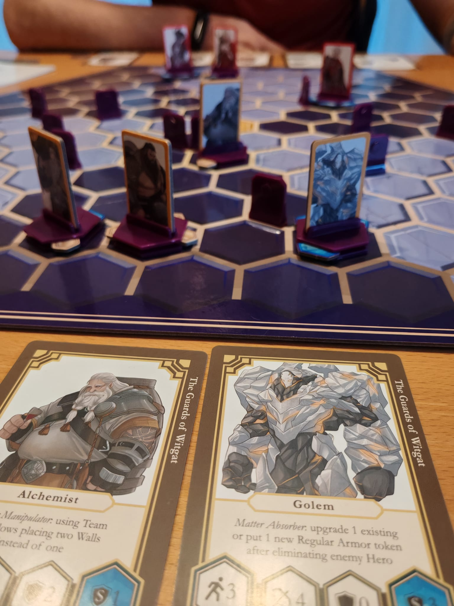

<Setting>

Björn osserva gli scontri a distanza. Chi vincerà? Ancora non è chiaro. Ha già punito entrambe le squadre per i loro comportamenti, ma ora… Erano partiti in tanti: ora è uno contro uno. Chissà come sarà il prossimo scontro. Quel Blob sembra promettente…

</Setting>

<Rules>

Una mappa esagonale, un team di eroi, dei muri di plastica, dei pezzi di armatura da inserire nelle basi del proprio team e cinque turni. Di base, questo è heroes of Timeline. Andiamo però con ordine.  
Innanzitutto, i giocatori dovranno posizionare dei muri per la mappa. Due per le tre sezioni di mappa disponibili ad ogni giocatore. I muri, di fatto, sono una protezione dagli attacchi a distanza che quasi ogni eroe ha a disposizione. Poi bisognerà disporre i propri eroi in due zone ai capi opposti della mappa. Tempo di iniziare. Ogni round continuerà fino a che tutti gli eroi di ogni team non si saranno attivati e, alla fine, verrà stabilito un giocatore vincitore del round che guadagnerà un punto e il perdente otterrà una penalità. A fine partita, cioè dei 5 turni, chi ha più punti vince. Il tutto può terminare prima se un giocatore elimina tutti gli eroi avversari!   
L’attivazione di ogni eroe è molto semplice ed è veicolata dalle sue caratteristiche presenti su una carta riepilogo. Si muove di un numero massimo di esagoni stabiliti dal suo movimento, si gira verso una direzione e colpisce con un attacco a distanza con un raggio di azione, anch’esso indicato. Inoltre, se con i punti movimento a disposizione dell’eroe avresti raggiunto un eroe nemico hai a disposizione un attacco da mischia. Tutti gli attacchi poi dovranno interagire con un’eventuale armatura del bersaglio, che, a seconda della qualità base o avanzata, sarà in grado di difendere da più colpi a distanza ,degradandosi, o dall’attacco da mischia. Inoltre, se per caso un giocatore ha a disposizione meno eroi dell’avversario per compensare la mancanza, potrà avere accesso a una o più reazioni per alcuni dei propri eroi, permettendo agli stessi di effettuare un mini turno.

</Rules>

<Feedback>

Heroes of Timeline è un gioco che si propone come gioco a Fortuna zero, in cui solo la strategia la fa da padrona. È così? Effettivamente sì. Sin dal setup una piccola azione può, in retrospettiva, averti reso la partita un <strong>inferno</strong>. Quell’innocuo movimento, quell’innocuo attacco, quella innocua armatura…  
Beh tutto conta!  
Un gioco che ci ripaga per le partite ripetute, come ci ripaga conoscere le caratteristiche di ogni fazione. Ogni singolo eroe, ogni avversario, ogni configurazione di muri e capire se una fazione è bilanciata o no può essere terribile. Una fazione è davvero debole? Davvero forte? <strong>Impara </strong>.  
Ne vale la pena però? In un mondo in cui più di mille giochi si "materializzano" ogni anno, vale la pena imparare proprio questo? Non sempre chiaro, un po’ strizzacervello e un po’ strano?  
Sì probabilmente e ve lo dice un giocatore terribilmente scarso a Heroes of Timeline. Un giocatore che è una frana a scacchi e a malincuore ammette che è stato salvato da un tiro di dadi più di una volta in moltissimi giochi. 

</Feedback>

