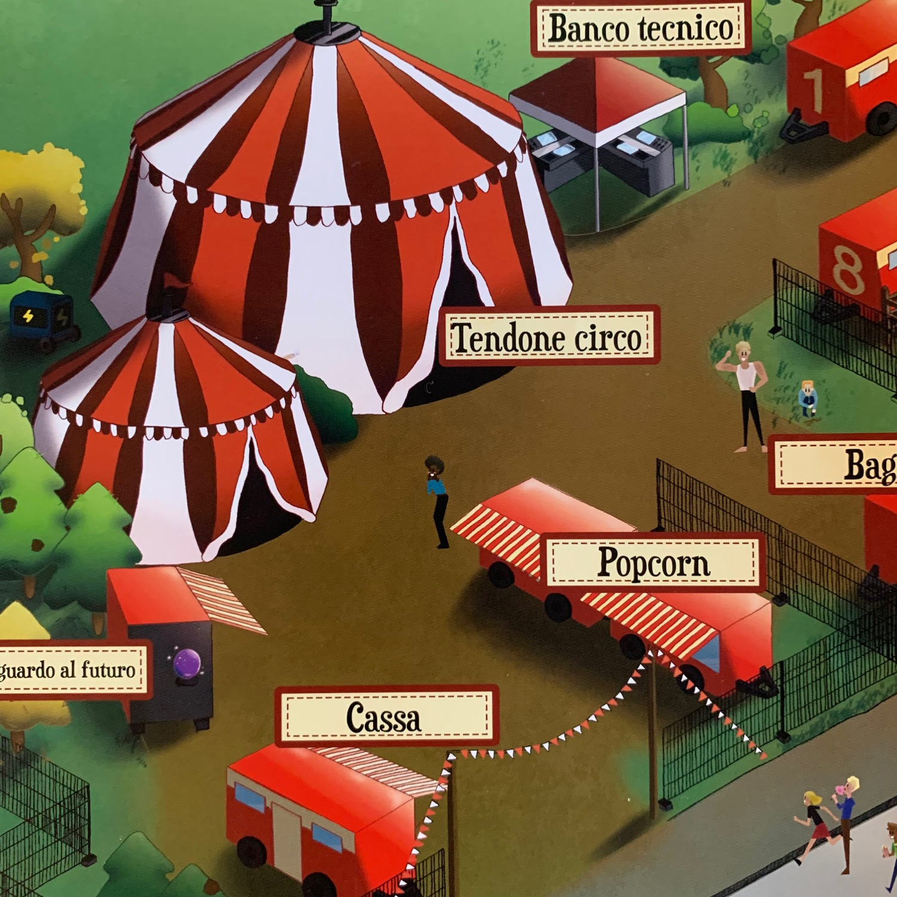
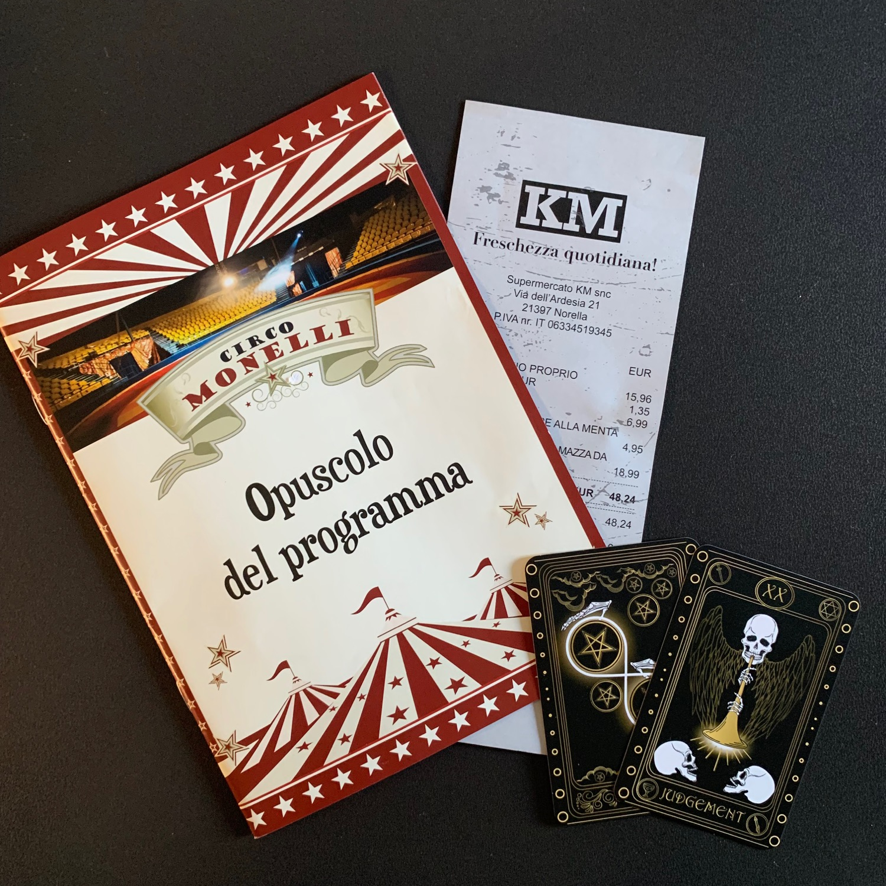

<Setting>

  Il Circo Monelli è arrivato in città. 
  Inizia lo spettacolo e si esibiscono gli artisti. 
  È il turno di <strong>Felicia</strong>, la funambola, famosa per non utilizzare mai protezioni durante i suoi spettacoli. 
  Salta la luce ed è improvvisamente buio. 
  Silenzio. 
  Torna la luce. 
  Felicia è a terra. 
  È morta? 
  <strong>È stata una disgrazia oppure c'è sotto lo zampino di qualcuno?</strong>

</Setting>

<Rules>

  Come succedeva per il fratellino <Link to="/reviews/hidden-games-veleno-verde/">Veleno verde</Link>, anche in questo caso siamo davanti a una "<strong>busta</strong>" e, anche qui, una volta aperta avremo a disposizione tantissimo materiale sin da subito, a tal punto che un tavolo vi starà stretto.  
  Il primo oggetto sul quale metteremo gli occhi sarà la <strong>lettera dell'assicuratore</strong>, che ci chiederà di investigare per capire come è avvenuto il fatto, per determinare se la polizza deve rispondere o meno. L'assicuratore ci consegnerà screenshot di chat, articoli di giornale, foto e molto, molto altro. Inoltre, attraverso l'uso di un telefono, visiteremo siti web, interrogheremo database della polizia e, soprattutto, chatteremo direttamente con l'assicuratore dubbioso. 
  Una volta che saremo in grado di unire tutti i puntini, di utilizzare tutti gli elementi presenti nella busta e di <strong>rispondere a tutte le domande che farà l'assicuratore</strong>, saremo pronti a dare la soluzione.  
  Cosa è successo davvero a Felicia?

</Rules>

<Feedback>

  Ho completamente riempito un tavolo da sagra in un post grigliata con fogli, foglietti, foto, ricevute, volantini e blabla: non sapevo da che parte iniziare a muovermi. Se avete letto la mia recensione di <Link to="/reviews/in-giallo-delitti-di-una-vita/">In Giallo</Link>, saprete che a risolvere investigativi <strong>faccio schifo</strong>… ma sto imparando!  
  Ecco, immaginatemi a dover collegare <em>ottocentomila </em>documenti quando per andare da A a B faccio voli pindarici. E invece no. Mi sono trovato molto più a mio agio. Avendo tante prove, tanti indizi, potete mettere dei paletti chiari, limpidi, fissi. Stanno lì e non si muovono. Non c'è fantasia, ci sono dati! Che belli i dati!  
  Tralasciando questo mio flusso di coscienza, <strong>il gioco mi ha divertito molto</strong>, l'ho giocato con gente abbastanza estranea ai giochi da tavolo (aka ragazza, mamma e sorella, tutte appassionate di true crime) e devo dire che gira.  
  Loro sono state fondamentali a sbrogliare l'intreccio della storia: chi sono i personaggi, che cosa hanno fatto, dove erano, se avevano un alibi o, piuttosto, una motivazione (grazie ancora!). <strong>È stato un lavoro di squadra davvero divertente, ma non banale, che ci ha tenuto al tavolo 3 ore belle e buone</strong> (sarà perché siamo scarsi o sarà perché la grigliata si faceva sentire…). 
  L'unica cosa che mi ha lasciato un po' perplesso è un "click" della trama, una motivazione non data, una spiegazione dettata dalla "casualità"… per me che sto imparando a fare investigativi non aveva senso di esistere… e ci sono rimasto un po' male. In ogni caso, l'esperienza non è stata stravolta da questo particolare!  
  Invece, <strong>la cosa che mi ha convinto più di tutto sono i componenti</strong>: diversi tipi di carta, formati di fogli e metodi di stampa diversi per permetterti di entrare ancora di più nell'ambientazione. Al secondo posto c'è la voglia di sorprendere: ora non voglio entrare troppo nei dettagli per non fare spoiler, ma sappiate che delle semplici scelte di design vi porteranno davvero a farvi sentire di essere voi gli investigatori!  
  Ma quindi, ‘sta Felicia… che è successo?

</Feedback>

