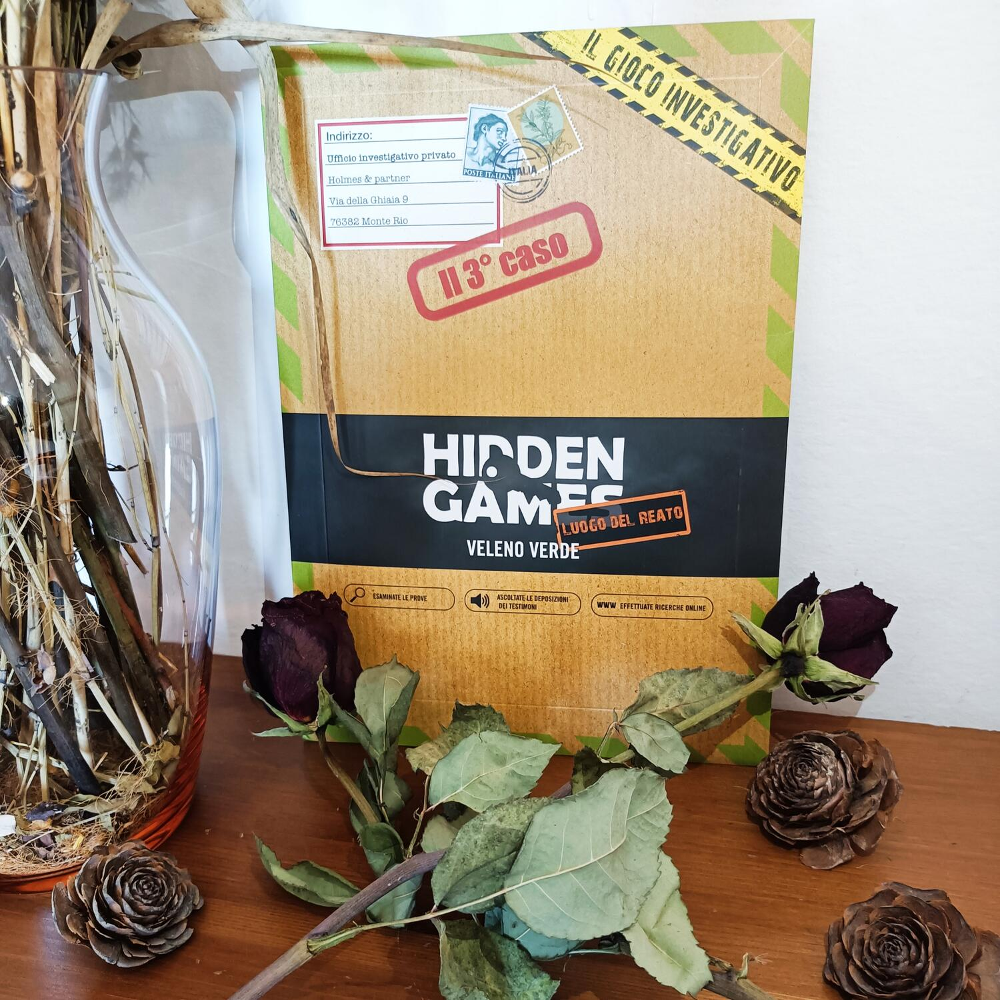

<Setting>

  Presso l’area di balneazione, un cadavere è stato portato a riva dalla
  corrente. Poco tempo dopo un imputato era già dietro le sbarre. Ma si tratta
  davvero del colpevole? Riuscirete a scoprire la verità?

</Setting>

<Rules>

  Appena aprirete la busta vi troverete di fronte ad un'enorme quantità di
  carte, documenti, mappe e fotografie. Diversamente da altri giochi
  investigativi, la Hidden games mette a disposizione fin da subito tutte le
  informazioni per risolvere il caso. Nessuna narrazione, o cornice storica, ma
  un classico e ben congegnato giallo. Da questo momento dovrete leggere
  accuratamente i vari documenti, fare ricerche online, ascoltare audio e
  addirittura chiamare numeri di telefono. Dovrete giostrarvi in un’intricata
  rete d’informazioni che, man mano, vi svelerà la risoluzione del caso. Avrete
  fin da subito le domande a cui dovrete trovare una risposta. Una volta che
  sarete sicuri di aver risolto il caso, andate su internet, compilate le
  risposte e ascoltate il finale.

</Rules>

<Feedback>

  Veleno verde è il terzo caso della collana di giochi investigativi della
  Hidden games. Premetto di aver già giocato e risolto gli altri due casi
  precedenti e, anche in quest’occasione, ho trovato il gioco davvero bello.
    La Hidden games mi sorprende ogni volta, creando casi ben strutturati, complessi
  ma allo stesso tempo non frustranti. La soluzione è lì, sotto i vostri occhi. Starà
  a voi cercare di risolvere il puzzle pezzo dopo pezzo. L’interazione con il telefono,
  registrazioni, chiamate, ricerche su internet e social permettono di rendere la
  partita ancora più realistica, quasi come nella vita reale. I componenti sono sempre
  spettacolari, tanti e ben realizzati, quasi fin troppo realistici, in alcuni casi.
    Anche questa volta la Hidden games mi ha colpito, e, come sempre,
  consiglio vivamente a tutti i grandi e piccoli investigatori di provare almeno
  una volta uno di questi giochi.

</Feedback>

