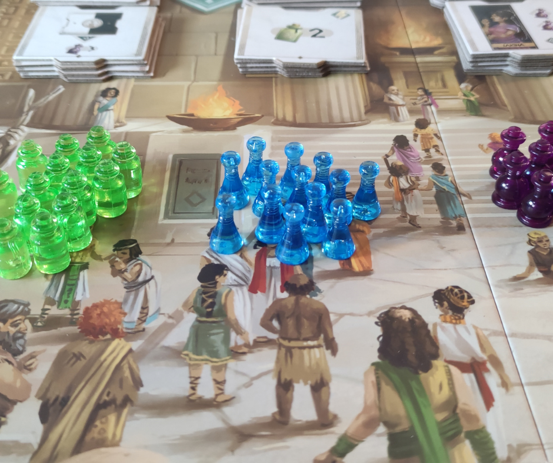
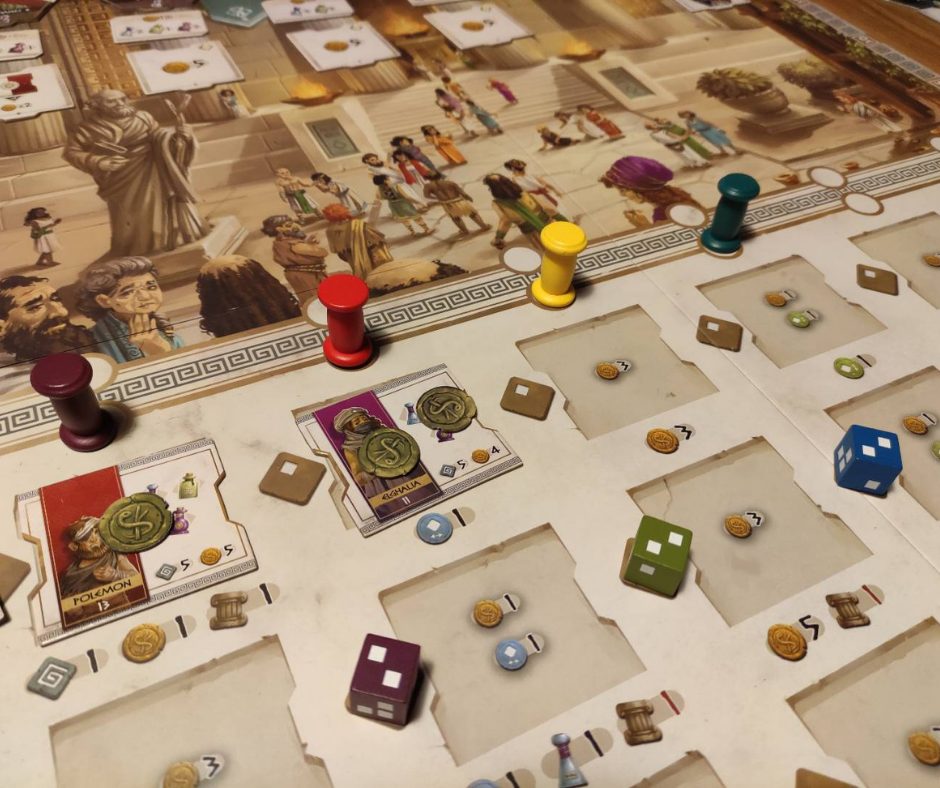

<Setting>

  Nell'antichità, le malattie erano considerate delle punizioni divine a cui
  sottostare.
   
  Ippocrate fu il primo a capire che le loro cause non avevano nulla a che
  vedere con il divino ma piuttosto con il terreno e curò pazienti che venivano
  da ogni dove con i primi rudimentali medicinali.
   
  Ambientato nella Grecia del 370 a.C., Hippocrates ci mette nei panni di
  giovani dottori che cercheranno di aggiudicarsi il titolo di degno erede di
  Ippocrate, recentemente scomparso. Guideremo il nostro team di medici nel
  tentativo di guarire il maggior numero di pazienti possibile che si
  presenteranno al tempio di Asclepio.

</Setting>

<Rules>

  Il gioco dura 4 round, ognuno dei quali è suddiviso in 5 fasi.
  <ul>
    <li>      <strong>Fase 1</strong>: Vengono lanciati dei dadi colorati; ogni colore è
      associato ad una regione. I dadi vengono quindi piazzati nelle relative
      regioni, sulla casella corrispondente in base al risultato che può essere
      1, 2 o 3. In base all'ordine del tracciato accoglienza si sceglie una
      regione, spostando il segnalino, e il paziente a cui è associato il dado,
      pagando o ricevendo bonus/malus indicati sotto la relativa tessera. Questa
      operazione viene effettuata tre volte, in modo che tutti possano avere
      fino a tre nuovi pazienti, che ci pagheranno poi in anticipo le Dracme
      indicate sulla loro tessera per essere curati.</li>
    <li>      <strong>Fase 2</strong>: Si pagano gli stipendi dei medici in base alla
      reputazione: più ne avremo, meno li pagheremo.</li>
    <li>      <strong>Fase 3</strong>: Si assumono nuovi medici, avendo però prima la
      possibilità di prenotarne uno. Ogni medico può somministrare determinate
      fiale, indicate sulla tessera. È quindi auspicabile ingaggiare quelli che
      possono curare subito i pazienti acquisiti. Pagatene il costo, indicato
      sempre sulla tessera. Si potranno inoltre acquistare i Kit di Medicine
      associati al dottore che avrete assunto, che offrono fiale per curare i
      pazienti. Se lo fate otterrete la tessera bonus associata. Volendo,
      potrete poi assumere il medico che avevate prenotato.</li>
    <li>      <strong>Fase 4</strong>: Si curano i pazienti, ai quali potete associare
      uno o più medici. Sulle tessere dei malati sono indicati numero e colore
      delle fiale necessarie a guarirli; dovrete avere sia i medici che le fiale
      necessarie a curarli: la cura deve essere completa!</li>
    <li>      <strong>Fase 5</strong>: Si contano i punti. I pazienti guariti danno i PV
      stampati sulle loro tessere, ogni medico che ha utilizzato tutti i lati
      dell'esagono con le fiale avrà esaurito il suo compito e la sua tessera
      verrà scartata, assegnando altri PV al giocatore.</li>
  </ul>
  Se un paziente non può essere curato si aggraverà, la sua tessera verrà
  spostata nella sala emergenze della plancia e se non riuscirete a guarirlo
  neppure nel turno successivo morirà e vagherà negli Inferi. Ogni paziente
  morto farà perdere 3 PV a fine partita.

</Rules>

<Feedback>

  Hippocrates ci è piaciuto molto. Sembra difficile da digerire, ma in realtà è
  molto più semplice di quello che sembra. In sostanza si accolgono i pazienti e
  si assumono dottori in base ai pazienti da curare. Se siamo bravi a gestire i
  soldi, si potranno comprare le medicine. Già, i soldi: ne avremo sempre pochi
  e molte volte dovremo scegliere se assumere medici (a cui pagare lo stipendio
  al round successivo) o comprare medicine. Cercare di associare dottori e
  pazienti può creare una forte paralisi da analisi se giocate con forti
  pensatori (e nelle prime partite rischierete di superare i 90' dichiarati).
   
  L'ambientazione si sente: avrete l'ansia di curare i malati, che nei (pochi) 4
  round potrebbero aggravarsi e lasciarci, se non adeguatamente curati. Buona la
  longevità, ma non eccelsa, poiché alla fine le cose da fare sono sempre
  quelle. Infine, i materiali: bellissimi, specie le fiale che ricordano un po'
  i ciucciotti in stile anni 90'. Ma vi servirà un tavolo grandissimo per
  ospitare tabellone, plance e incastri dottori/pazienti. Infine, essendo un
  gioco di dadi, l'alea può farsi sentire, ma ci vengono in aiuto gli assistenti
  che mitigano i risultati sfortunati.
   
  Insomma, un gioco che ci ha divertito, strizzato un po' il cervello e che
  merita una possibilità di finire sui vostri tavoli!

</Feedback>

