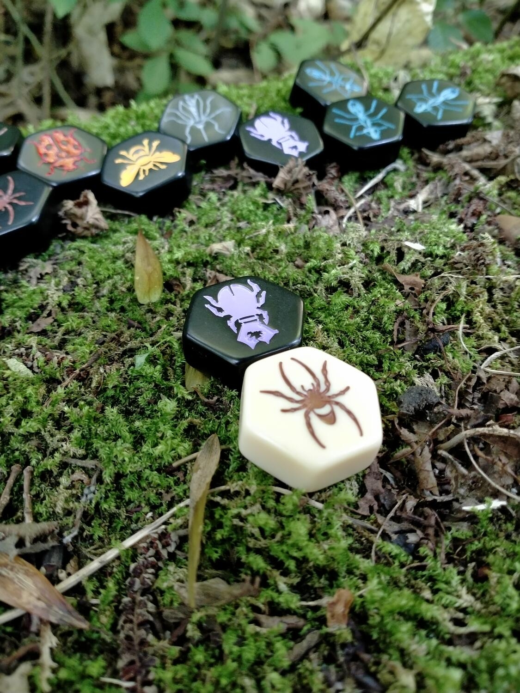
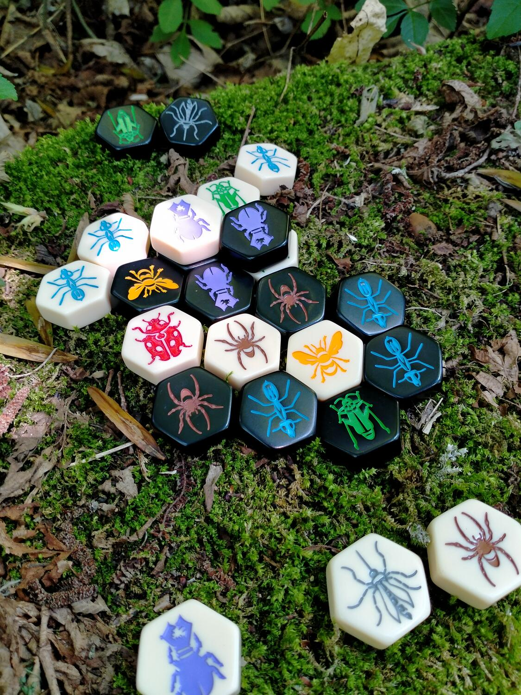

<Setting>

  In questo gioco dall'impronta scacchistica, due eserciti di insetti si scontrano a suon di ronzii per circondare l'Ape
  Regina avversaria e conquistare l'alveare. Aggiungi insetti ad ogni turno o muovi quelli già piazzati ma ricorda:{" "}
  <strong>NON DIVIDERE MAI L'ALVEARE!</strong>

</Setting>

<Rules>

  Il gioco si svolge in turni e, come negli scacchi, i bianchi iniziano sempre per primi.
   
  Lo scopo è circondare completamente l'Ape Regina avversaria, sia con pezzi alleati che avversari, cercando al tempo
  stesso di difendere la propria.
   
  Ad ogni turno i giocatori potranno effettuare un'azione a scelta tra:
  <ul>
    <li>Piazzare una tessera insetto</li>
    <li>      Muovere una tessera insetto già piazzata (questa azione verrà sbloccata solo dopo aver posizionato la tessera Ape
      Regina)</li>
  </ul>
  Ogni tessera andrà posizionata in modo che tocchi solo tessere del proprio colore, ad eccezione delle prime due
  tessere. L’Ape Regina dovrà essere sempre posizionata entro il quarto turno di gioco.  
  Una volta inserita l'Ape Regina nel nostro alveare, avremo la possibilità di muovere gli insetti già in gioco.  
  Ogni insetto muove in modo diverso:
  <ul>
    <li>L'Ape Regina può muoversi di solo uno spazio alla volta</li>
    <li>      Il Ragno si muove esattamente di 3 spazi alla volta senza mai tornare indietro e rimanendo sempre a contatto con
      gli altri pezzi</li>
    <li>      Il Coleottero può muoversi di solo uno spazio per volta anche sopra l'alveare, coprendo pezzi alleati e avversari.
      Un pezzo coperto da un Coleottero non può muoversi</li>
    <li>La Formica Soldato può muoversi ovunque nell'alveare rispettando le Regole d'Oro</li>
    <li>      La Cavalletta si muove saltando dal suo spazio sopra un qualsiasi numero di pezzi (sempre almeno uno), arrivando
      nel primo spazio vuoto, seguendo una linea retta di tessere unite.</li>
  </ul>
   
  <strong>LE REGOLE D'ORO DI HIVE</strong>
   
   
  <strong>MAI SPEZZARE L'ALVEARE!</strong>
   
  I pezzi in gioco devono essere sempre collegati in qualsiasi momento, anche durante il movimento di una tessera. In
  nessun caso si può lasciare un pezzo isolato o dividere l'alveare in due.
   
   
  <strong>NON SCORRI? NON MUOVI!</strong>  
  Il movimento dei pezzi è sempre inteso come uno scorrimento. Se un pezzo è circondato da altre 5 tessere, questo è
  fisicamente impossibilitato a scorrere fuori dalla sua posizione e quindi non potrà muoversi. Allo stesso modo non si
  potrà muovere un pezzo in uno spazio vuoto circondato da altri 5 pezzi.  
  Fanno eccezione a questa regola la Cavalletta e il Coleottero che possono "saltare" gli altri pezzi.

</Rules>

<Feedback>

  Tra i giochi di strategia di stampo scacchistico, Hive è senza dubbio uno dei più belli in circolazione ed è uno di
  quei giochi "facili da imparare ma difficili da padroneggiare".  
  L'assenza di alea lo rende un gioco puramente strategico, per cui non potremo prendercela con la sfortuna se perderemo
  una partita: sicuramente avremo sbagliato qualcosa nella nostra strategia.
   
  Il flusso di gioco è scorrevole grazie alla semplicità delle regole ma, nonostante ciò, la rigiocabilità e la profondità
  sono altissime.  
  La durata indicata di 20 minuti è in linea con la durata reale di una partita tra due giocatori esperti; probabilmente
  le prime partite che farete dureranno intorno ai 10 minuti.
   I pezzi sono di plastica liscia molto spessa e resistente, piacevoli al tatto e alla vista e dalle dimensioni contenute.
  Non avendo bisogno né di una plancia di gioco né di setup, Hive è un gioco dalla portabilità altissima.  
  L'unica vera nota dolente di Hive è proprio il tema: diciamolo, gli insetti fanno schifo a (quasi) tutti. Il design
  degli insetti lo rende davvero poco accattivante. Se il tema fosse stato, per esempio, unicorni e gattini, il gioco
  avrebbe sicuramente avuto più appeal e popolarità.
   
  Hive è disponibile in commercio in versione classica, Pocket (con tessere leggermente più piccole) e Carbon (tessere
  grandi con gli insetti in bianco e nero anziché colorati). La versione Pocket contiene già le espansioni Coccinella e
  Zanzara mentre per le altre due versioni sono vendute separatamente insieme all'espansione Onisco.  
  Chiudendo un occhio sul tema del gioco, se giocate prevalentemente in due, Hive è un gioiello che non potete perdervi.

</Feedback>

