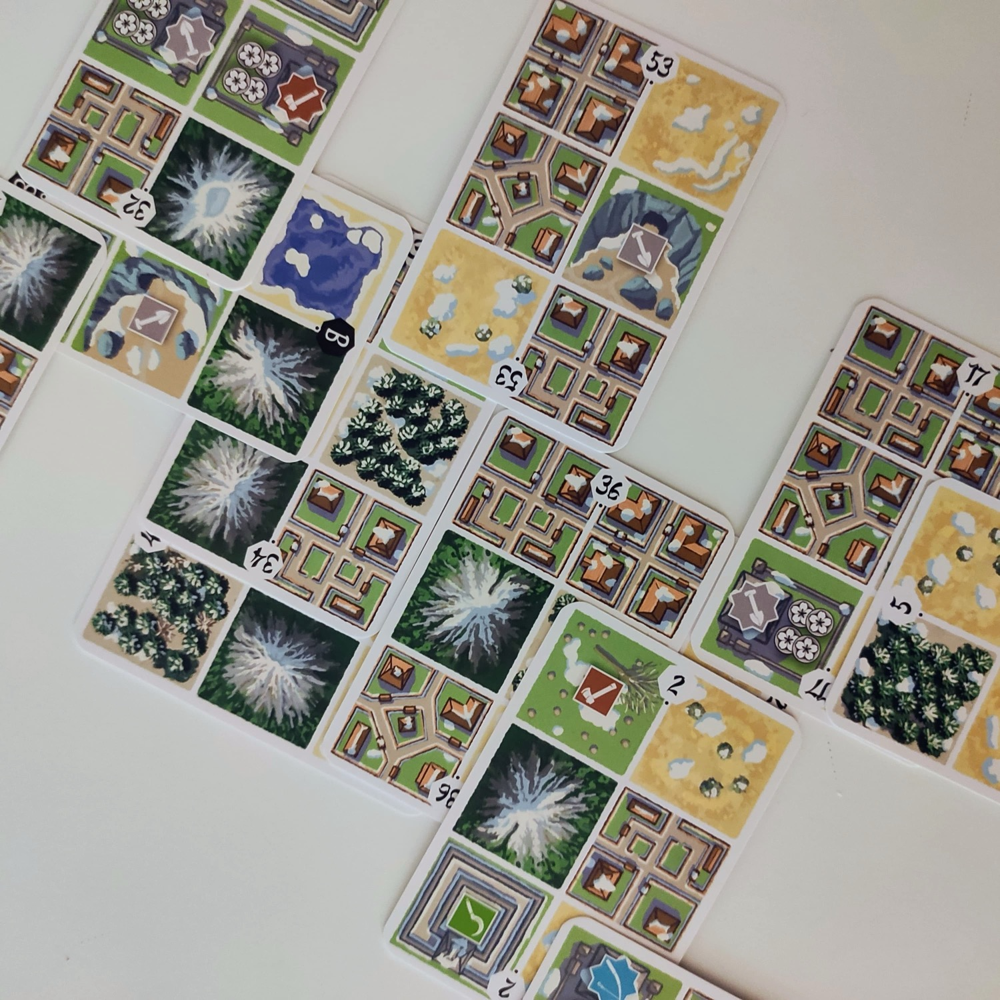
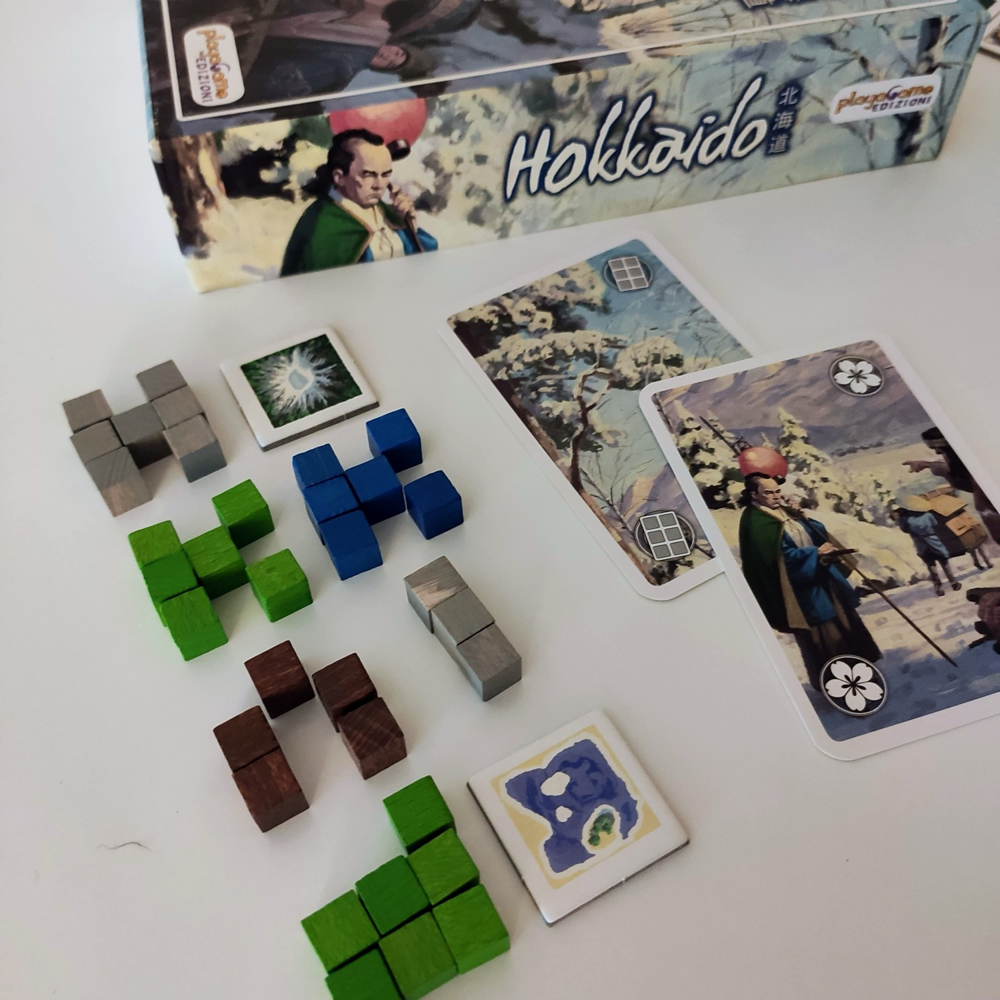
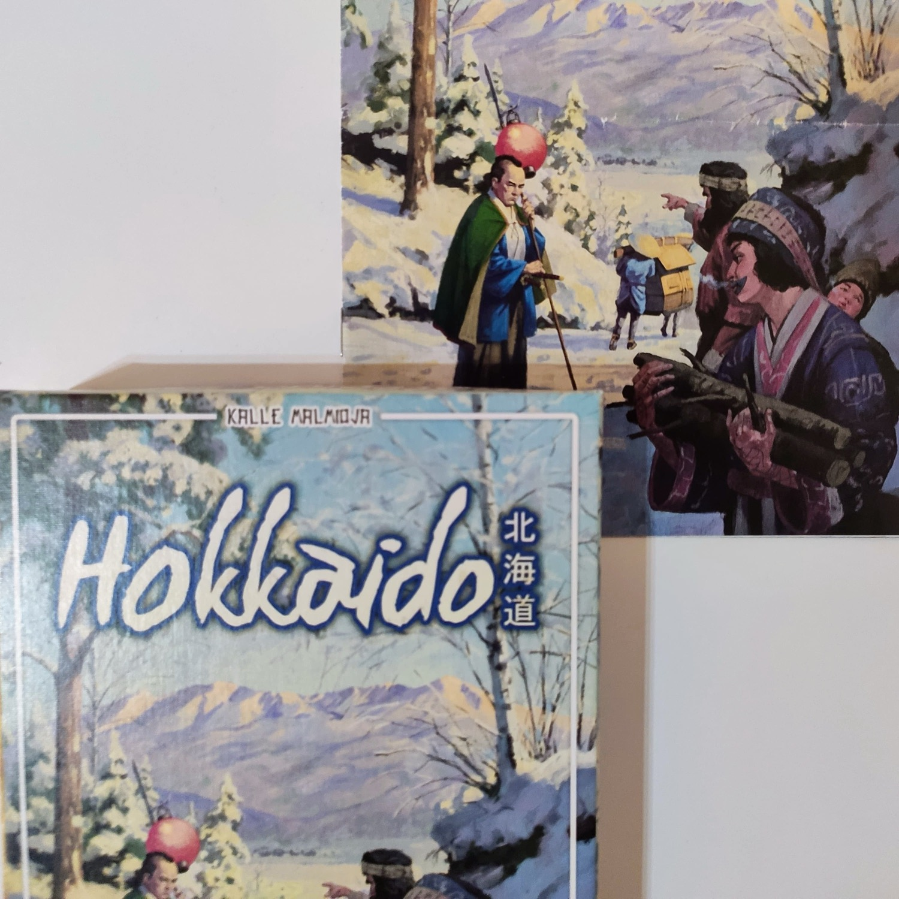

<Setting>

  <em>Hokkaido</em> è un gioco astratto di costruzione mappa ambientato nell'omonima isola nel nord
  del <strong>Giappone</strong>. Hokkaido è caratterizzata da un freddo paesaggio montano, ed era la dimora della
  popolazione indigena Ainu, prima che venisse occupata dalla nazione nipponica e che i suoi abitanti fossero sottoposti
  allo stermino e all'assimilazione, cancellando quasi del tutto la loro lingua e cultura. Quando giochiamo,
  ricordiamoci che è importante costruire una consapevolezza attorno alle culture e ai popoli che portiamo sui nostri
  tavoli, che non possono essere ridotti a colorati pretesti d'ambientazione.

</Setting>

<Rules>

  In <em>Hokkaido </em>i giocatori si passano di mano in mano dei mazzetti di carte che useranno per costruire delle
  mappe, sovrapponendole e incastrandole tra di loro. Ogni carta è strutturata in una griglia 2x3 di quadrati; questi
  ultimi rappresentano un tipo di terreno: montagna, foresta, lago, città, produzione, maggese o fabbrica. Finché una
  carta s'interseca con una già in gioco, non ci sono divieti di piazzamento oltre ai seguenti: non è possibile coprire
  Laghi o Montagne già in gioco e le Montagne devono necessariamente essere tutte adiacenti tra di loro (anche in
  diagonale). 
  I tipi di terreno possono avere degli effetti o garantire dei punti a fine partita. 
  <ul>
    <li><strong>Montagna</strong>: 2 punti per casella;</li>
    <li><strong>Foresta</strong>: 2 punti per casella;</li>
    <li><strong>Lago</strong>: 3 punti per casella per ogni gruppo di Laghi adiacente (ortogonalmente), meno la prima
      casella;</li>
    <li><strong>Città</strong>: 2 punti per ogni casella Distretto (gruppo di Città) più piccolo, scelto tra i due più
      grandi da ciascun lato della catena di Montagne;</li>
    <li><strong>Produzione</strong>: quando viene giocata, metti 1 cubetto del colore corrispondente sulla casella;</li>
    <li><strong>Maggese</strong>: puoi pagare 2 cubetti in gioco per Terraformare la casella Maggese, cioè coprirla con
      una tessera Montagna/Foresta/Lago/Città, in base al tipo di Produzione;</li>
    <li><strong>Fabbrica</strong>: alla fine della partita, può essere occupata da 1 cubetto Produzione del suo stesso
      colore ancora in gioco, garantendo 4 punti.</li>
  </ul>
  Al termine del draft, il giocatore con più punti vittoria è il vincitore. 
  Per giocatori più navigati, esiste la possibilità di aggiungere delle carte obiettivo che potranno essere riscattate
  nel corso della partita per fare ulteriori punti.

</Rules>

<Feedback>

  <em>Hokkaido</em> è un <strong>filler</strong> molto semplice che può godere di un <strong>gameplay
  essenziale</strong>, senza particolari virtuosismi. 
  Il gioco sta tutto nello scegliere non solo la carta da giocare, ma anche il suo posizionamento. Bisogna capire su
  quali tipi di caselle puntare, <strong>preparandosi il terreno</strong> in anticipo, e stando attenti a non
  precludersi troppe possibilità, evitando il rischio di concentrandosi su un tipo di terreno trascurandone altri. È
  bene, inoltre, tenere d'occhio le mappe degli altri giocatori, perché ad ogni mano di draft una carta sarà eliminata,
  quindi è anche possibile (e consigliato) sabotare gli avversari. 
  Perché <em>Hokkaido </em>dovrebbe interessarvi? Non c'è una ragione specifica e, in effetti, il titolo <strong>non
  brilla</strong> in mezzo ai suoi colleghi. E tuttavia, c'è qualcosa che mi spinge a tornarci, vuoi i toni tiepidi
  delle illustrazioni o l'atmosfera rilassata che cala sul tavolo. 
  I suoi difettucci li ha: lo spazio che rischia di occupare e la macchinosità del piazzamento delle carte (che a volte
  vanno infilate tra quelle già presenti, rischiando di alterarne la posizione) sono elementi di disturbo che rompono
  momentaneamente il flusso. 
  A conti fatti, <em>Hokkaido </em>rimane però una <strong>solida alternativa</strong> a tanti classici di piazzamento
  tessere, come l'acclamato Carcassonne, e che può contare sulla compattezza, su una durata molto contenuta e su una
  gradevole scelta di materiali, nonché su una <strong>discreta profondità</strong>.

</Feedback>

