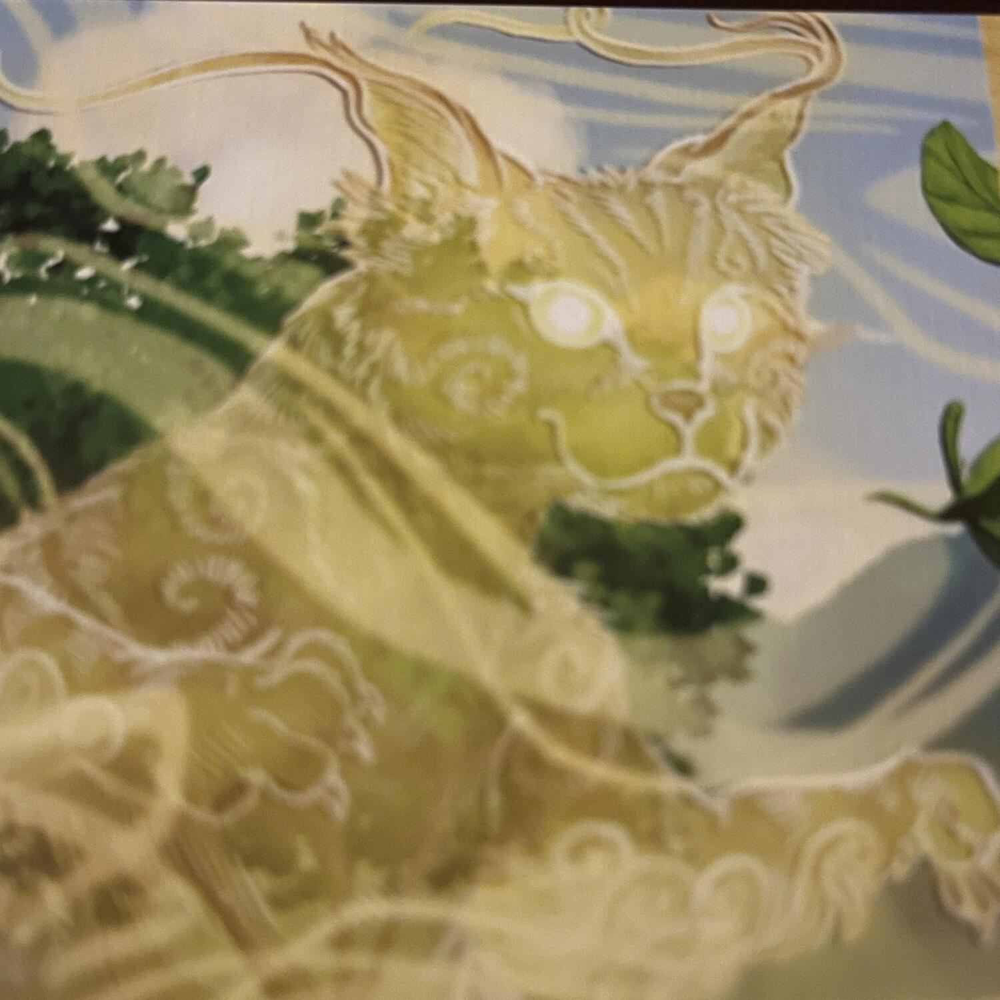
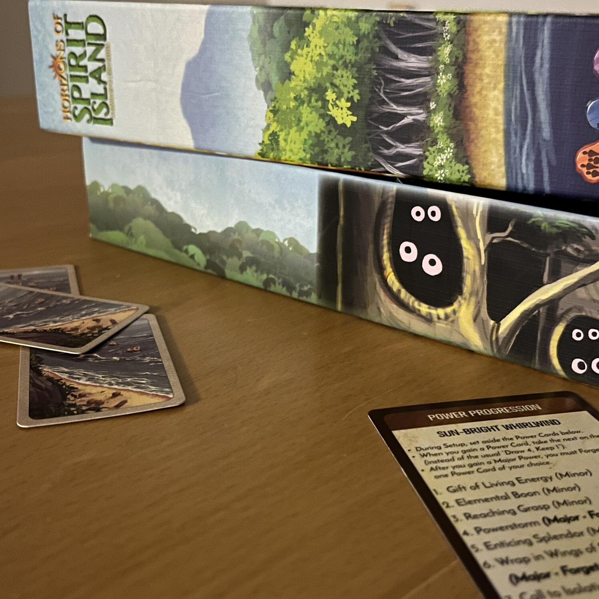

<Setting>

Horizon of Spirit Island è un gioco cooperativo sul colonialismo. I colonizzatori cercano di invadere un’isola abitata dagli indigeni Dahan e i giocatori dovranno affrontare questa invasione da una posizione privilegiata: il pantheon degli Dei dell’isola.

</Setting>

<Rules>

In Spirit Island il round di gioco è diviso, grosso modo, in 2 macro fasi in cui gli spiriti/giocatori diventeranno più potenti ottenendo nuove carte ed estenderanno la propria influenza, mentre gli invasori, a loro volta, accresceranno la loro influenza negativa sull'isola corrompendola, costruendo villaggi o città e esplorando nuove terre. Prima che gli invasori agiscano, agli spiriti è data la possibilità di utilizzare i propri poteri per attivare una incredibile moltitudine dei più disparati effetti prima o dopo il turno degli invasori. Il gioco continuerà poi fino a quando una delle condizioni di fine partita si sarà verificata: gli invasori vinceranno se l'isola è troppo contaminata, gli spiriti non hanno più influenza sull'isola o saranno passate troppe generazioni (rappresentate dalla fine di un mazzetto di carte). Dal canto loro gli spiriti vinceranno solamente se saranno stati in grado di spaventare i colonizzatori abbastanza da farli fuggire.

</Rules>

<Feedback>

Ora… I più maliziosi potrebbero notare delle similitudini con la recensione di <Link to="/reviews/spirit-island">Spirit Island</Link> … Beh è così. Oggettivamente ci sono così poche differenze tra l’uno e l’altro che non varrebbe la pena neanche fare la recensione. Se non fosse che
    <ul>
<li> ha al suo interno meno materiale e più economico, rendendolo più accessibile </li> 
<li> gli spiriti sono di un puccioso che la metà basta, rifacendosi in maniera più marcata ad animali esistenti </li>
<li> mancano tutte le questioni di scalabilità della difficoltà, rendendolo meno complesso e variabile a lungo termine, ma decisamente più accessibile per una partita ogni tanto </li>
<li> secondo le leggende, si può comunque giocare contro tutta la Prussia, ingegnandosi un po’ in quanto unico avversario che fornisce difficoltà variabile senza aggiungere troppe regole e componentistica </li>
</ul>
Che dire? Volevate accedere a Spirit Island e vi siete fermati finora? Oppure lo avete già e siete a caccia di nuovi spiriti? Allora Horizons fa per voi!  
Se invece non rientrate in queste categorie , ma volete approcciarvi ad un buon <Link to="/mechanisms/cooperativo"> Cooperativo </Link> e ad un buon <Link to="/mechanisms/solitario"> Solitario</Link>, non scappate: siete comunque nel posto giusto!

</Feedback>

