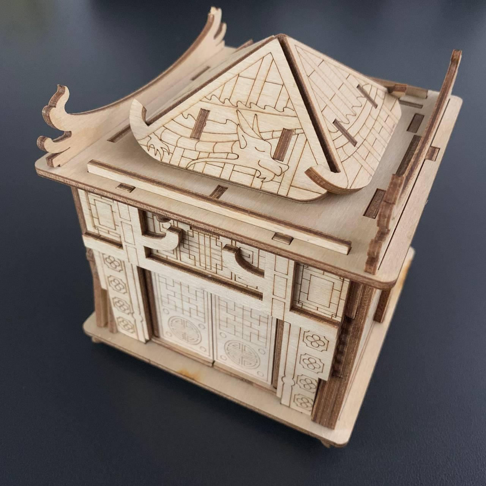
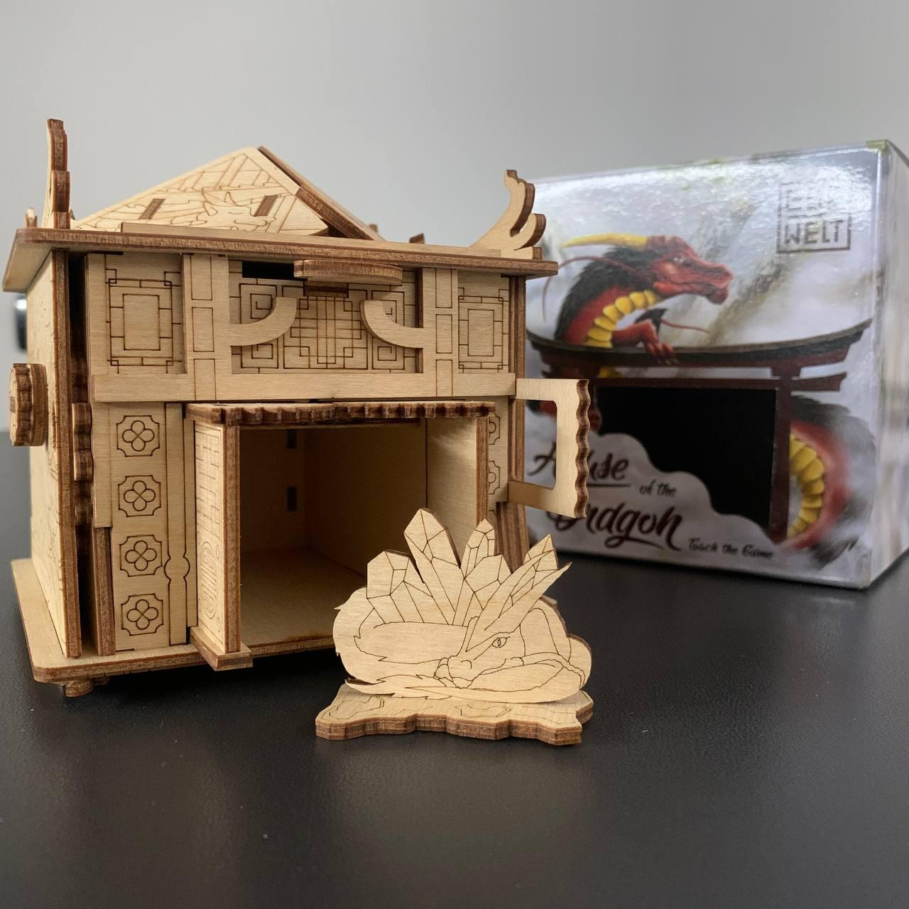

<Setting>

  Questa è la storia di un padre, Asahi, che fin da giovane sacrificò la sua
  vita, lavorando duramente come falegname, per dare un futuro al suo unico
  figlio, Ryoto.  
  Non appena compì 18 anni, però, Ryoto lasciò il padre per studiare a Tokyo e non
  fece più ritorno a casa.  
  Passarono gli anni e Asahi scoprì che suo figlio si era sposato e aveva avuto
  dei figli, ormai già in età scolare. Sconfortato da questa notizia, Asahi
  prese in mano i suoi pennelli e i suoi colori, e iniziò a sognare ad occhi
  aperti su come sarebbe stato bello poter riunire la famiglia.{" "}
  <strong>Mentre realizzava la sua opera d'arte</strong>, fu rapito da Morfeo e
  un Drago gli venne in sogno dicendogli: “Non piangere per i tuoi nipoti: non è
  mai tardi per costruire un forte legame familiare!”
   
  Al suo risveglio, Asahi trovò sul tavolo lo schema di un giocattolo di legno.
  Passò tutta la notte a lavorare al progetto e, appena lo ebbe finito, qualcuno
  bussò alla sua porta. Era la sua famiglia! Asahi non poteva credere ai suoi
  occhi. Raccontò subito del suo sogno e mostrò loro il nuovo puzzle che aveva
  realizzato.
   I bambini, ovviamente, non potevano risolvere gli enigmi da soli e solo grazie
  all’aiuto dei grandi riuscirono finalmente ad aprire la scatola. Un semplice giocattolo
  era riuscito nell'intento più difficile: far capire che <strong>    i membri di una famiglia sono forti solo stando insieme!</strong>
   

</Setting>

<Rules>

  Per giocare a House of the Dragon non c'è bisogno di sapere niente, nessun
  regolamento da leggere e nessun dettaglio da imparare. Vi basta prendere in
  mano la scatola (la casa del drago), osservarla, capovolgerla, decifrarla con
  l'unico scopo di aprirla e lasciarle trasmettere il messaggio di unità per la
  quale è stata creata.  
  Sulla scatola sono presenti 10 enigmi, alcuni più difficili di altri. Enigma dopo
  enigma ci si avvicinerà sempre più al Drago e al suo messaggio.  
  Tutto quello che vi serve è in bella mostra: riuscirete a capirlo?
   

</Rules>

<Feedback>

  Prosegue l’avventura nella soluzione delle scatole di EscapeWelt.
   
  Dopo <Link to="https://dudexpress.it/reviews/fort-knox">
    Fort Knox
  </Link> , <Link to="https://dudexpress.it/reviews/space-box">Space Box</Link>{" "}
  e <Link to="https://dudexpress.it/reviews/quest-pyramid/">Quest Pyramid</Link>
  , veniamo catapultati in Giappone, in un viaggio "introspettivo" che punta a trasmettere
  un messaggio di unione: da soli siamo più deboli e uniti siamo più forti.  
  Bisognerà affrontare <strong>10 enigmi</strong> in successione per arrivare al
  Drago che ci attende. Ho trovato un po' di difficoltà a capire da dove partire
  ma, una volta compreso quello, il resto della scatola si viola con velocità e
  piacere (e la sensazione di essere un po' polli).  
  Gli enigmi sono più <strong>sfidanti</strong> di quelli di <Link to="https://dudexpress.it/reviews/quest-pyramid/">
    Quest Pyramid
  </Link>,: alcuni vi faranno brillare gli occhi dall'incredulità per ciò che state
  facendo e perfino gioire nel momento in cui li risolverete.
   
  "Cose" che si staccano, "cose" che si aprono, "cose" che appaiono, "cose" che…
  wow!
   
  La <strong>bellezza</strong> dell'opera è <strong>disarmante</strong>, ornamentale,
  a tal punto che ora se ne sta a casa a fianco di un bonsai.
   
  Anche in questo caso, bisogna tenere a mente che la scatola è realizzata in legno
  e che, quindi, qualche meccanismo potrebbe risultare leggermente inceppante, ma
  con un po' di pazienza e con qualche ovvio micro movimento tutto torna a funzionare.
   
  Inoltre, il tempio dispone di un bell'antro capace di ospitare dei piccoli oggetti,
  un biglietto o qualsiasi cosa si voglia nascondere, raggiungibile dopo aver risolto
  tutti gli enigmi. Ottimo per "incartare" un regalo!
   
  E voi? Avete mai fatto niente di simile? Scriveteci su Instagram!
   

</Feedback>

