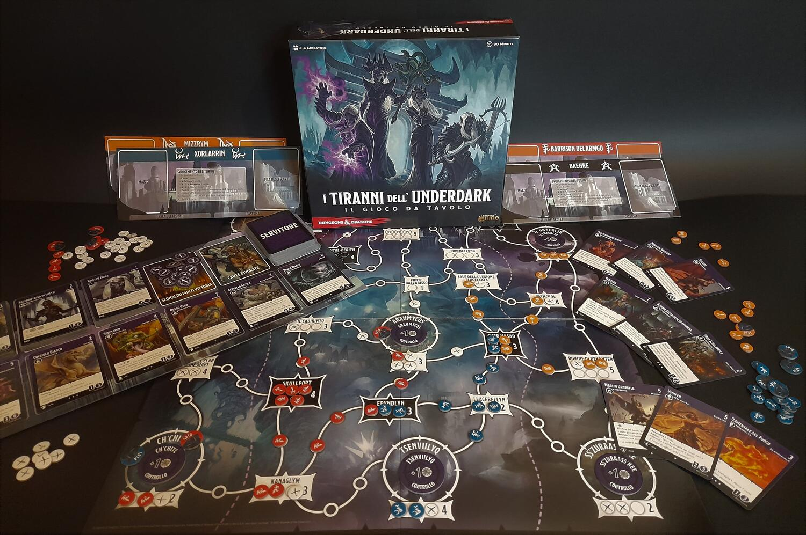
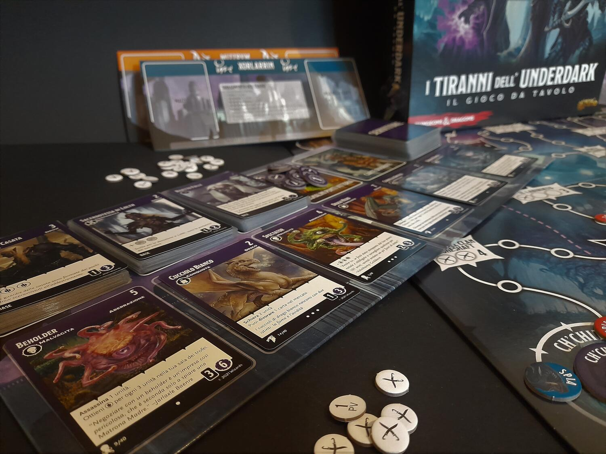

<Setting>

  Nell'Underdark, la fitta rete di caverne e grotte che si estende sotto Faerûn,
  le casate dei Drow, gli elfi oscuri, tramano per ottenere il controllo
  dell'intero reame. Astuti e malvagi come poche altre razze al mondo, potranno
  contare su stuoli di servitori crudeli tanto quanto loro, tra demoni, draghi,
  non-morti e aberrazioni.
   
  Cosa sarà decisivo per lo scontro? Il controllo delle grandi città e
  guarnigioni? Il potere e i consigli del circolo interno di consiglieri? O
  forse i cadaveri dei caduti raccolti nelle sale dei trofei? Solo la fine del
  conflitto potrà dircelo…

</Setting>

<Rules>

  Ogni giocatore impersona una casata Drow e dispone di un mazzo di 10 servitori
  (uguali per tutti) e di un esercito di 40 unità. La mappa dell'Underdark è
  divisa in città e luoghi collegati tra loro da diversi sentieri.
   
  Scelti i 2 mazzi mercato da utilizzare (tra 6) e piazzate le unità neutrali e
  quelle dei giocatori sulla mappa, la partita può cominciare.
   
  Si procede con una serie di round divisi in turni in cui i giocatori giocano
  le carte della propria mano e ne eseguono le rispettive azioni. Le carte
  iniziali permetteranno unicamente di acquistare altre carte (fornendo
  influenza, la valuta del gioco) o di schierare o uccidere unità in modo da
  controllare i luoghi e accumulare punti nella sala dei trofei; solo a mano a
  mano che si procederà nel gioco i mazzi dei giocatori diventeranno diversi
  l'uno dall'altro, con carte capaci di innescare potenti sinergie.
   
  Quando un giocatore schiera la sua ultima unità o il mazzo mercato si
  esaurisce, la partita termina. I giocatori sommano i punti vittoria dei luoghi
  controllati, di quelli dominati, delle unità uccise, delle carte nel mazzo e
  nel circolo interno e dei PV guadagnati in altro modo. Chi ne avrà guadagnati
  di più sarà il dominatore dell'Underdark.

</Rules>

<Feedback>

  I Tiranni dell'Underdark è un ottimo deckbuilding, appagante e dalla durata
  contenuta. In poco più di un'oretta, infatti, avrete la soddisfazione di far
  crescere e potenziare il vostro mazzo, volgendolo verso questa o quella
  strategia. Essenzialmente, le vie per la vittoria sono due: promuovere le
  carte nel circolo interno, rimuovendole quindi dal mazzo ma garantendosi più
  punti (ogni carta ha due valori in punti: uno base e uno se promossa), o
  puntare a schierare ed eliminare unità, ottenendo così il controllo delle
  città, che generano punti ogni turno, e degli altri luoghi, che se controllati
  interamente garantiranno molti punti a fine partita.
   
  La cosa interessante è però la varietà con cui si attueranno queste strategie.
  L'interazione con gli altri giocatori, l'uscita casuale delle carte mercato e
  la scelta stessa dei 2 mazzi in gioco costringeranno a continue scelte su come
  ottimizzare il mazzo o come volgere al meglio la situazione militare sulla
  mappa, rendendo il gioco sempre interessante e teso. Un plauso particolare va
  poi fatto ai 6 mazzi mercato che, grazie alle combinazioni che creeranno,
  garantiranno partite sempre varie e diverse, in quanto ogni fazione
  rappresentata ha un modo diverso di approcciarsi al gioco.  
  Dal punto di vista dei materiali, a parte le belle illustrazioni delle carte, il
  gioco non eccelle, con i piccoli segnalini di cartone per le unità e una plancia
  che, prendendo alla lettera la sua ambientazione, risulta molto scura. Tuttavia,
  ai fini di gioco, poco importa avere un segnalino o una miniatura extralusso, soprattutto
  in un deckbuilding ben fatto come questo.
   
  Un ultimo accenno al banner “D&amp;D” stampato sulla scatola: oltre ai nomi di
  luoghi, fazioni e creature, alcune carte hanno nomi propri e rappresentano personaggi
  noti dell'Underdark, ma al di là di questo l'ambientazione di “Dongioni e Dragoni”
  si sente poco, quindi se ne valutavate l'acquisto sperando in un bel gioco d'avventura
  con le vostre amate classi e creature sotterranee, vi conviene guardare ad altro.

</Feedback>

