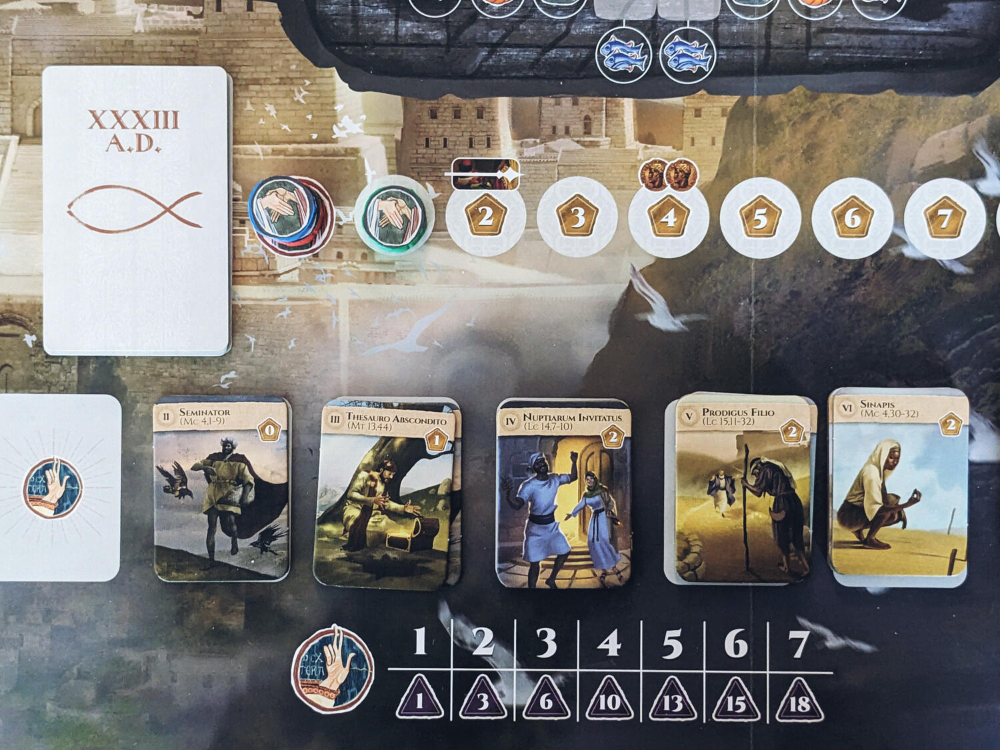
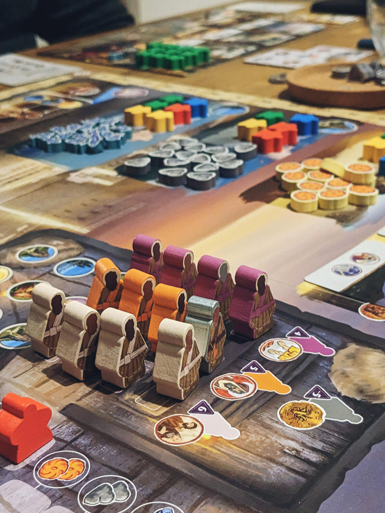
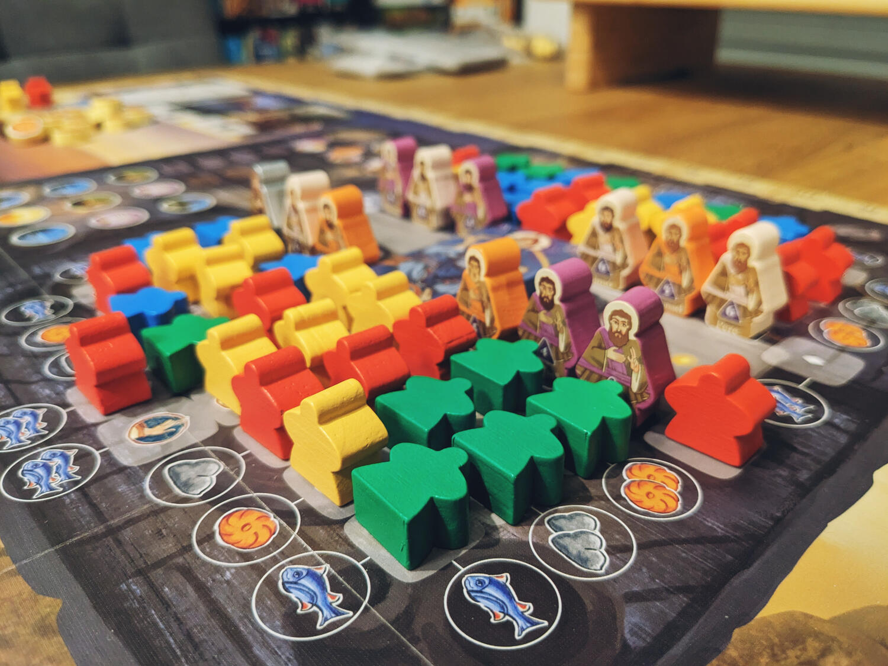

<Setting>

  I giocatori si ritroveranno a Gerusalemme, sul monte Sion, cercando di
  posizionare i loro seguaci al tavolo dell'Ultima Cena, prima che il tradimento
  di Giuda metta fine ai festeggiamenti. Come ci spiega il regolamento, è molto
  probabile che l'Ultima Cena abbia incluso molti seguaci di Gesù da
  Gerusalemme, più che essere un incontro privato tra Lui e gli apostoli. Da
  queste premesse, Ierusalem riesce a creare un gioco sugli eventi di questa
  cena, e ti spinge a posizionare tuoi seguaci il più vicino possibile a Gesù e
  agli apostoli (e il più lontano possibile da Giuda).
   I giocatori manderanno i loro seguaci in pellegrinaggio sulle montagne, nel
  deserto e sul mare a raccogliere risorse per ottenere un invito al tavolo, faranno
  favori ad altri giocatori e ascolteranno varie parabole, tutto per assicurarsi
  un post al tavolo più ambito della Bibbia.

</Setting>

<Rules>

  L'obiettivo principale del gioco è quello di inviare la gente dalla tua
  plancia personale fino all'Ultima Cena sulla plancia centrale. Questo avviene
  dapprima inviando i propri seguaci come pellegrini in uno dei tre luoghi sul
  tabellone a raccogliere risorse (deserto, montagna o mare), e da lì,
  successivamente, al tavolo dell'Ultima Cena.
   
  Ogni turno inizia allo stesso modo: si gioca una carta sulla plancia
  personale, in uno dei tre slot disponibili. Questo determina le azioni che il
  giocatore vuole effettuare. Per prima cosa si esegue <em>    l'azione luogo</em>{" "}
  (sulla parte superiore della carta) che permette di ottenere risorse (pane,
  pietra e pesce) dalle suddette posizioni sul tabellone, inviare persone dalla
  plancia personale a queste località, o concedere un'azione di mercato per
  acquistare o vendere risorse. Uno degli aspetti più interessanti è che il
  numero di risorse che si otterranno da ogni luogo sarà uguale al numero di
  pellegrini in quel luogo specifico. Dopo aver eseguito questa azione di base,
  si eseguono le <em>azioni principali </em>che possono essere iterazioni di
  quelle precedenti o altre completamente diverse, incluso l'invio di persone al
  tavolo (a volte anche gratis!), il cambio di posizione con altri invitati al
  tavolo, l’ascolto di parabole, e così via. Un altro tipo di azione che i
  giocatori possono eseguire è quella di ottenere il favore degli apostoli
  (ottenere questo beneficio dipende dall'ordine in cui le carte sono
  posizionate nei tre slot disponibili sopra citati) così da ottenere un’azione
  aggiuntiva. I dodici apostoli si siederanno a loro volta al tavolo dell'Ultima
  Cena, e sedersi al loro fianco risulterà particolarmente fruttuoso a fine
  partita.
   
  Tutte queste diverse azioni hanno come fine ultimo quello di ottenere la
  maggior quantità di punti e vincere. Ma quali punti sono sommati a fine
  partita esattamente?
   
  <ul>
    <li>      La posizione dei propri seguaci al tavolo darà il maggior numero di punti,
      e questi punti sono determinati dalla posizione relativa di ciascun
      seguace rispetto a Gesù e agli apostoli</li>
    <li>Il numero di parabole ascoltate (in una sorta di collezione set)</li>
    <li>I restanti punti raccolti in vari modi nel corso della partita</li>
  </ul>

</Rules>

<Feedback>

  Ierusalem è un gioco molto interattivo, dotato di un flusso interessante e di
  un tema fuori dagli schemi. Giocando, la sensazione è davvero quella di
  cercare di raggiungere i posti migliori al tavolo dell'Ultima Cena prima che
  sia troppo tardi. Sul tabellone c’è un movimento sorprendente e interessante,
  che nel corso del gioco evolve in un'attenta pianificazione strategica. Ma
  l'elemento che rende questo gioco particolarmente coinvolgente è l'interazione
  (spesso negativa) che avviene al tavolo dell'Ultima Cena, in cui spostarsi di
  posto a vicenda diventa un’attività necessaria per raggiungere i posti più
  ambiti, e allontanarsi da chi invece determina punti negativi a fine partita
  (Giuda).
   
  La scelta del tema tanto particolare è stata una mossa molto audace da parte
  di Devir, ma è stato sicuramente un rischio che valeva la pena correre. Non
  importa che tu sia una persona religiosa o meno: Ierusalem ti racconta
  semplicemente una storia, e lo fa nel modo più rispettoso possibile, non
  volendo scatenare polemiche o discussioni.

</Feedback>

