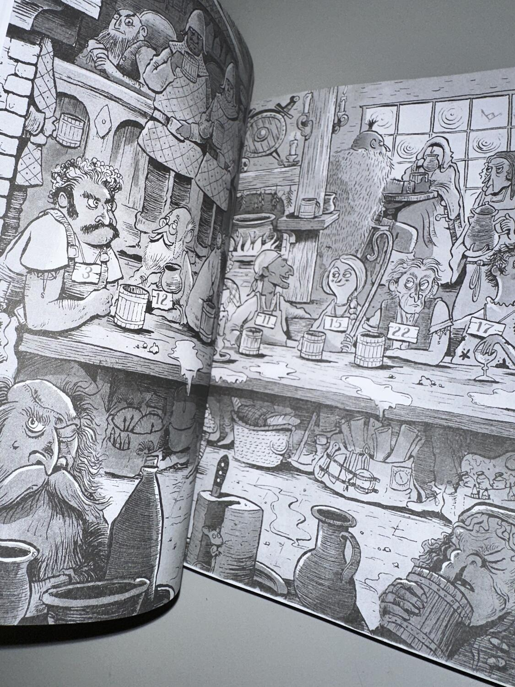
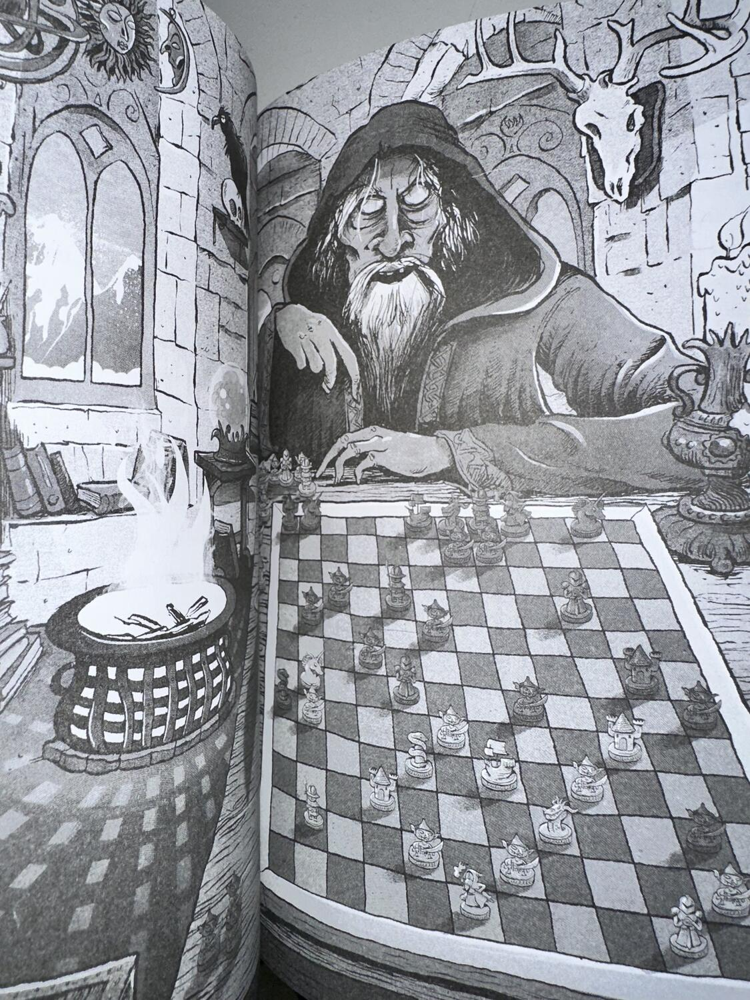
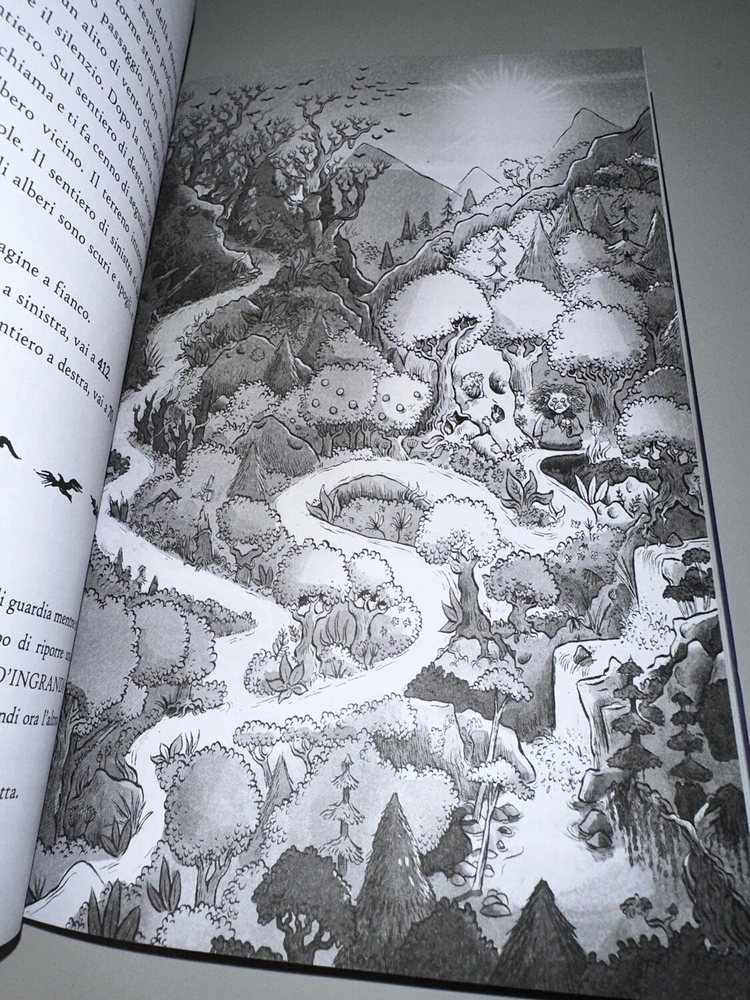

<Setting>

  Il regno di <strong>Arkendale </strong>è sotto attacco da parte delle ombre.
  Nelle città di frontiera la gente inizia a svanire nel nulla, dissolvendosi
  come nebbia, e tra le silenziose vie si aggirano delle strane figure
  incappucciate. La tua avventura inizia dalla città di{" "}
  <strong>Helmsgard</strong>, quando una notte, sbirciando dalla tua finestra,
  capisci quanto le ombre siano sempre più vicine. Attraversa un mondo fantasy,
  abitato da meravigliose creature ma anche da nemici ingannevoli e senza
  scrupoli. Esplora Arkendale, attraverso le sue città, le sue montagne, i suoi
  mari e anche solcando i cieli, alla ricerca di risposte. Insieme a te ci
  saranno personaggi pronti a tutto per aiutarti nella tua impresa. Sei pronto a
  compiere il tuo destino e a fermare le ombre?

</Setting>

<Rules>

  Il nostro personaggio si chiama Rowan. Tramite le nostre scelte, paragrafo
  dopo paragrafo (per un totale di 435), comprenderemo sempre più il nostro
  ruolo all'interno del mondo di Arkendale. Le meccaniche di gioco sono molto
  semplici, riprendono pienamente dal bagaglio classico dei librigame: abbiamo
  una scheda personaggio su cui appuntare gli oggetti, le armi, le armature e le
  abilità del nostro protagonista, che sono 4: Sesto Senso, Atleticità,
  Resistenza, Destrezza; tutte iniziano con un valore di 3 e man mano che si va
  avanti nel libro ci sarà la possibilità di aumentarle.  
  Le abilità servono per sbloccare delle scelte all'interno di alcuni paragrafi,
  in base al valore che hanno. Armi e Armature, invece, servono per i combattimenti.
  Alcuni di questi oggetti danno dei bonus oppure permettono di attaccare determinati
  nemici. I combattimenti si basano sul tiro di due dadi a 6 facce, così come tutte
  le prove presenti nel libro. Il giocatore, prima di tirare i dadi, deve scegliere
  quanti danni fare al suo avversario tra 1, 3 e 5, e in base al valore scelto, dovrà
  ottenere un risultato con i dadi che sia più alto del danno dichiarato di almeno
  6 unità. Altro punto fondamentale delle meccaniche del libro sono gli enigmi, che
  si basano quasi sempre sull’analisi di illustrazioni.

</Rules>

<Feedback>

  Penso che per questo libro valga in pieno il proverbio: "Non giudicare mai un
  libro dalla copertina". Vedendolo da fuori vi aspettereste un fantasy per
  ragazzi, ma una volta aperto ci troverete molto altro.  
  L’elemento che spicca è sicuramente la caratterizzazione del mondo di gioco ma
  soprattutto personaggi secondari e del mondo di gioco, con una loro storia, un
  loro background, una loro personalità e un loro pensiero, il che è davvero raro
  per un librogame. Di solito i personaggi che si incontrano sono supporti o comparse,
  mentre in questo titolo sono dei veri e propri comprimari, al punto che spesso
  ci si ritrova a compiere scelte in loro favore piuttosto che per il proprio obiettivo.{" "}
   
  Anche il mondo intorno a noi risulta vivo, popolato da gente che svolge la
  propria quotidianità indipendentemente dalla storia principale. Belle anche le
  quest secondarie di alcuni personaggi, anche antagonisti, che vanno portate a
  termine con i vari oggetti che troveremo nel percorso.  
  Se il lavoro di Simon Tudhope mi ha emozionato sotto il punto di vista narrativo,
  non si può tuttavia dire lo stesso dal punto di vista del gameplay. Il tiro dei
  dadi influenza troppo il gioco, e un po’ di sfortuna costringe a ricominciare il
  libro dall’inizio una miriade di volte, soprattutto verso il finale dove i dadi
  da tirare diventano veramente tanti e il fallimento è dietro l’angolo. Sarebbe
  stata apprezzabile l'introduzione di qualche checkpoint, in questo senso.  
  Ciononostante, Il Cacciatore di Ombre rimane una lettura consigliata. La
  storia, il mondo e i personaggi che incontrerete vi rimarranno impressi nella
  mente, le illustrazioni e gli enigmi vi terranno con gli occhi incollati alle
  pagine, mentre i dadi vi faranno maledire il giorno che l'avete iniziato. Un
  mix di emozioni assolutamente da provare.

</Feedback>

