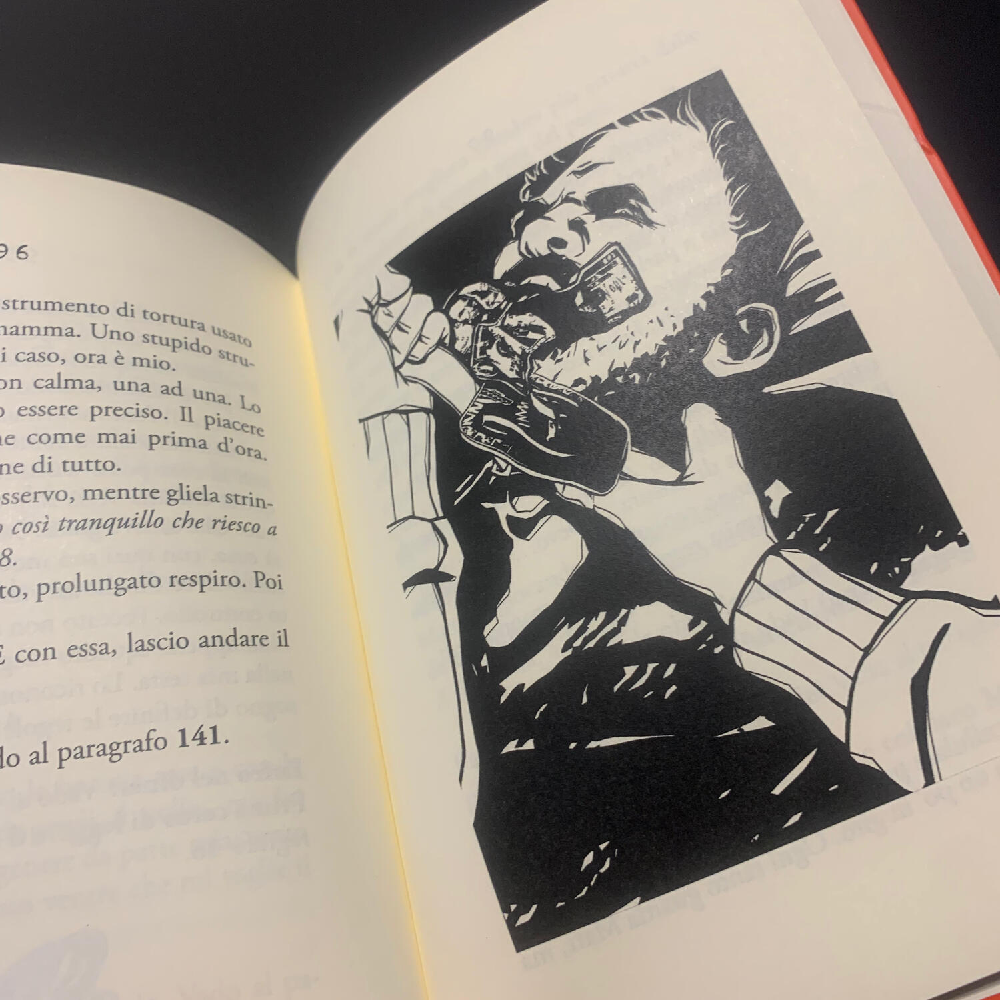
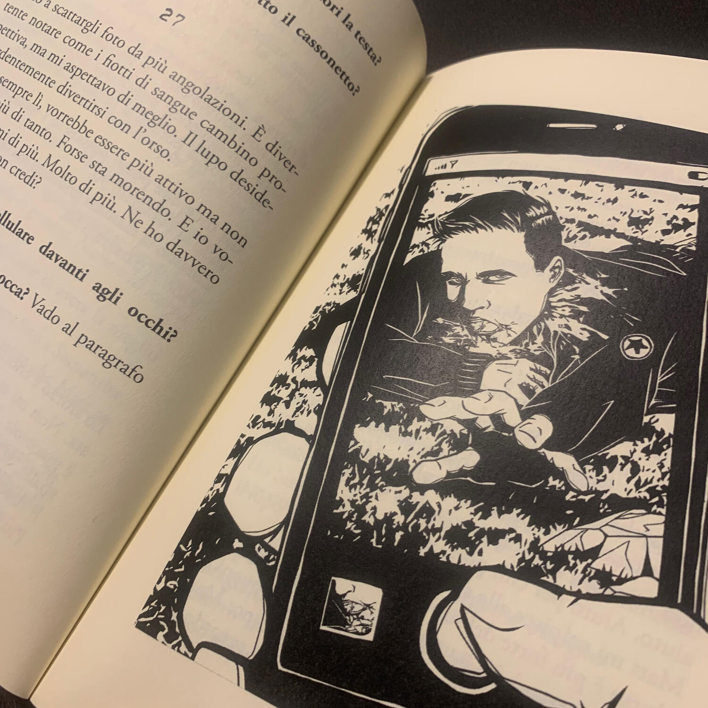

<Setting>

  “Mi chiamo Simon.
   
  Sono gracile e un po' testardo, almeno è così che gli altri mi considerano. Ma
  la verità è che un fuoco mi pulsa in testa da quando TU non ti sei fatto più
  vivo. Da quel momento il fuoco non mi ha più abbandonato: per calmarlo, devo
  uccidere. Come? Odio gli uomini che trattano male le donne. Allora io tratto
  male loro.
   
  Sembro calmo, ma sono pieno di desideri oscuri. Sembro innocuo, ma so come
  farmi temere. Sembro un ragazzo, ma in realtà sono… Il lupo del Maine.”

</Setting>

<Rules>

  Simon vi permetterà di leggere il suo <strong>diario</strong> dove ha annotato
  tutti i pensieri e le azioni che lo hanno portato a commettere questi omicidi.
   
  Il vostro scopo sarà quello di addentrarvi nella mente del{" "}
  <strong>serial killer</strong>, capire il suo <strong>modus operandi</strong>{" "}
  e utilizzarlo per fargli raggiungere l'obiettivo.
   
  Ma andiamo con calma: dopo aver letto il primo paragrafo, prenderete la prima
  decisione e via via così fino al finale, commettendo quei famosi{" "}
  <strong>tre omicidi</strong>. In realtà, ci sono molti finali, uno solo dei
  quali è "positivo". Positivo per Simon… un po' meno per le vittime.
   
  Nel libro sono presenti <strong>160 paragrafi</strong>, uno dei quali è
  l'epilogo, ovvero un racconto che spiega cosa ha portato Simon ad
  intraprendere questa strada e capace di far capire ancora meglio la sua
  figura. Leggere l'epilogo, però, non sarà facile: nel corso di tutto il
  racconto saranno presenti delle <strong>parole in corsivo</strong> che, se
  interpretate nel modo corretto, vi daranno accesso al paragrafo dove potrete
  trovarlo.

</Rules>

<Feedback>

  Sono tutt'ora combattuto su cosa disturbi più di questo libro game: la dose di
  oscurità che provi mentre ti addentri nella <strong>mente di Simon</strong> o
  il fatto che chi ha partorito questo libro è lo stesso autore di{" "}
  <Link to="/reviews/chicken-crimes-il-mistero-del-dom-gallignon/">
    Chicken crimes
  </Link>
  .
   
  L'esperienza di gioco è <strong>molto forte</strong>, <strong>cruda</strong>, assolutamente
  per un <strong>pubblico adulto</strong> e <strong>    poco impressionabile</strong>: vi troverete a parteggiare per un serial killer, augurandogli di riuscire
  nel suo intento di commettere tre omicidi, davvero tetri e impressionanti. Riuscire
  in questo intento al primo colpo è pressoché impossibile… e se ci riuscite non
  voglio conoscervi… davvero, avrei paura per la mia stessa vita. Se invece siete
  delle persone senza i disturbi mentali di Simon, vi consiglio di "salvare" dopo
  ogni omicidio, segnandovi il numero di capitolo dove siete arrivati, per poter
  ricominciare da lì invece che dal paragrafo 1.
   
  Peccato che non sia presente uno spazio dove prendere appunti (per annotare le
  sopracitate parole in corsivo): come tutti sappiamo, procurarci un foglio di carta,
  quando serve, è una missione impossibile.
   
  Da un punto di vista narrativo, invece, il racconto mi è piaciuto molto, anche
  se avrei voluto poter approfondire la conoscenza e i pensieri di alcuni personaggi,
  a costo di renderlo eccessivamente prolisso.  
  Inoltre, le <strong>dimensioni tascabili</strong> dell'opera e la mancanza di
  ulteriori elementi oltre al libro stesso, lo rendono perfetto per essere letto
  anche durante gli spostamenti da pendolari. Le <strong>immagini</strong> a
  tutta pagina, inoltre, sono davvero <strong>spettacolari</strong>.  
  Considerato tutto questo e quanto sia stato capace di smuovermi, l'unica cosa che
  posso davvero consigliarvi è la sua lettura.

</Feedback>

