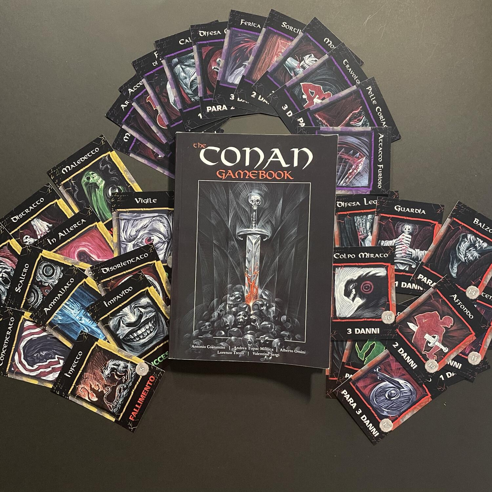
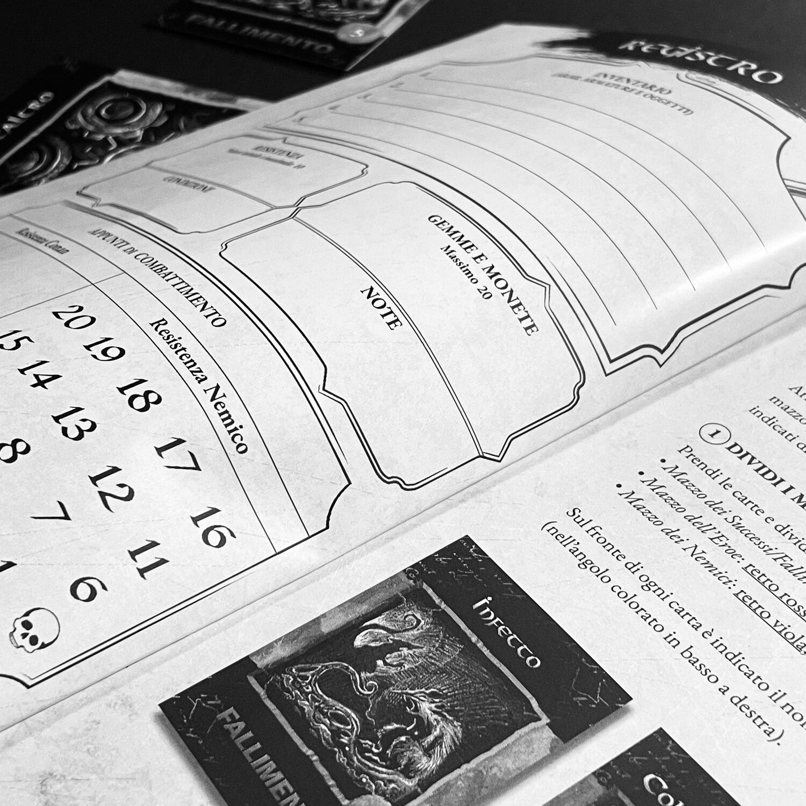

<Setting>

  <em>La Torre dell’elefante</em>, <em>Il palazzo dei morti</em>,{" "}
  <em>Il Dio nell’urna</em>, <em>Gli intrusi a palazzo</em> e{" "}
  <em>La figlia del Re dei ghiacci</em>: <strong>cinque avventure</strong> che
  vi porteranno davanti a tesori nascosti, enigmi complessi, misteri
  indecifrabili, prove letali e orrende creature, in un mondo selvaggio, mistico
  e brutale, fatto di demoni, falsi amici e pericoli d'ogni sorta. Ogni scelta
  sarà sofferta: ucciderete il mostro o ascolterete la sua storia? Salverete le
  donzelle in pericolo o andrete per la vostra strada? Vi fiderete del vostro
  alleato o vi guarderete costantemente le spalle temendo il peggio? Non
  esitate: siate impavidi, scaltri e generosi. In questo libro, Conan sarete
  voi!

</Setting>

<Rules>

  <em>Il Sangue del Barbaro (alias The Conan Gamebook)</em> consiste in una
  narrazione sviluppata in più o meno brevi <strong>paragrafi numerati</strong>,
  a conclusione di ciascuno dei quali al lettore-giocatore viene richiesto di
  compiere una <strong>scelta narrativa univoca</strong>: la scelta comporterà
  la continuazione della storia in una direzione o in un’altra, portando a un
  altro paragrafo numerato e così via, fino a{" "}
  <strong>UNA delle possibili conclusioni</strong>. Il lettore-giocatore
  interpreta il protagonista, Conan, il quale possiede un profilo narrativo e un
  profilo ludico: il <strong>profilo narrativo</strong> rappresenta il
  personaggio dal punto di vista della narrazione, ovvero il ben noto barbaro
  della Cimmeria, con i suoi muscoli e il suo ardimento, ma anche il suo sistema
  di valori e di credenze; la carta d’identità definitiva di questo personaggio,
  tuttavia, consisterà solo per il 50% nel profilo voluto dall’autore: per il
  restante 50%, egli rivivrà nelle scelte del giocatore, risultando in un ibrido
  estremamente accattivante dal punto di vista metaletterario. Il{" "}
  <strong>profilo ludico</strong> consiste invece in un personaggio da gioco di
  ruolo, con una sua <strong>Resistenza</strong>, con delle{" "}
  <strong>Condizioni psico-fisiche</strong>, con un suo{" "}
  <strong>Inventario</strong> fatto di oggetti, monete, protezioni, armi. Il
  libro-gioco dedicato a Conan prevede <strong>momenti narrativi</strong> e
  momenti di <strong>abilità o combattimento</strong>: ogni situazione richiede
  di essere attentamente ponderata e, non di rado, una decisione avventata si
  risolverà in un incontro pericoloso, se non addirittura nella morte diretta e
  senza appello del protagonista. Il combattimento è settato su una scala di{" "}
  <strong>difficoltà</strong> <strong>media</strong>, ma prima di iniziare
  l’avventura si può scegliere di renderlo più <strong>facile</strong>, con
  scontri più rapidi e meno tattici, o più <strong>difficile</strong>, con
  scontri più lunghi e logoranti. Il sistema di prove di abilità e di
  combattimento è basato su un mazzo di carte costituito da tre sottomazzi (
  <strong>Nemici</strong>, <strong>Eroe</strong>,{" "}
  <strong>Successi e Fallimenti</strong>), per cui ogni sfida richiede di
  pescare un certo numero di carte e confrontarle con un certo livello di
  difficoltà o di combinarle per fiaccare la resistenza dei nemici. Mentre
  l’esito delle prove è in prevalenza casuale, il combattimento risulta
  gestibile sulla base di un calcolo matematico-probabilistico: sapendo
  esattamente cosa c’è nel mazzo del nemico, si potrà valutare a tavolino
  l’esito più conveniente dello scontro, anche se nessun calcolo potrà mai
  salvarvi dalla vostra scarsa capacità di giudizio…

</Rules>

<Feedback>

  Se siete stati lettori appassionati dell’indimenticabile{" "}
  <em>Robert Ervin Howard</em>, se avete fatto le prime esperienze di
  libro-gioco con lo storico <em>Lupo Solitario</em>, se avete cari i piccoli
  racconti pieni di suspense, dove ogni scelta cambia tutto, dove dovete
  ponderare ogni minima azione, dove lo scontro è estremamente tattico e, sì, se
  avete riso a crepapelle guardando il Conan di quell’energumeno repubblicano di{" "}
  <em>Arnold Schwarzenegger</em>… non potete assolutamente perdervi le avventure
  di questo libro-gioco. <em>Il Sangue del Barbaro</em> è un classico nel suo
  genere, che ripropone fedelmente l'atmosfera pseudo-romana/bizantina/barbarica
  dell'opera di Howard, in un sorprendente quanto vincente mix di esperienze
  letterarie: si va dal giallo al mistery, dall'epica all'avventura. Ogni
  paragrafo vi proporrà delle scelte che stimoleranno in voi sensazioni
  ancestrali: coraggio, ardimento, temerarietà, codardia, nobiltà d’animo,
  scaltrezza, arguzia (e stupidità…). Avvertirete chiaramente l'evoluzione del
  vostro personaggio nel corso delle cinque storie, dato che non solo
  l'Inventario ma anche il mazzo del Set delle prove di Conan può svilupparsi in
  base alle scelte che farete, e perfino il modo in cui concluderete una storia
  influirà sul percorso dell'eroe nel tempo. Certo, occorrerà un po’ di fortuna
  per arrivare alla fine, se non del tutto incolumi, quantomeno nel pieno delle
  proprie facoltà mentali, ma la ricompensa per aver concluso un percorso così
  accidentato sarà straordinaria. La narrazione di ogni episodio è studiata con
  scrupolosa attenzione e avrete la possibilità di rigiocare ogni avventura
  diverse volte prima di esaurire tutte le varianti narrative previste. Ma anche
  qualora voleste fermarvi e preferiste “leggere” il librogame, piuttosto che
  giocarlo, anche la lettura vi risulterà gratificante. Tutto ciò, oltre che
  incrementare la longevità dell’aspetto ludico di un prodotto costruito con
  perizia da cinque grandi maestri dell’intrattenimento interattivo, ne aumenta
  plasticamente le possibilità di godimento. Davvero{" "}
  <strong>da non perdere</strong>!

</Feedback>
