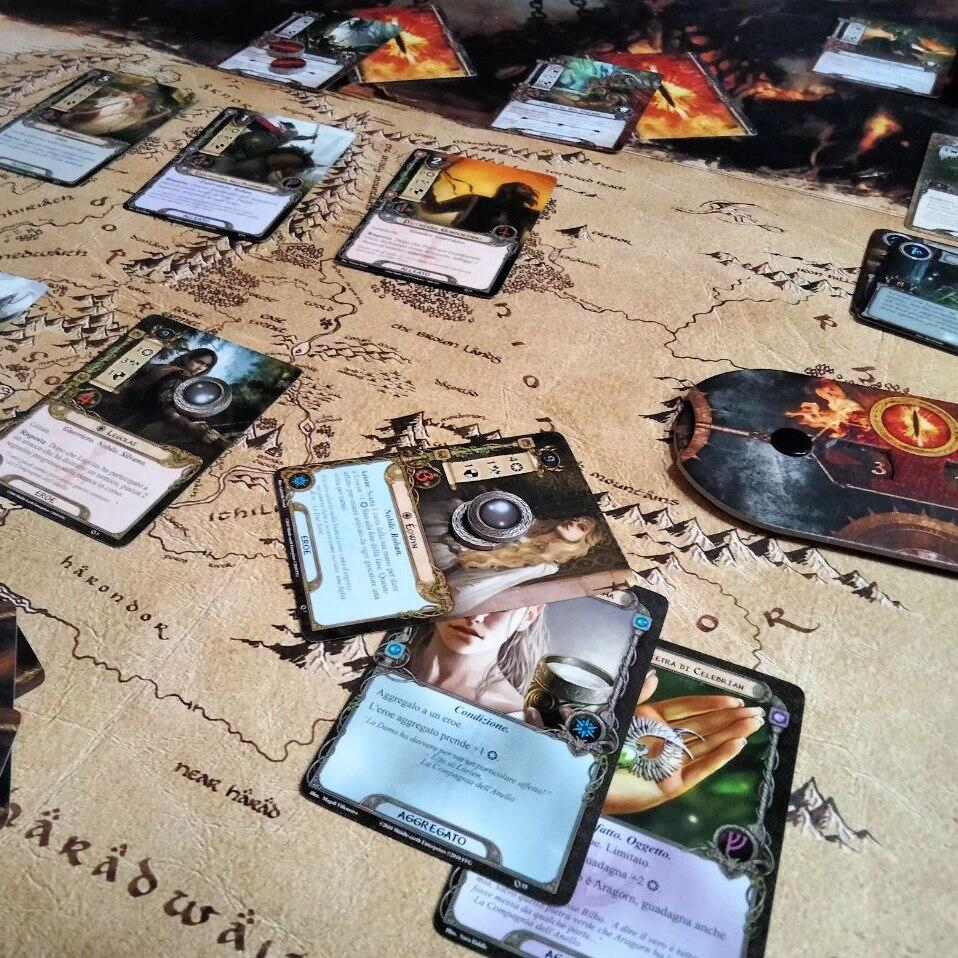
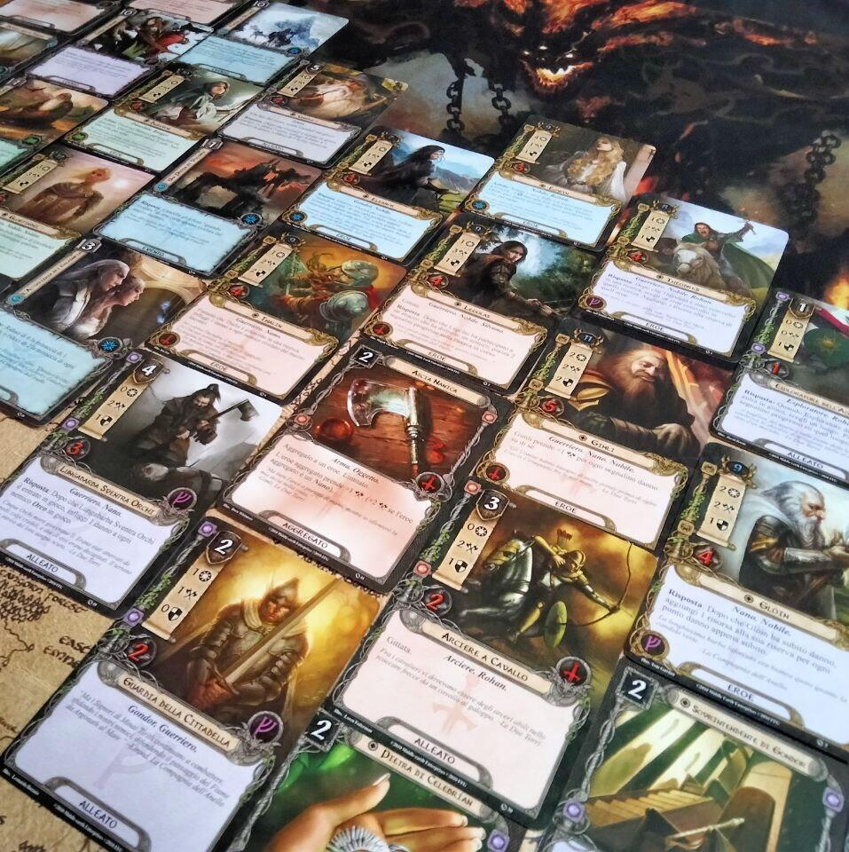

<Setting>

  Il Signore degli anelli: Il Gioco di Carte è un gioco di eroi, viaggi
  perigliosi e avventure nelle terre descritte nel capolavoro fantasy creato da
  J.R.R. Tolkien, Il Signore degli Anelli. In questo gioco, i giocatori assumono
  il ruolo di un gruppo di eroi che cercano di portare a termine pericolose
  ricerche. Queste missioni hanno luogo in un intervallo temporale di 17 anni:
  da quando Bilbo celebra il suo centounesimo compleanno (e il trentatreesimo di
  Frodo) ai giorni che precedono la partenza di Frodo dalla Contea; dunque, non
  ripercorrono le classiche storie già narrate nei libri e nelle pellicole del
  grande schermo, bensì consentono ai giocatori di vivere nuove avventure nella
  Terra di Mezzo.
   
  Per quanto concerne le avventure contenute nel set base, sono ambientate nel
  cuore di Bosco Atro, dalla Vecchia Strada della Foresta, viaggiando lungo
  l'Anduin, fino agli antri oscuri di Dol-Guldur. I nemici non si
  risparmieranno: orchi, troll, warg, ragni e mostri provenienti dal bosco
  saranno pronti a tendere ogni tipo di agguato agli avventurieri, cercando di
  impedire loro in tutti i modi di portare a termine la missione.

</Setting>

<Rules>

Il Signore degli Anelli: Il Gioco di Carte è un gioco cooperativo in cui i giocatori agiscono insieme per completare uno scenario. Ogni giocatore avrà a disposizione un mazzo di almeno 50 carte e 3 eroi, accuratamente preparato prima di affrontare l'avventura, che verrà gestita completamente con un mazzo di nemici, formato da carte di volta in volta diverse e che è possibile preparare in meno di cinque minuti.
 
Le carte Giocatore sono divise in quattro sfere, con diversi stili di gioco, che indicano quali risorse il giocatore deve spendere per poter giocare una determinata carta. Attenzione però: non tutte le sfere sono disponibili, bensì è possibile utilizzare unicamente risorse compatibili con le sfere dei propri Eroi. In ogni sfera, troviamo carte Alleato, Evento o Aggregato.
 
Le carte Incontro (il mazzo dei nemici), a loro volta, sono divise in Nemici, Luoghi o Perfidie e, per alcuni scenari, anche Obiettivi. 
 
Il gioco si svolge su diversi Round, durante i quali i giocatori dovranno utilizzare alcuni eroi o alleati per compiere l'impresa di turno e usare i rimanenti per difendersi dagli attacchi dei nemici e contrattaccare. I giocatori vincono la partita se riescono ad arrivare alla fine delle carte Impresa, viceversa perdono qualora tutti i giocatori raggiungano il livello di Minaccia di 50 o tutti gli eroi vengano sconfitti. 
 
La versione aggiornata del gioco, introduce la modalità Campagna, che grazie all'ausilio di alcune carte speciali, consente di legare le avventure offrendo la possibilità di vivere i tre scenari come un'unica avventura, tramite bonus o malus a seconda dell'esito di ogni singolo scenario.

</Rules>

<Feedback>

  Il Signore degli Anelli: Il Gioco di Carte riesce perfettamente ad immergere i
  giocatori nel mondo della Terra di Mezzo, offrendo un'ampia gamma di Nemici da
  affrontare, nonché Alleati da affiancare ai propri Eroi. Le tre avventure nel
  set base consentono un rapido apprendimento delle regole, aumentando in
  maniera alquanto rapida il grado di sfida. Le carte Giocatore presenti nel
  set, specie nella versione aggiornata, consentono di giocare fino a quattro
  giocatori, sebbene i mazzi consigliati non siano ottimizzati per le avventure.
  Nel regolamento sono presenti anche due mazzi per affrontare il gioco in
  solitario o in due giocatori, e personalmente ritengo tali mazzi performanti
  per affrontare le avventure del set base, anche nella modalità Campagna.
   
  Ovviamente, il gioco è un Living Card Game, dunque è possibile incrementare e
  personalizzare il gradimento e l'esperienza di gioco con l'acquisto di nuove
  espansioni. Allo stato attuale del gioco, sono presenti quattro mazzi
  precostruiti per i giocatori per le principali razze della terra di mezzo
  (Cavalieri di Rohan, Difensori di Gondor, Elfi di Lorien e Nani di Durin), che
  introducono nuove strategie e combo tra le carte; un Pack Scenario, che
  aggiunge due nuove avventure ambientate a Bosco Atro ed è prevista la ristampa
  di un set di avventure e carte Giocatore ambientate nell'Eriador, con
  rispettiva modalità campagna.
   
  Il Signore degli Anelli: Il Gioco di Carte è sicuramente un titolo degno di un
  posto di rilevanza nella libreria di ogni appassionato dell'opera del
  Professore: le avventure riescono di volta in volta a sorprendere sia dal
  punto di vista della narrazione che delle meccaniche, diverse ed innovative
  per ogni missione, che vi permetteranno con un semplice mazzo di carte di
  inseguire nemici, catturarli, cercare ingredienti o altri oggetti, completare
  dei contratti… Il tutto nella fantastica cornice della Terra di Mezzo, al
  fianco dei vostri Eroi preferiti.

</Feedback>

