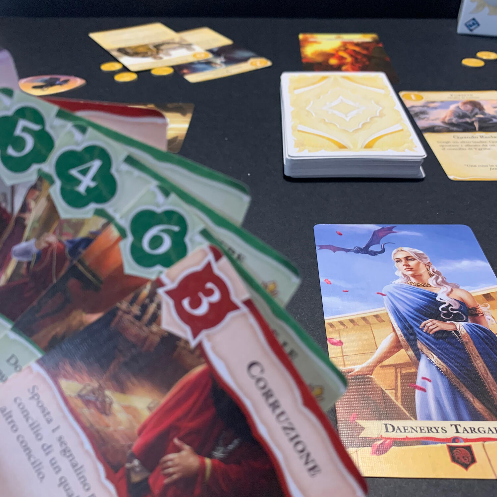

<Setting>

  Manipolate le complicate politiche di Approdo del Re nell'imperdibile lotta
  per il potere, per la gloria, per il trono di spade.
   
  Il trono che venne forgiato su ordine di Aegon il conquistatore, il primo dei
  re Targaryen, dopo aver conquistato gran parte di Westeros. Il trono composto
  dalle 1.000 spade che si arresero durante la Guerra della Conquista. Il trono
  sul quale tutti vorrebbero sedere.
   
  Assumete la guida della vostra casata e utilizzate la vostra influenza per
  attirare a voi nuovi alleati, cospirate per ottenere il controllo, stipulate
  astute alleanze e tradite i vostri "amici" nel momento più opportuno.
   
  Quando si gioca al gioco del trono, o si vince o si muore. Non esistono terre
  di nessuno.

</Setting>

<Rules>

  Per vincere il gioco del trono in "Il Trono di Spade: terre di nessuno"
  bisogna fare in modo di essere il giocatore con il concilio più potente... tra
  i due che ognuno dovrà costruire nel corso della partita. Il concilio non è
  altro che un'area di gioco dove i leader delle casate (i giocatori) collocano
  le loro “carte alleato”. Queste, oltre ad avere una capacità unica, danno
  potere, ovvero punti vittoria, a fine partita. Ogni giocatore deve posizionare
  questi personaggi sia nel concilio condiviso con il giocatore alla propria
  sinistra sia in quello alla propria destra. Non c'è nessuna restrizione su
  dove collocarli ma, a fine partita, ogni giocatore dovrà prendere in
  considerazione solamente il concilio più ristretto, quello con meno potere.
   
  Occorre precisare che un giocatore potrà annettere questi alleati dentro uno
  dei propri concili solamente dopo aver vinto un'asta di influenza (determinata
  dalle carte giocate): a turno, ogni giocatore dovrà ritirarsi o calare una
  carta rappresentante sia la forza di suggestione, sia un particolare effetto.
  Alcune carte permetteranno di rubare influenza ad altri, alcune di
  appropriarsi del potere altrui, altre ancora obbligheranno i propri vicini a
  doversi comportare in un determinato modo. Così facendo, l'alleato entrerà
  nelle vostre grazie portando con sé un potere caratterizzante e un segnalino
  potere ignoto a tutti, capace di dare ulteriori punti e di rendere più forte
  il concilio che si pensava essere il più debole... o viceversa.
   
  Inutile dire che le alleanze non sono scritte sulla pietra e che i tradimenti
  sono all'ordine del round: bisogna tenersi gli amici vicini e i nemici ancora
  di più.
   
  Alla fine della stagione, che in round corrisponde al numero di alleati che
  sarà possibile influenzare, tutti i giocatori pescheranno nuovamente le carte
  influenza e si continuerà a giocare fino a quando arriverà l'inverno e si
  decreterà il vincitore.

</Rules>

<Feedback>

  Il "Trono di Spade: terre di nessuno" si gioca tutto tra un leggero equilibrio
  sul quando uscire allo scoperto a scommettere, quanto scommettere e contro chi
  scommettere.
   
  Ha senso prendere questo alleato? O è meglio tenere le carte influenza per il
  prossimo? E se scommetto su questo, chissà se il prossimo non mi ammazzerà
  qualche membro del mio concilio. Non basta solo aver fortuna, bisogna avere
  anche tempismo.
   
  Questo gioco è in grado di farvi esaltare per le piccole vittorie, che
  probabilmente vi verranno spazzate via nel round successivo, ma poco importa.
   
  Oltre al gioco base, il regolamento prende in considerazione alcune varianti
  che, a mio avviso, rendono il tutto sicuramente più interessante: l'asimmetria
  delle casate, definite da carte influenza specifiche e uniche, e la versione
  breve che ne dimezza la durata, e risolve così l'unico neo del gioco.
   
  "Trono di Spade: terre di nessuno" è il gioco nel gioco nel gioco. Il gioco
  dei troni di George R. R. Martin, il gioco dove spargi influenza per ottenere
  alleati, e il gioco dove fai bello e il cattivo tempo con i tuoi amici al
  tavolo. Oltre ad influenzare le carte alleato, dovrete raggirare i vostri
  amici in carne e ossa, mostrandovi affidabili quando vi fa comodo e
  pugnalandoli nel momento perfetto, senza fare prigionieri.
   
  In fondo si sa, questo è il Trono di Spade: o si vince o si muore.

</Feedback>

