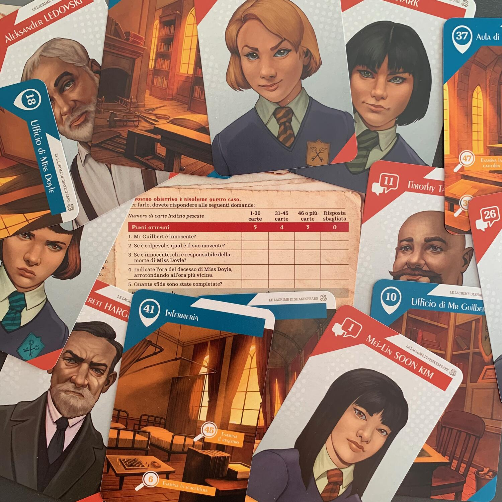
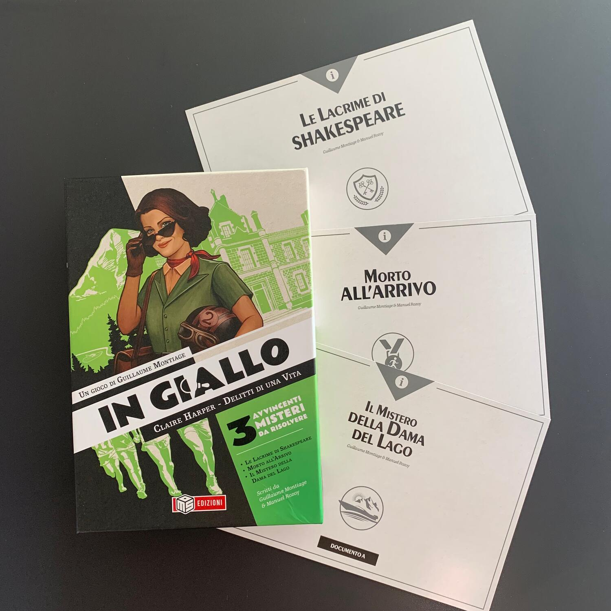

<Setting>

  Claire Harper, nella sua vita, ne ha viste tante. Ma tante tante.
   
  Tre eventi l'hanno toccata nel profondo.  
  Quando Miss Doyle, l'insegnante di letteratura, è stata trovata morta.
   
  Quando quella maratona durante le Olimpiadi di Londra sembrava nascondere qualcosa
  di losco.
   
  Quando un tranquillo viaggio in Svizzera si è trasformato in una caccia all'assassino.{" "}
   
  Siete pronti a <strong>rivivere questi 3 casi</strong> che hanno cambiato la
  sua vita per sempre?

</Setting>

<Rules>

  Nella scatola troverete <strong>tre casi</strong>: "Le lacrime di
  Shakespeare", "Morto all’arrivo" e "Il mistero della dama del lago". Ogni caso
  è definito da <strong>un mazzo di carte e da elementi extra</strong>, come ad
  esempio piantine (mappe, non bonsai), elenchi telefonici e tanto altro.
   
  Il vostro compito è, ovviamente, quello di risolvere il caso. Risolvere il
  caso significa rispondere a delle domande che vi vengono poste dal gioco dopo
  che avete letto l'introduzione.
   
  Per rispondere dovrete seguire molte piste, parlare con molte persone,
  ispezionare oggetti e chi più ne ha più ne metta.{" "}
  <strong>Quando finirete il mazzo</strong> (e quindi avrete letto tutte le
  carte), <strong>la partita terminerà e dovrete dare la soluzione</strong>.
  Leggete quella fornita dal gioco e controllate se avete risposto correttamente
  alla domande. Ogni domanda vi darà un tot di punti vittoria: più ne
  collezionerete, più sarete dei provetti Hercule Poirot!

</Rules>

<Feedback>

  Se mi seguite, sapete che molte volte le mie impressioni iniziano con un
  "Premetto", e questa volta non sarò da meno.  
  Premetto che <strong>sono un cane negli investigativi</strong>, ma che l'idea di
  giocarne uno e di arrivare più o meno alla soluzione corretta mi eccita sempre
  tantissimo. Con questo titolo, avendo a disposizione tre casi, sono riuscito, partita
  dopo partita, a <strong>capire cosa e perché fallivo nel mio intento</strong> (se
  vi interessa contattatemi su Instagram e parliamone), finché non ho completato
  un caso con il massimo dei voti! Solamente per questo, consiglio di giocarlo!  
  In ogni caso, il gioco è davvero molto bello, sia per quanto concerne i
  materiali, sia per le storie raccontate. Tutto gira attorno a un mazzo di
  carte, ognuna delle quali verrà utilizzata in svariati modi: nella maggior
  parte dei casi vi limiterete a leggerla; in altri, dovrete combinarla con
  altre per ottenere ancora più informazioni; in altri, beh… non vi faccio
  spoiler!
   
  Come dicevo, nella scatola ci sono 3 casi e teoricamente si potrebbero giocare
  nell'ordine che si preferisce (come un{" "}
  <Link to="/reviews/unlock-escape-adventures/">Unlock</Link>), ma non fatelo.
  Infatti, voi risolverete questi casi nelle varie fasi della vostra vita:
  quando andate a scuola, nella maggior età e più avanti con gli anni: chissà
  che non troverete qualche <strong>easter egg</strong>!  
  Secondo me, il punto di forza di questa collana, è il <strong>    livello di accesso</strong>: sono investigativi <strong>facili ma non banali</strong>, con una bella
  durata. Le domande che vengono poste all'inizio permettono subito di concentrarsi
  sulle vie ottimali da seguire per ottenere le informazioni a noi utili. Ogni domanda
  darà punti se la risposta è corretta, ma più carte saranno girate, più punti andranno
  persi. Le risposte si possono dare (o cambiare) fino a che non viene girata l'ultima
  carta del mazzo. Questo rende il gioco poco punitivo e, soprattutto, fa percorrere
  sempre tutte le strade prima del momento delle risposte, togliendo un po' di pepe
  e di brivido.  
  In giro ho letto che alcuni, per aumentare il livello di sfida,{" "}
  <strong>    diminuiscono il numero totale di carte che si possono analizzare</strong>
  , obbligando così a dire addio a qualche percorso. Ecco, questo non era il mio
  caso.
   
  Ringrazierò sempre questo titolo per avermi permesso di completare un caso correttamente.{" "}
   
  Quindi: se siete dei cani come me ma vi incuriosiscono gli investigativi,
  andate tranquilli. Se siete dei boss… utilizzate qualche regola per
  complicarvelo un po' oppure buttatevi direttamente su{" "}
  <Link to="/reviews/sherlock-holmes-consulente-investigativo/">
    Sherlock Holmes Consulente Investigativo
  </Link>
  !
   
  Invece, se siete degli amanti del genere, mi consigliate il prossimo titolo da
  affrontare? Grazie!

</Feedback>

