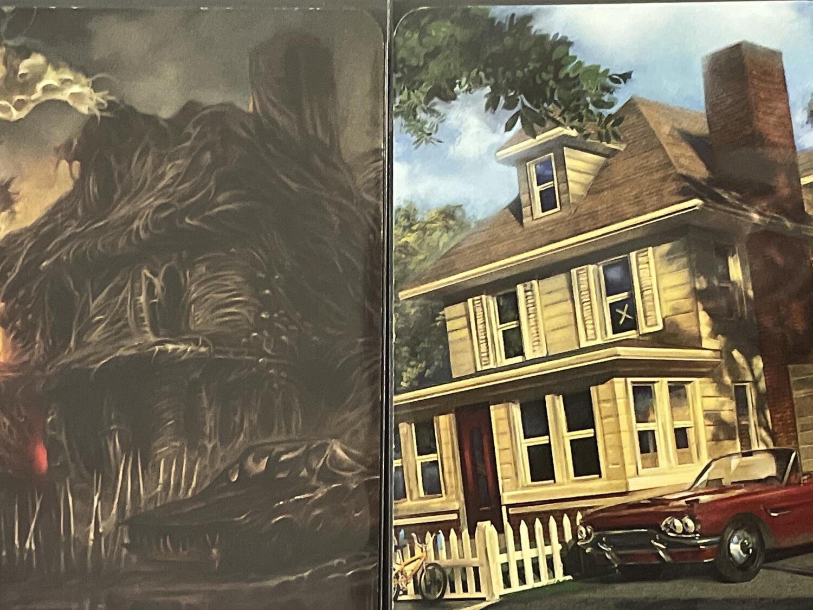
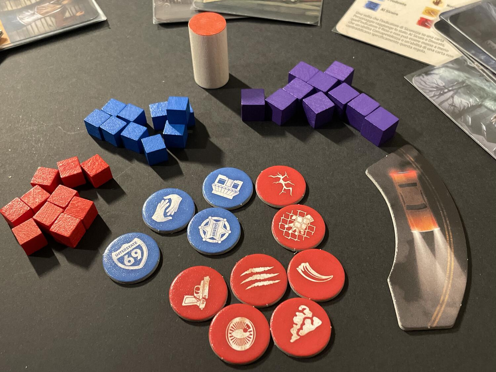

<Setting>

  <strong>Qualcosa di oscuro</strong> serpeggia tra le strade di{" "}
  <strong>Upsideville</strong>. <strong>Le persone spariscono</strong> senza
  lasciare tracce. Le rare volte in cui riesci a incrociare gli sguardi di amici
  e vicini riconosci la <strong>paura</strong> nei loro volti. Gli{" "}
  <strong>occhi sgranati</strong> trasmettono un muto e gelido messaggio dettato
  dalla <strong>disperazione</strong>: "Cosa ci sta succedendo? Non voglio
  essere il prossimo…"
   

</Setting>

<Rules>

  In <em>InBetween</em> due giocatori si sfidano, come il gioco stesso
  suggerisce, in un <strong>tiro alla fune interdimensionale</strong> tra la{" "}
  <strong>Città</strong> e la <strong>Creatura</strong>, per proteggere o
  divorare gli abitanti di Upsideville.
   
  Delle 18 <strong>carte Personaggio</strong>, se ne collocano in cerchio 10,
  alternandone i lati tra dimensione Umana e dimensione della Creatura.
  All'inizio, tutte le carte Personaggio sono nello{" "}
  <strong>stato InBetween</strong>, senza{" "}
  <strong>indicatori di Sicurezza</strong> su di esse. Sulla prima carta
  Personaggio rivelata con il simbolo Stella si collocherà il{" "}
  <strong>segnalino Attività</strong>, che si sposterà nel senso del{" "}
  <strong>segnalino Direzione</strong> (inizialmente orario): il colore visibile
  sarà quello opposto alla dimensione della carta Personaggio e determinerà il{" "}
  <strong>primo giocatore attivo</strong>. Prima di iniziare, ogni giocatore
  otterrà 5 <strong>cubi Energia</strong> iniziale nel proprio colore e comporrà
  la propria mano iniziale pescando 3 carte dal suo <strong>Mazzo</strong>,
  formato da <strong>28 carte</strong> in totale: tutte diverse per la Città; 7,
  ciascuna in 4 copie, per la Creatura.
   
  Ogni <strong>Turno</strong> si sviluppa in <strong>4 Fasi</strong>,
  nell'ordine:
   
  <ol>
    <li><strong>Fase Consapevolezza</strong>: il giocatore attivo può utilizzare (una volta per partita) la propria abilità Consapevolezza.</li>
    <li>      <strong>Fase Azioni</strong>: il giocatore attivo deve svolgere una delle tre azioni disponibili: (i){" "}<strong>        <em>Giocare una carta</em></strong>{" "}dalla propria mano: subito dopo, il giocatore può scegliere se spostare un{" "}<em>indicatore di Sicurezza</em> o se piazzare un{" "}<em>segnalino Simbolo</em> su una carta Personaggio; quindi, il giocatore potrà anche attivare l'abilità della Carta giocata, pagando un costo in Energia; (ii) <strong>Prepararsi</strong>, ovvero sostituire Carte della propria mano fino a un max. di 5; (iii) <strong>Riposare</strong>, ovvero ottenere tanta <em>Energia</em> quante sono le <em>carte Personaggio</em>{" "}nella propria dimensione.</li>
    <li>      <strong>Fase Attività</strong>: viene attivata la{" "}<em>carta Personaggio</em> su cui si trova il <em>segnalino Attività</em>: se c'è un <em>indicatore di Sicurezza</em> sulla carta, il giocatore nella cui dimensione si trova il Personaggio può accrescere di 1 il proprio{" "}<em>livello di Consapevolezza</em>, spendendo un numero di{" "}<em>cubi Energia</em> corrispondente al livello; in aggiunta, se l'<em>indicatore di Sicurezza</em> si trova su <em>Prudente</em>,{" "}<em>Al Sicuro</em>, <em>Terrorizzato</em> o <em>Divorato</em>, allora l'abilità di quella <em>carta Personaggio</em> si attiva.</li>
    <li>      <strong>Fase Movimento</strong>: il <em>segnalino Attività</em> viene spostato sulla carta Personaggio adiacente nel senso indicato dal{" "}<em>segnalino Direzione</em>: poi viene capovolto.</li>
  </ol>
      <strong>Vince</strong> il giocatore che per primo <em>Divora </em>/
      <em> Mette al Sicuro</em> <strong>3 Personaggi</strong> nella propria
      dimensione o che per primo porta la <strong>Consapevolezza</strong> al
      massimo (<strong>livello 6</strong>). In alternativa, se in qualunque
      momento rimangono in gioco solo 5 <strong>carte Personaggio</strong>, il
      giocatore che ha più <em>carte Personaggio</em> nella propria dimensione
      vince.

</Rules>

<Feedback>

  <em>InBetween</em> non spicca particolarmente per la qualità dei materiali di
  gioco, quanto piuttosto per la sua <strong>peculiare riconoscibilità</strong>,
  determinata in primo luogo dall'<strong>artwork</strong>{" "}
  <strong>curato e cromaticamente coerente</strong>. 
  Per essere un gioco del 2017 ideato nel 2015, è stato fin troppo ampiamente assimilato
  alla fortunata serie di <strong>Stranger Things</strong>, di cui prima del 2016
  ancora non era apparsa neppure la prima puntata. Giochi del fortunato brand ne
  esistono (se non ne conoscete, date un'occhiata a questa <Link to="/reviews/stranger-things-salvate-will-e-undici/">Recensione</Link>), ma <em>InBetween </em> ne richiama più che altro le ambientazioni e i
  motivi, probabilmente ispirato dalla stessa wave di revival anni ‘80.
   
  Le <strong>prime partite</strong> a <em>InBetween</em> vi sembreranno lunghe e
  tediose, in cui davvero a ogni <strong>mossa</strong> <strong>    della Città</strong> seguirà una <strong>contromossa della Creatura</strong>, senza che il
  gioco vi sembri avanzare di un millimetro, giustificando la metafora del tiro alla
  fune. Tuttavia, una volta assimilato il meccanismo e memorizzate le specificità
  delle Carte dei Mazzi e dei Personaggi, inizierete a visualizzare delle <strong>    strategie vincenti</strong> e delle mosse che vi consentiranno di sganciare l'avversario in passaggi
  cruciali della partita, accelerando i tempi di gioco. Sarà importante <strong>    giocare entrambe le fazioni</strong> per capirne punti di forza e debolezze: solo allora l'asimmetria delle
  rispettive strategie vi apparirà chiaramente e sarete in grado di opporre all'avversario
  dei tatticismi che faranno la differenza.
   
  <em>InBetween </em>è un gioco che <strong>    accompagnerà intensamente le vostre serate</strong> per un periodo di tempo compatto e che, anche quando lo avrete masticato
  e digerito, continuerà a reclamare un suo posto dignitoso nella vostra vita ludica:{" "}
  <strong>vi ispirerà sempre</strong> dall'angolo della vostra collezione in cui
  lo avrete sistemato, distinguendosi per la <strong>durata contenuta</strong>, l'
  <strong>agilità del setup</strong> e la <strong>    gradevolezza visiva del suo intavolamento</strong>.

</Feedback>

