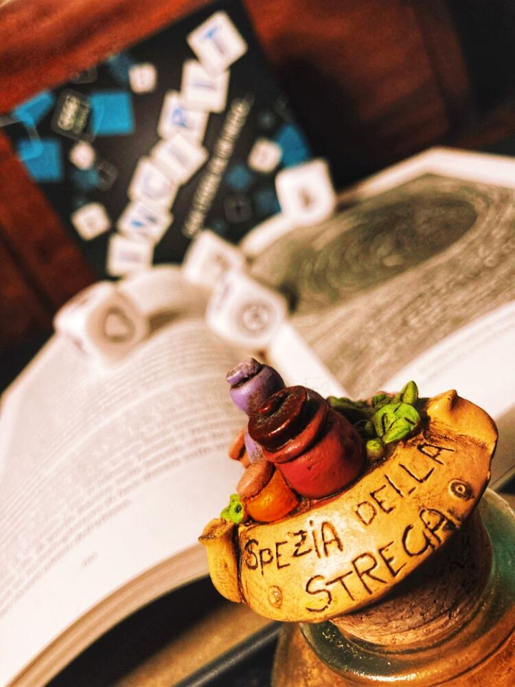
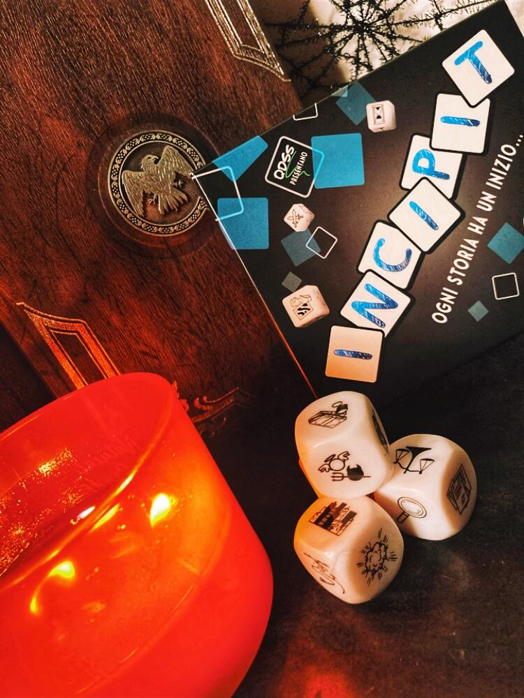

<Setting>

"…la tempesta era implacabile, ma il pericolo sembrava esser scampato! Un piccolo spiraglio di luce nel cielo faceva sperare nella fine di questo incubo quando, con un rombo spaventoso, qualcosa colpì la prua della nave… "  
"…l’odore acre di fumo si percepiva fin dall’ingresso e subito entrati nello studio si sentiva il forsennato rumore della macchina da scrivere! John deve avere finalmente trovato l’ispirazione per il suo nuovo romanzo; sì, dev’essere di certo così! La veemenza con cui preme sui tasti fa presupporre la pubblicazione di un nuovo best seller…"  
Ebbene sì, in questo gioco l’ambientazione la sceglieranno i giocatori. Potrete viaggiare tra i mondi e visitare terre nascoste e selvagge, incontrare creature meravigliose e sfuggire a pericoli mortali!Potrete essere chiunque vogliate e vivere l’avventura che avrete sempre sognato! I vostri amici seguiranno la vostra trama o la stravolgeranno? La sinergia delle menti è tutto, ma ancor più importante per creare una storia fantastica sarà liberare la vostra fantasia!

</Setting>

<Rules>

  Le regole di questo gioco sono davvero semplici e immediate:
  <ol>
    <li>      Il giocatore designato dovrà decidere l’INCIPIT perfetto per la storia: lo
      potrà inventare oppure cercare tra i tantissimi proposti sull’app e sul
      sito{" "}</li>
    <li>      Il giocatore a destra sceglie un dado e lo lancerà: partendo dall’immagine
      che uscirà e ricordandosi dell’incipit, dovrà plasmare la sua storia{" "}</li>
    <li>      Quando il giocatore di turno avrà concluso la sua sezione di storia
      toccherà al successivo scegliere un dado, tirarlo e a sua volta continuare
      la narrazione da dove il compagno l’ha lasciata{" "}</li>
    <li>      Di turno in turno mettete da parte i dadi utilizzati e ripetete i passaggi
      precedenti fino a quando non saranno terminati tutti i dadi</li>
    <li>L’ultimo giocatore a tirare un dado dovrà concludere la storia.</li>
  </ol>
  L’immagine ottenuta dal dado deve fungere puramente da ispirazione e non si
  dovrà necessariamente usare il soggetto raffigurato, ma si potranno adoperare
  anche concetti che ne possono derivare (esempio:i pianeti potranno suggerire
  anche l’universo, le galassie, il Sistema Solare o magari un meteorite).{" "}
   
  Insomma, l’unico vero limite sarà la fantasia dei giocatori!  I giocatori
  più temerari possono poi sbizzarrirsi con alcune varianti del gioco:
  <ul>
    <li>      LA MACCHINA DELLA FOLLIA: in questa variante, ad ogni turno i giocatori
      dovranno innescare sull’app la Macchina della Follia che genererà un
      evento casuale da inserire necessariamente nella storia.</li>
    <li>      Il MUCCHIO SELVAGGIO: in questo caso, ad inizio partita i giocatori
      dovranno scegliere un numero di turni da svolgere (gli autori suggeriscono
      un multiplo dei giocatori) e un numero di dadi da tirare. Durante ogni
      turno verrà scelto e tirato il numero di dadi prestabilito e i giocatori
      dovranno comporre la storia utilizzando tutti i simboli; i dadi utilizzati
      NON verranno poi scartati e il gioco terminerà allo scadere dei turni
      concordato.</li>
  </ul>

</Rules>

<Feedback>

Se si amano i giochi super narrativi e d’inventiva questo è sicuramente un buon punto di partenza. All’inizio, un po’ per l’emozione e un po’ per il "blocco dello scrittore", far uscire le idee sarà difficilino, ma a mano a mano che il gioco procederà, in parte perché si lascerà libera la fantasia e in parte perché si sarà spronati dall’inventiva dei compagni, diverrà sempre più facile inventare storie emozionanti. Inoltre, non essendoci linee guida da seguire, verrà ben presto spontaneo e naturale creare storie sempre più articolate e ricche di dettagli.
È interessante l’uso dell’app per cercare o scegliere casualmente l’incipit da utilizzare nelle vostre partite; questo aspetto dà quel tocco di casualità perfetta per dare la spinta giusta alla sfida. Un tocco di classe è poi la possibilità, registrandosi sull’app, di entrare in contatto con altri giocatori e quindi di condividere con moltissime altre persone i propri incipit.
Parlando di pro e contro, un grande punto a favore del gioco è che i dadi non sono tematizzati: le loro facce vedono raffigurate le icone più disparate che spaziano dalle semplici emoticon ai pianeti, dalla morte ai muscoli, da una serratura a una fiammella; anche gli argomenti su cui potranno vertere le narrazioni potranno essere i più disparati, quindi sarà una vera sfida inglobarli uniformemente all’interno di un racconto a più voci. Un contro, invece, è il suo essere collaborativo (si dovrebbe confrontare con il suo gemello competitivo Once Upon A Time, per capire in che senso); inoltre, nella sua forma base, non c’è un obiettivo prestabilito, cosa che potenzialmente può far perdere enfasi alla narrazione.
Un consiglio spassionato è quindi quello di giocarlo sfruttando le varianti create dagli autori o, perché no, inventandone di nuove.

</Feedback>
