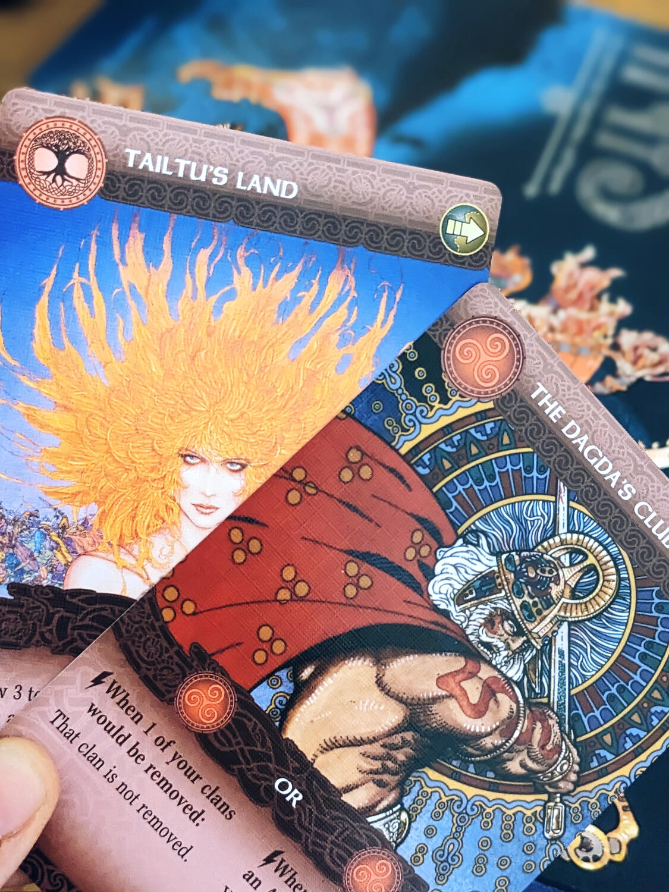
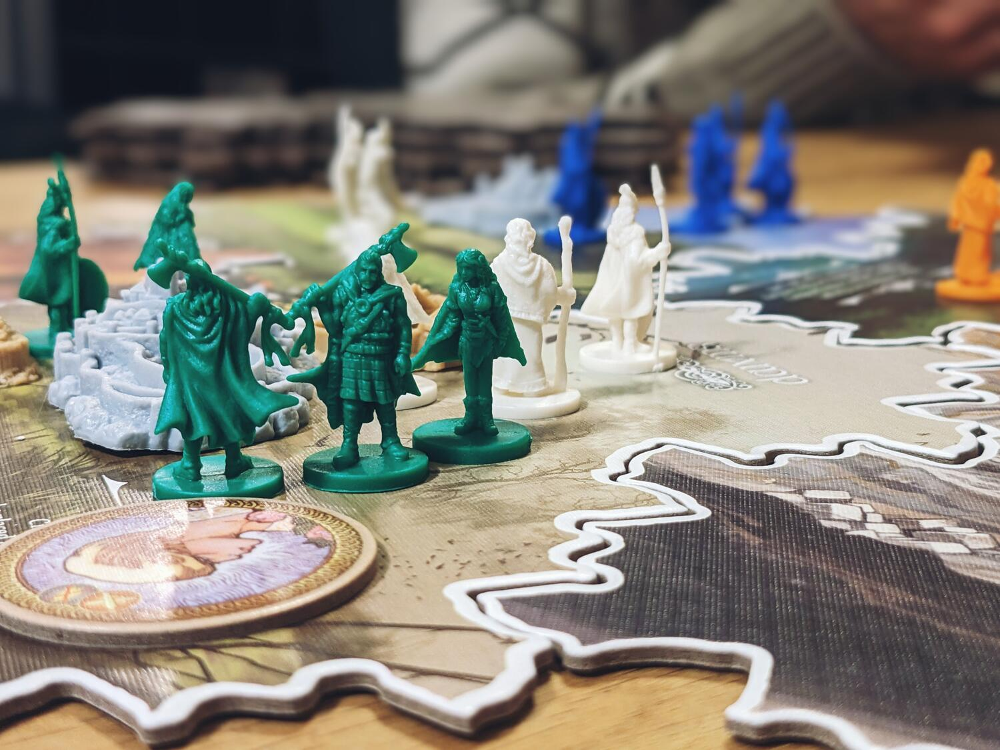
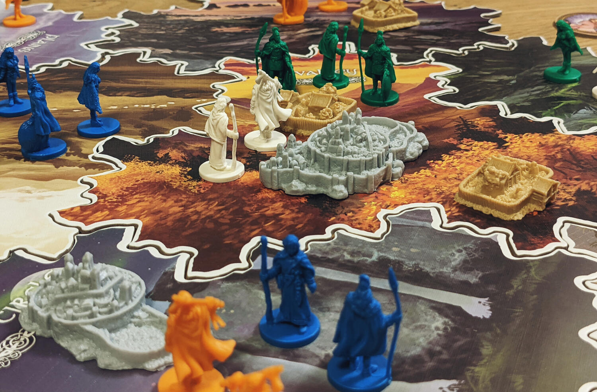

<Setting>

  Con Inis ci troviamo in una meravigliosa isola celtica, intrisa di storia e
  mitologia, dove ogni area ed ogni luogo ci raccontano qualcosa. Qui indosserai
  le vesti di un clan celtico che lotta per il controllo di Inis (che in celtico
  significa appunto isola) e per dominare tutti i clan rivali. In questa
  missione sarai aiutato da potenti spiriti, luoghi, e incantesimi, che ti
  faranno immergere in un mondo ricco di storia e di magia. Preparati quindi a
  lottare con le unghie e con i denti per il controllo e la dominazione del
  territorio, e ricordati di non sottovalutare i tuoi avversari.
   

</Setting>

<Rules>

  Le regole di Inis sono molto semplici. Ogni turno inizia con un drafting: un
  mazzo di carte passerà di giocatore in giocatore, ognuno dei quali sceglierà
  una carta alla volta. Quindi i giocatori a turno giocheranno una carta per
  compiere varie azioni: muovere i propri clan, reclutare, o combattere. Sono
  previste tre diverse condizioni di vittoria: sottomettere almeno 6 clan
  avversari, essere presente in almeno 6 territori, o possedere almeno 6
  santuari. Prima di poter effettivamente rivendicare la vittoria, tuttavia,
  dovrai annunciarlo ufficialmente, impiegando uno dei tuoi turni e diventando
  quindi bersaglio degli altri giocatori, che si alleeranno per cercare di
  fermare la tua ascesa.  

</Rules>

<Feedback>

  Inis è davvero un gioco che si fa amare. La profondità tattica e strategica è
  impareggiabile: ogni movimento e azione sono importanti per raggiungere lo
  scopo finale. Il perno di questa profondità è il drafting aperto iniziale, il
  quale implica una attenta pianificazione non solo delle azioni che il
  giocatore avrà a disposizione durante il tuo turno, ma anche delle azioni che
  saranno lasciate disponibili agli altri giocatori. Inoltre, la presenza di
  carte speciali (ed estremamente potenti) accessibili solo in occasioni
  specifiche rende il gioco ancora più variegato ed avvincente. L’alto livello
  di interazione e la costante attenzione alle possibili risposte avversarie
  rende Inis naturalmente coinvolgente ed immersivo: non si può mai abbassare la
  guardia.  
  Un altro elemento che rende Inis unico nel suo genere è la continua alternanza
  tra competizione per la vittoria e cooperazione per bloccare l'ascesa di chi sta
  per vincere. Bilanciare (e programmare) tutti questi diversi elementi del gioco
  non è affatto un’operazione banale, e rende questo titolo una vera sfida anche
  per i giocatori più esperti. Il carattere dei singoli giocatori emergerà durante
  le partite e sarà fondante per il flusso di gioco. Questo, insieme ad un’ottima
  scalabilità, ne assicura la longevità.  
  Insomma, Inis è un gioco estremamente elegante e pieno, che raccomandiamo
  caldamente a chiunque non abbia paura del confronto diretto e di spargimenti
  di sangue.
   

</Feedback>

