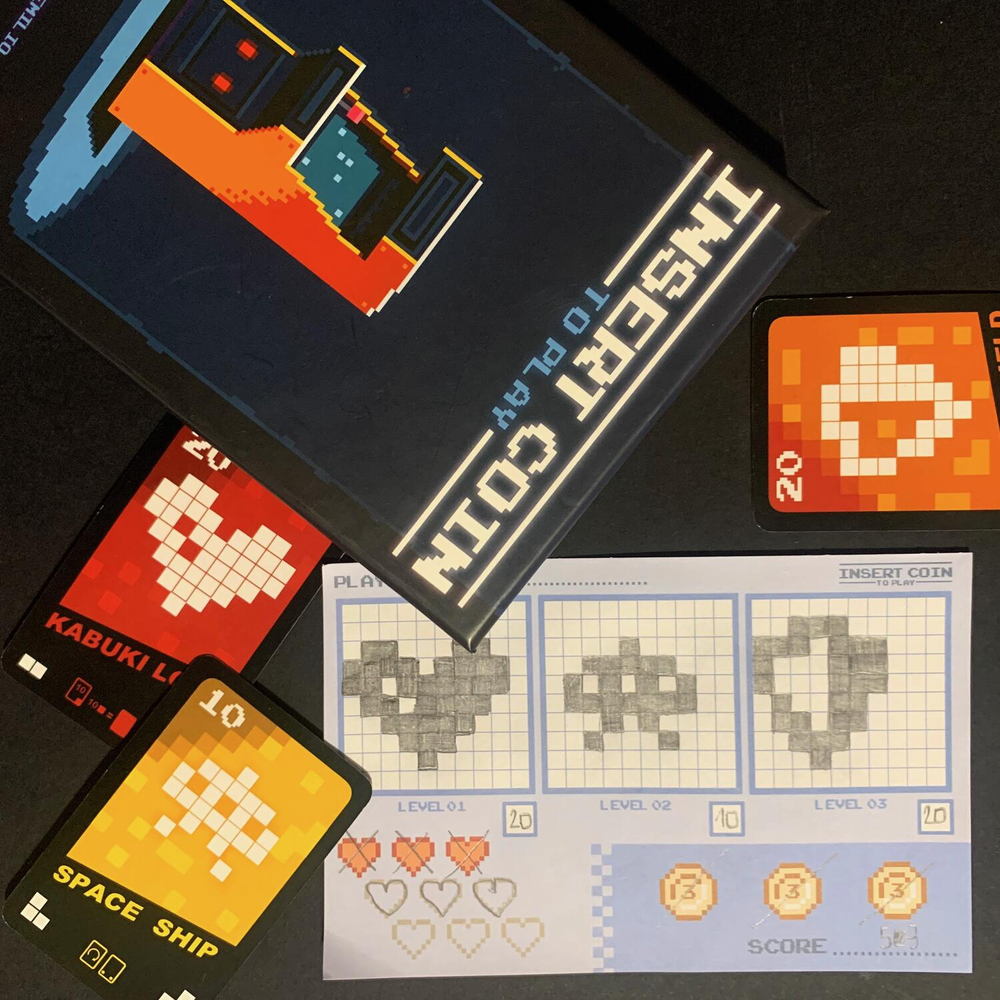
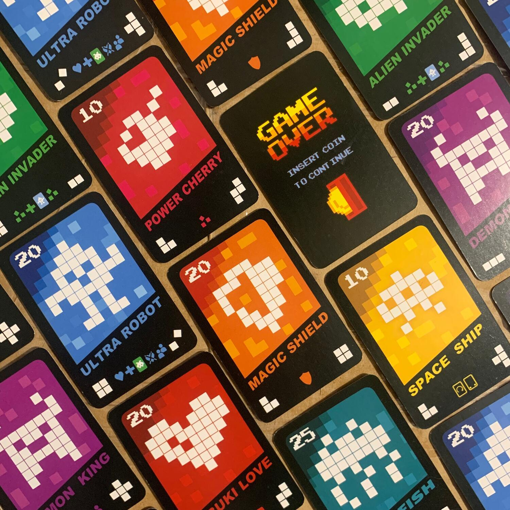
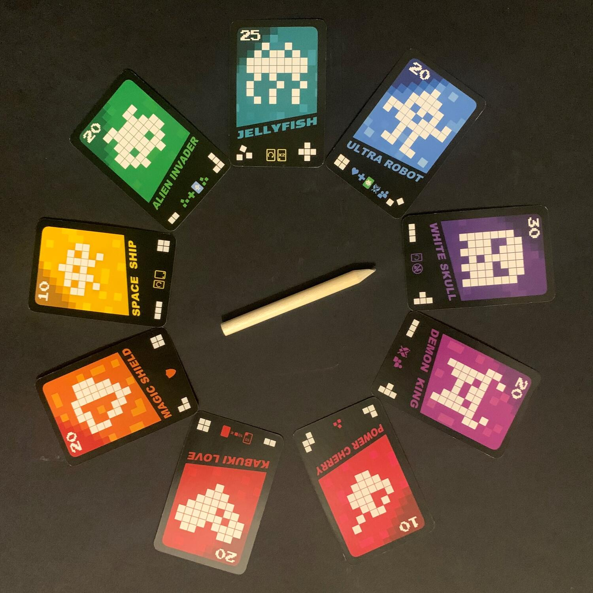

<Setting>

  Quando ero piccino, prima che tutti avessero le console a casa, durante
  l'estate, andavo in sala giochi per sfogare la mia ludopatia nel migliore dei
  modi: con i soldi di mamma e papà.  
  Gettone dopo gettone, spaccavo le palle con <strong>Puzzle Bobble</strong>, facevo
  il rider e portavo le pizze su <strong>Radikal Bikers</strong> o sparavo a chiunque
  in <strong>Metal Slug</strong>.  
  Sempre in quella sala giochi, nell'angolo in fondo, c'era il Cabinato di{" "}
  <strong>Space Invaders</strong>.  
  Il gioco con gli alieni dalle forme strane.
   
  Il gioco con quella canzone a 8bit che ancora oggi canticchio.
   
  Il gioco con l'astronave da 300 punti.  E le serate passavano così: insert
  coin to play, e via, si giocava!

</Setting>

<Rules>

  A inizio partita, ogni giocatore riceve 4 carte,{" "}
  <strong>ne sceglie una e passa le altre</strong> a sinistra. Si continua così
  finché ognuno non ha nuovamente 4 carte. Di queste ne sceglie 3 e disegna i
  contorni delle figure nelle apposite griglie sulla propria "plancia".
   
  Quando tutti i giocatori hanno terminato di disegnare, si va a formare un
  mazzo di pesca con tutte le 32 carte "forma" e due carte Game Over,
  "mescolandolo" alla <Link to="/reviews/pandemic/">Pandemic</Link> con 16 carte
  "forma" e una Game Over sopra l'altro.  
  Ogni giocatore inizia la partita con <strong>tre cuori e tre monete</strong>. 
  Un giocatore gira la prima carta del mazzo: sul fondo ci sono due simboli.
  Ogni giocatore deve sceglierne uno e{" "}
  <strong>colorarlo all'interno di una delle proprie forme</strong>, rimanendo
  nei bordi!
   
  Se un giocatore non può o non vuole usare un simbolo, perde una vita e riempie
  un singolo quadratino in una qualsiasi forma. Se perde tutti e tre i cuori,
  deve "inserire una moneta" (barrare) per continuare a giocare. Inserendo una
  moneta si ottengono altre tre vite.
   
  Si possono colorare le forme in totale anarchia, tenendo a mente che,{" "}
  <strong>    una volta completata una forma, verrà generato un potere diverso per ogni
    tipologia di forma!</strong>{" "}
  Si potranno riempire tre caselle qualsiasi se si completa la ciliegia, si farà
  saltare il turno agli avversari se si completa il teschio e molto, molto
  altro.
   E cosa succede quando peschiamo la carta <strong>Game Over</strong>? Se non
  avete completato almeno un disegno quando esce la prima carta Game Over (o 2 quando
  esce la seconda) perdete una moneta.
   
  La partita termina quando un giocatore finisce tutti i livelli, quando non ci sono
  più carte, quando un giocatore ha finito le vite e le monete, oppure quando non
  riesce a inserire una moneta quando viene girata una carta Game Over.  
  Si contano i punti, si sottraggono le caselle lasciate bianche e chi ha più
  punti è il vincitore!

</Rules>

<Feedback>

  Quando ho visto la scatola non ho avuto dubbi: questo gioco doveva venire a
  casa con me.  
  Una sera, tra un gioco e l'altro, intavolo questo filler e ne rimango davvero <strong>    colpito per la grafica e per l'uso dei polimini</strong> (da amante di <Link to="/reviews/project-l/">Project L</Link>): davvero
  spettacolare! <em>Dal bel te ghe roseghi zo poc</em> (Ma non si vive di sola grafica).{" "}
   
  La parte interessante e non ovvia del gioco è il{" "}
  <strong>draft iniziale</strong>, bisogna capire quali forme scegliere per
  portarsi a casa la vittoria, tenendo in considerazione difficoltà nel
  colorarla, potere speciale e punti (più è articolata, più punti varrà).
   
  Ad ogni turno si è portati a fare una scelta che, però, 9 casi su 10 è
  scontata.
   
  Giocare "Insert coin to play" è stato carino,{" "}
  <strong>15 minuti passati in spensieratezza</strong> colorando quadratini,
  lanciando poteri e sperando che non uscisse la carta del Game Over prima che
  avessi colorato completamente le forme. Nulla più.  
  Questo gioco mi ha lasciato <strong>un po' l'amaro in bocca</strong>, speravo che
  fosse qualcosa di più, forse avevo aspettative troppo alte.

</Feedback>

