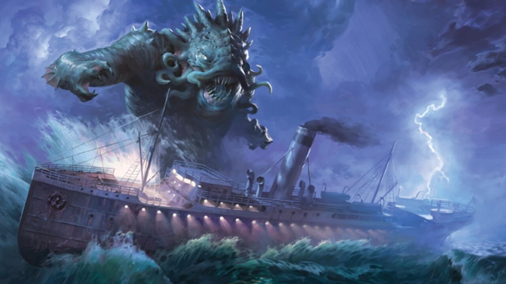
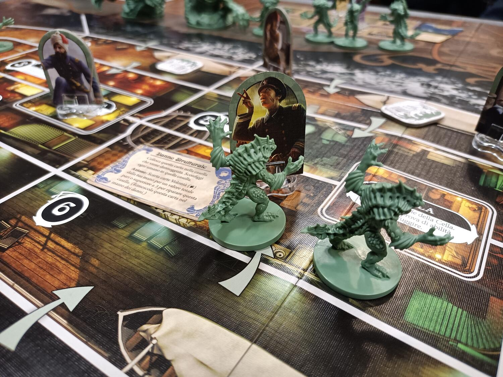

<Setting>

  È il <strong>1913</strong>. Fate parte dei passeggeri e dell'equipaggio della
  SS Atlantica, un piccolo battello a vapore di proprietà della Fairmont
  Shipping Company in viaggio attraverso l'Oceano Atlantico con destinazione
  Boston, Massachusetts. Pochi giorni dopo la partenza, venite a sapere che le
  vedette hanno notato delle <strong>sagome enormi</strong> e scure nell'acqua,
  sulla scia della nave; inoltre, come se questo non bastasse, avete sentito
  alcuni degli altri passeggeri gracidare come anfibi, e visto altre persone
  fissare con sguardo vacuo il mare aperto. Persino voi avete cominciato a
  sentirvi strani, e non fate che sognare inquietanti panorami sottomarini che
  brulicano di figure avvolte nell'ombra. La tensione è palpabile, i nervi sono
  a fior di pelle e l'Atlantica è una polveriera pronta a esplodere. Durante la
  terza notte di viaggio, una passeggera viene trovata{" "}
  <strong>assassinata</strong> nella cappella della nave. Il suo cadavere è
  riverso su un antico tomo ed è circondato dai componenti di un rituale sparsi
  sull'altare; il volume è aperto su una pagina che ritrae una figura al centro
  di un cerchio scintillante, attorno al quale vi è uno sciame di mostri in
  fuga. Non avete nemmeno il tempo di rimuginare sul significato
  dell'illustrazione che l'Atlantica si trasforma in una cacofonia di urla di
  terrore. <strong>Qualcosa è emerso dall'acqua...</strong> e sta cercando di
  salire a bordo!

</Setting>

<Rules>

  In Insondabili il vostro scopo sarà quello di arrivare "sani" e salvi al porto
  di Boston prima che qualcosa di davvero grave vada storto. Insondabili è un
  <strong>semi cooperativo</strong> in cui i giocatori dovranno collaborare per sopravvivere
  all'assalto degli abitanti degli abissi, ma le sventure non finiscono qui. Infatti,
  tra di voi si nascondono dei <strong>traditori</strong>, ibridi e cultisti, che
  faranno di tutto per mettervi i bastoni tra le ruote. Le regole di questo gioco
  sono abbastanza semplici e lineari: ogni giocatore avrà a disposizione <strong>    due azioni</strong> nel suo turno con cui potrà spostarsi sulla nave, affrontare i vari mostri,
  salvare i poveri malcapitati della nave, scambiare oggetti e attivare o riparare
  le varie zone del battello. Saranno presenti sulla mappa <strong>    due tracciati</strong>, quello del viaggio, che vi indicherà quanta strada avete percorso, e
  quello del rituale. Quest'ultimo, una volta concluso, permetterà di scagliare un
  potente incantesimo che spazzerà via ogni essere vivente dal ponte della nave,
  quindi state attenti! Avrete a disposizione anche delle carte, divise in cinque
  caratteristiche, che pescherete ad inizio di ogni turno. Con queste, non solo potrete
  effettuare azioni particolari ma potrete anche spenderle per superare le numerose
  sfide che vi si pareranno davanti. Infatti, alla fine di ogni turno di un giocatore
  bisognerà pescare una <strong>carta Mito</strong>. Quest'ultima sarà solitamente
  una prova che dovrete superare utilizzando delle carte caratteristiche prestabilite.
  Ogni giocatore potrà spendere un numero qualsiasi di carte per superarla. Queste
  però saranno coperte e inoltre le carte di caratteristiche diverse da quelle della
  carta Mito daranno un <strong>malus</strong>, quindi non fidatevi di nessuno. Come
  già detto prima, infatti, i figli di Dagon non saranno l'unica minaccia, saranno
  presenti alcuni traditori che potranno giocare <strong>    nascosti o venire allo scoperto</strong> e ostacolarvi con ogni mezzo possibile. I mostri vincono, e quindi anche
  gli ibridi, se una delle risorse della nave si esaurisce, se tutti gli abitatori
  dell'abisso sono sulla mappa o se ci sono sei danni sul battello. L'unica maniera
  per i giocatori umani di uscirne vincitori e riuscire ad arrivare ad avere un valore
  di dodici con le carte viaggio.

</Rules>

<Feedback>

  Partiamo da questa premessa: io non soltanto adoro l'ambientazione di
  Lovecraft ma la amo profondamente. Se non la conoscete, finite l'articolo e
  fiondatevi a leggere alcuni dei suoi racconti. Detto ciò, in Insondabili{" "}
  <strong>l'ambientazione</strong> è una cornice perfetta di suspence e
  immersività. Sentirete, grazie alle meccaniche, ai disegni e ai componenti,
  un'impercettibile sensazione di <strong>ansia</strong> che vi accompagnerà per
  tutta la partita. Un altro fulcro di questo fantastico gioco è{" "}
  <strong>l'interazione</strong>, ed in questo titolo siamo ai massimi livelli.
  La componente cooperativa ci porterà a discutere e prendere decisioni sempre
  più difficili, ma allo stesso tempo avremo sempre il fiato sul collo a causa
  della presenza di uno o più traditori nel gruppo. I materiali, che sono di
  ottima fattura, dettagliati e ben curati, aumentano ancora di più
  l'immersività in ogni partita. Alcuni tasti dolenti del titolo sono comunque
  presenti; partiamo dal primo e più importante: <strong>la durata</strong>.
  Purtroppo essendo un gioco narrativo ha bisogno di tempo al tavolo per creare
  l'atmosfera adatta, quindi la durata non è da sottovalutare. Principalmente
  nelle prime partite sforerete tranquillamente le{" "}
  <strong>tre ore di gioco</strong>. Il regolamento non è difficile ed è
  abbastanza lineare, ma presenta numerose piccole regoline che hanno bisogno di
  un'attenta lettura. Basterà, però, che uno al tavolo sia minimamente esperto
  di giochi e che abbia letto bene il regolamento e agli altri spetterà il
  semplice compito di ricordare le azioni disponibili. La componente della
  fortuna purtroppo è presente:{" "}
  <strong>lanci di dadi frequenti e pesca di carte</strong>, quindi attenzione a
  tutti i german gamer, non è un gioco adatto a voi. Infine, Insondabili, a mio
  avviso, non è un gioco complesso, ma ha bisogno di{" "}
  <strong>giocatori abituali</strong> per essere apprezzato; inoltre lo
  consiglio fortemente a gruppi di quattro/cinque persone, non più, non meno,
  sia per non allungarlo troppo sia per avere più suspence al tavolo. Per
  concludere, Insondabili è davvero <strong>un capolavoro</strong> del suo
  genere. Un titolo curato e ben realizzato che riprende le meccaniche del suo
  predecessore, Battlestar Galactica, e rinasce dalle ceneri con
  un'ambientazione e meccaniche, a mio avviso, ancora più immersive e
  coinvolgenti.

</Feedback>

