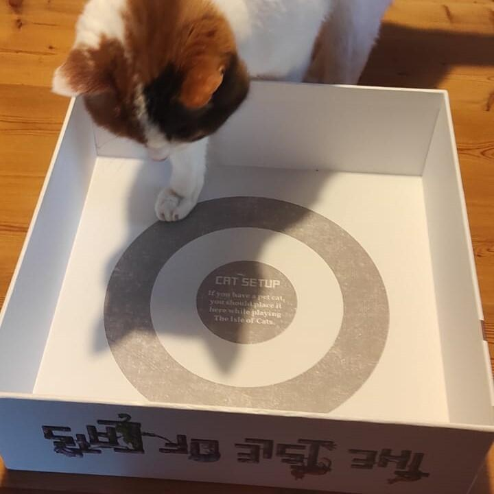
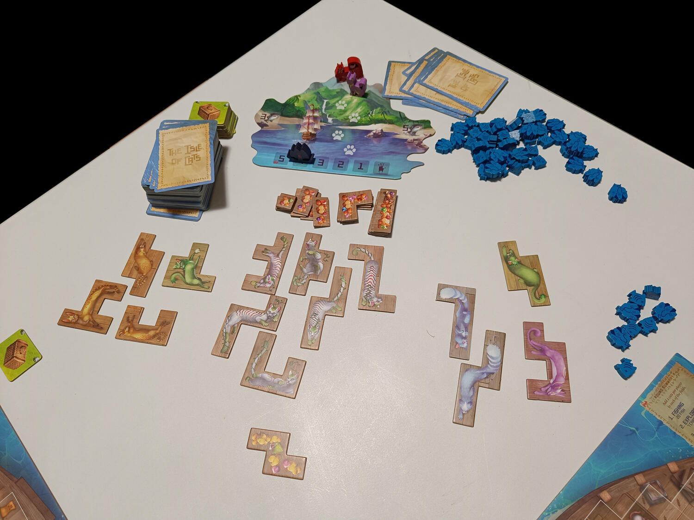

<Setting>

  La leggenda narra di una favolosa isola nascosta in mezzo all’oceano, dove
  prospera un’antica razza di gatti fieri, saggi ma anche giocherelloni. E
  proprio quest’isola è stata recentemente scoperta da alcuni esploratori di
  Squall’s End! Ma purtroppo una minaccia incombe all’orizzonte, e viaggia
  veloce verso l’isola trainata dalle vele della flotta del terribile Vesh
  Darkhand, che vuole distruggere l’isola e tutti i suoi abitanti. Mancano solo
  5 giorni prima che i devastatori arrivino: c’è ancora una speranza di salvare
  questi leggendari gatti, ed è tutto affidato a voi. Cercate di portarne in
  salvo più che potete sulle vostre navi e scappate prima che sia troppo tardi!
   

</Setting>

<Rules>

L’Isola dei Gatti è un gioco family competitivo da 1 a 4 giocatori. 
Lo scopo del gioco è imbarcare quanti più gatti possibili: questi non sono altro che tessere di varie forme (in stile tetris) che dovranno essere disposte nel modo più ottimale sulla griglia di quadrati che rappresenta la stiva della nave. 
La partita si sviluppa attraverso 5 giorni (turni), a loro volta divisi in 5 fasi, nelle quali tutti i giocatori svolgono alcune azioni specifiche. 
Nella prima fase, ovvero la Pesca, si aggiungono alla riserva di ciascun giocatore 20 nuovi pesci, i quali costituiscono la risorsa primaria, da usare durante tutto il gioco.  
Nella seconda fase ogni giocatore costruisce invece la propria mano di carte, con un sistema di draft. Ciascuno pesca 7 carte, ne sceglie due carte da tenere, e passa le restanti al giocatore successivo. A propria volta riceve quindi le carte non selezionate dal giocatore precedente, ne seleziona altre 2, e passa nuovamente le restanti al successivo, e via così fino a quando ogni giocatore non ha aggiunto alla mano 7 nuove carte. Si sceglierà infine quali di queste mantenere in mano (pagando il costo richiesto in pesci) e quali scartare. Le carte sono di quattro tipologie/colori: obiettivi (blu), salvataggio gatti (verdi) o ritrovamenti rari (marroni o gialle). Le carte guadagnate potranno quindi essere giocate nelle tre fasi seguenti: una per gli obiettivi, una per il salvataggio dei gatti e una per i ritrovamenti rari.  
Le carte obiettivo si distinguono in pubbliche, e quindi valide per tutti i giocatori, oppure in segrete (fino alla fine della partita) e valide solo per chi le ha guadagnate. Queste definiscono come vengono assegnati gran parte dei punti e influenzano molto le strategie dei giocatori.  
Le carte salvataggio permettono invece di guadagnare cestini che, insieme ai pesci ancora disponibili nella riserva, devono essere usati per scegliere un gatto tra quelli presenti sul tavolo e imbarcarlo sulla propria nave, ovvero sulla propria plancia. 
I ritrovamenti rari possono essere dei tesori o dei gatti oshax, cioè dei gatti jolly. Sia i tesori che i gatti oshax sono delle tessere molto utili per riuscire a riempire al meglio la stiva.   
Una volta finito il quinto giorno/turno, la partita termina e si determina il vincitore in base al punteggio ottenuto, assegnato secondo un criterio che tiene conto di come è stata riempita le navi, delle “famiglie” (gruppi di gatti adiacenti dello stesso colore) formate e degli obiettivi (privati e pubblici) perseguiti.

</Rules>

<Feedback>

  A chi non piacciono i gatti? A chi?  
Ok, avete ragione, in realtà qualcuno li detesta, altri sono allergici al suo pelo e per altri ancora è un piatto della tradizione popolare (Vicentini, sto parlando a voi), ma è indiscutibile il fascino che questo piccolo felino ha esercitato su di noi esseri umani, partendo dagli antichi Egizi, che lo avevano addirittura divinizzato, fino ai video/meme di gatti che colonizzano i nostri social.     
L’ambientazione dell’Isola di Gatti è perfetta quindi per catturare e suscitare la simpatia di chi si siede al tavolo, e anche il vostro gatto non potrà non apprezzare il coperchio che verrà lasciato incustodito da una parte una volta aperta la scatola. 
I componenti sono ben realizzati e di qualità, con delle tessere e delle plance di cartone solido, una grafica colorata e una simbologia facilmente comprensibile. I gatti, illustrati nelle pose e negli atteggiamenti più disparati, sono fantastici! Anche il regolamento è chiaro, con diversi esempi che permettono l’immediata assimilazione delle regole. 
Il gioco è semplice: la sfida è tutta nel cercare di comporre un puzzle di gatti ottimale, andando a selezionare le tessere giuste per riuscire a riempire la nave e non lasciare spazi vuoti. Le meccaniche in realtà non presentano nulla di rivoluzionario, l’interazione è bassa e comunque mai aggressiva, e le partite si svolgono in maniera molto lineare, con pochi sussulti o sorprese. Tutto questo rende l’Isola dei Gatti un gioco ideale per passare un’ora di compagnia anche con giocatori occasionali e neofiti, oppure con i più piccoli, andando a premiare alla fine della partita il miglior giocatore ma lasciando tutti abbastanza soddisfatti, con una nave piena di gatti sornioni e con punteggi piuttosto equilibrati.  
Nel gioco è prevista inoltre una modalità in solitario progettata abbastanza bene. 
L’Isola dei Gatti è quindi l’esempio perfetto di quello che definiremmo un “comfort game”, ovvero un gioco leggero e rilassante, pensato e creato per piacere a quante più persone possibile.

</Feedback>

