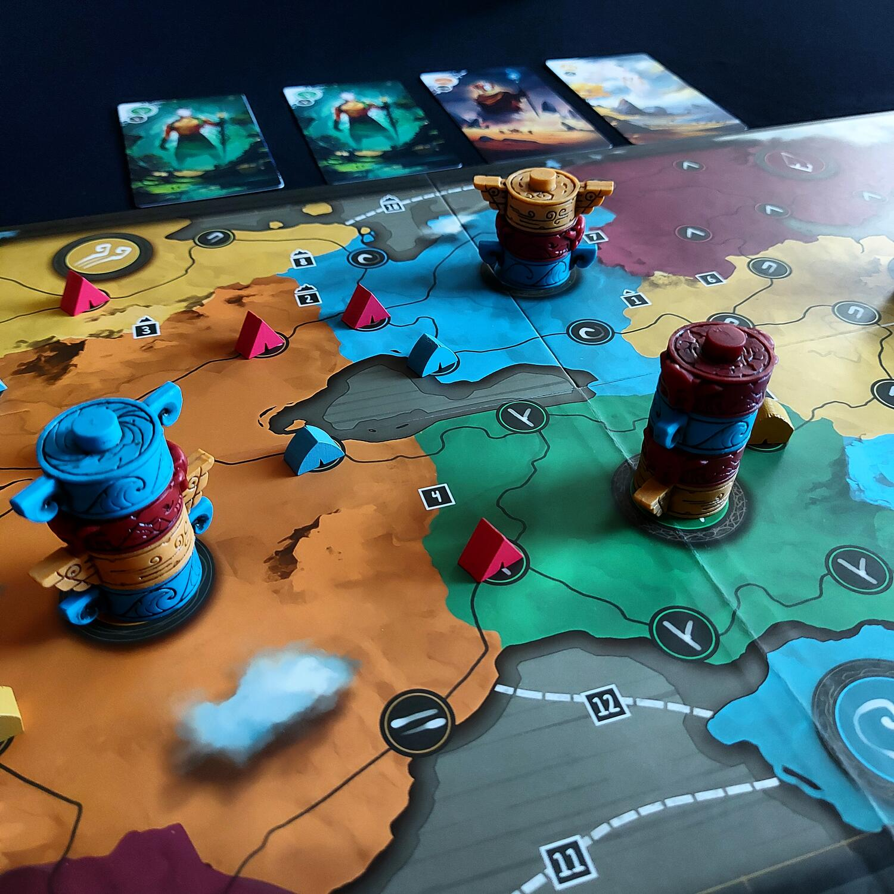

<Setting>

Viaggiate in un mondo fantastico agli albori dell'umanità. Il mondo di Iwari è formato da diverse tipologie di territorio che alcune tribù hanno deciso di colonizzare con le loro tende, chiedendo l'aiuto degli dei per diventare la tribù più potente innalzando loro degli splendidi totem.

</Setting>

<Rules>

Dopo aver scelto il lato della plancia ed effettuato il veloce set-up ottimamente illustrato nel regolamento, siete già pronti per giocare. 
In Iwari <strong>vige la regola d’oro del 3-2-1</strong>: si potranno utilizzare fino a 3 carte per posizionare fino a 2 pezzi in 1 solo territorio. Durante il proprio turno, il giocatore può giocare fino a 3 Carte Bioma dalla propria mano per posizionare Tende e/o Totem sulla Plancia. Il colore e il simbolo sulle carte giocate indicano il tipo di territorio su cui possono essere posizionati i pezzi. Dopo aver posizionato i pezzi, il giocatore scarta le carte giocate in una pila degli scarti di fronte a sé e ripristina la propria mano per avere sempre 3 carte a disposizione.
Le regole di posizionamento prevedono che:

<ul>
<li> i pezzi devono essere posizionati tutti in un unico territorio; </li>
<li>nei territori inesplorati (privi di Tende) è possibile posizionare 1 sola Tenda; </li>
<li>nei territori esplorati (che contengano almeno una Tenda di un qualsiasi colore) è possibile posizionare fino a 2 pezzi complessivi tra Tende e Totem; </li>
<li>due Carte Bioma dello stesso colore possono essere utilizzate come carta jolly per posizionare un singolo pezzo su un territorio di un altro colore a propria scelta. </li>
</ul>
A metà partita, ovvero quando sarà terminato il mazzo di Carte Bioma, si procederà con un primo conteggio dei punti in cui <strong>conteranno esclusivamente</strong> le maggioranze di tende presenti in ciascun territorio, dopodiché si procederà con la partita rispettando le stesse regole.  
Quando il mazzo di Carte Bioma sarà esaurito una seconda volta, oppure quando un giocatore avrà esaurito le proprie tende, la partita avrà termine e si procederà ad un secondo conteggio dei punti. In questo caso, oltre alle maggioranze di tende presenti in ciascun territorio, verranno conteggiate anche le maggioranze di Totem tra territori collegati e gli accampamenti, costituiti da 4 o più tende collegate.  
Manco a dirlo, il giocatore con il maggior punteggio sarà proclamato vincitore.

</Rules>

<Feedback>

Iwari vi colpirà indubbiamente per la sua veste grafica e per la qualità degli elementi, ma questo <strong>non ne fa certamente</strong> solo fumo e niente arrosto: per vincere sarà necessario costruire la propria partita una mossa alla volta, reagendo con prontezza alle mosse degli avversari. L'interazione indiretta al tavolo è molto forte e non ci saranno momenti di pausa. Inoltre, a rendere indubbiamente interessante Iwari è il meccanismo del calcolo del punteggio, che avviene in due momenti distinti nel corso della partita e che presuppone una pianificazione a medio e lungo termine delle proprie mosse.
Il gioco si adatta bene a giocatori esperti, anche se la semplicità delle regole permette a chiunque di avvicinarvisi, e saranno sufficienti alcune partite per padroneggiarlo pienamente.
Si consiglia di utilizzare le apposite bustine per proteggere le carte.

</Feedback>

