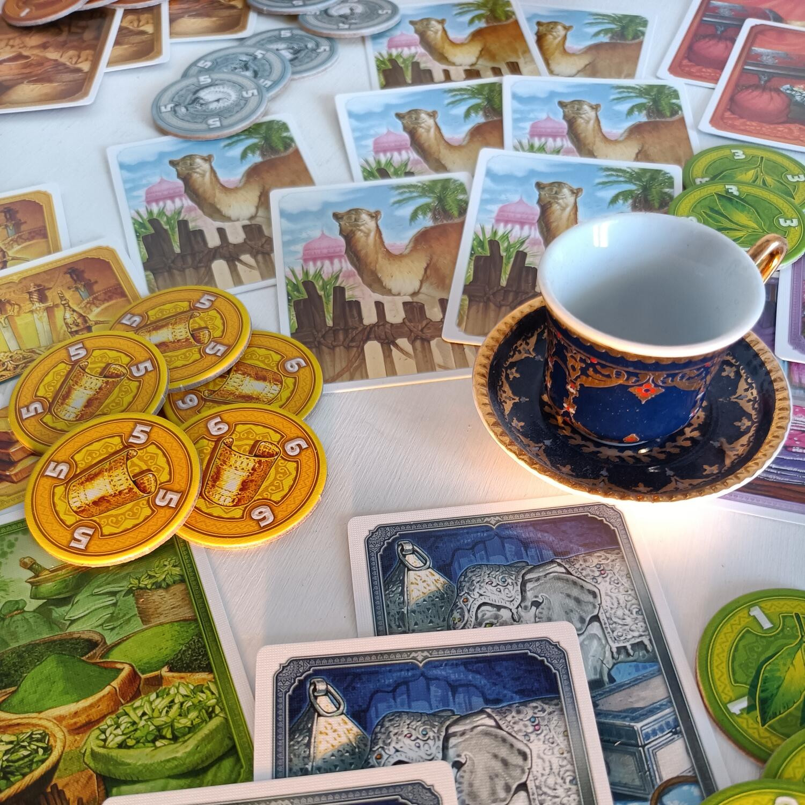
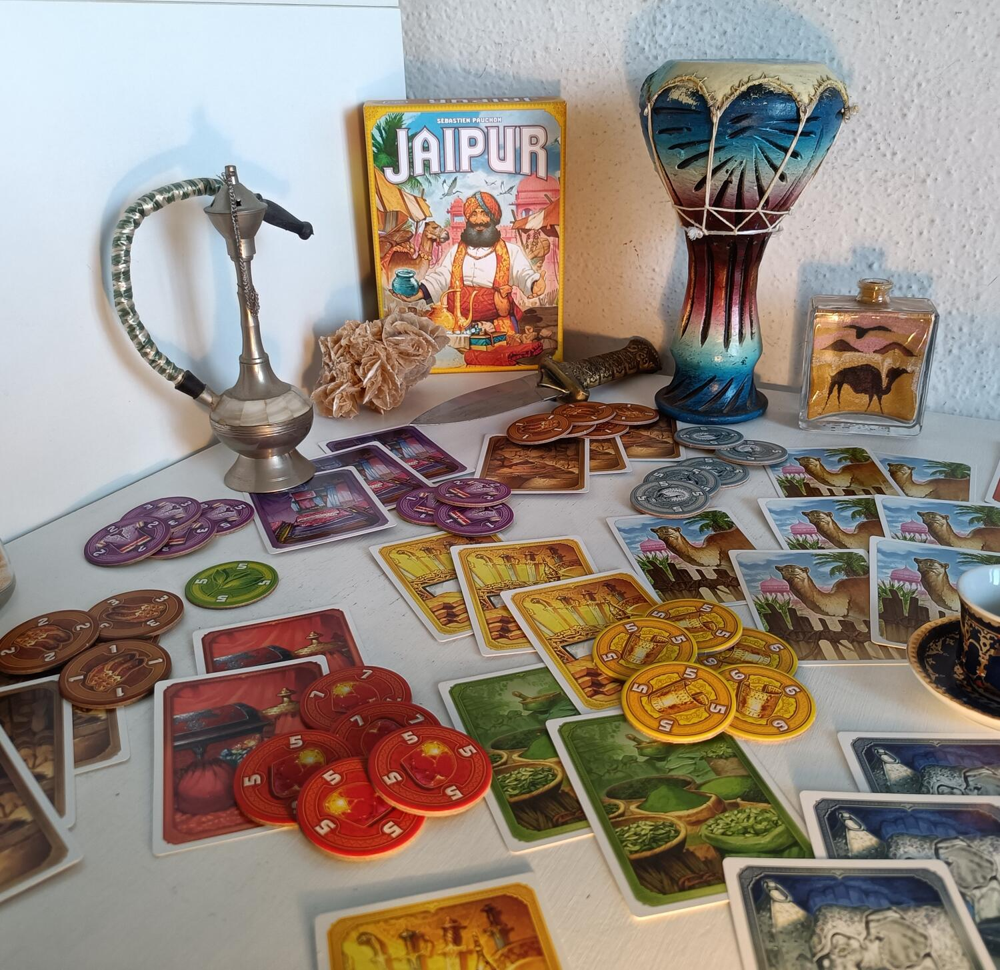

<Setting>

  Il vostro scopo sarà quello di diventare il nuovo mercante personale del
  Maharaja. Utilizzate la vostra astuzia e le vostre abilità commerciali per
  aggiudicarvi gli affari più fruttuosi vendendo merci rare e spezie al mercato.{" "}
   
  Sfruttate i cammelli per scambiare più risorse in un solo momento, avrete la stoffa
  per impressionare il Maharaja e diventare i più ricchi mercanti dell’India?

</Setting>

<Rules>

  In Jaipur ogni giocatore dovrà cercare di vincere due Round, aggiudicandosi
  quindi il diritto di diventare il nuovo mercante reale. All’inizio di ogni
  Round bisognerà creare un mercato comune composto da 3 cammelli e altre due
  carte casuali. Ogni giocatore poi riceverà 5 carte dal mazzo di pesca. I
  giocatori, a questo punto, potranno mettere i cammelli dalla loro riserva
  personale nelle loro mani. Questi ultimi infatti non occuperanno spazio nella
  mano, la quale avrà, per tutta la durata della partita, un limite di 7 carte.{" "}
   
  I giocatori dovranno porre poi in ordine decrescente tutti i gettoni delle sei
  differenti Merci, dividendole e raggruppandole in merci rare( diamanti, oro e argento)
  e comuni (tessuti, spezie e cuoio). A questo punto la partita può iniziare.
   A turno, ogni giocatore dovrà effettuare una di queste azioni: Prendere
  carte o vendere Merci. Quando un giocatore decide di prendere carte dovrà
  scegliere tra una di queste opzioni:
  <ul>
    <li>Prendere una singola Merce</li>
    <li>      Prendere più Merci, scambiando carte dalla propria mano o con i cammelli</li>
    <li>Prendere tutti i cammelli nel mercato</li>
  </ul>
  Bisogna sempre tenere presente che si ha il limite di 7 carte in mano in ogni
  momento della partita. Quando vi sentite pronti, potete invece vendere delle
  Merci per ottenere Rupie. Scartate le carte di una singola Merce e ricevete lo
  stesso numero di gettoni di quella Merce. Se avete concluso un buon affare,
  vendendo 3, 4 o 5 Merci uguali, riceverete anche un gettone bonus
  corrispondente, che vi darà ulteriori punti. Ricordate che potete scambiare
  solo una Merce alla volta, e che le Merci rare non possono essere scambiate
  singolarmente, al contrario di quelle comuni.  
  Inoltre, i gettoni vanno in ordine decrescente, quindi il primo che arriva guadagnerà
  di più!
   
  La partita termina quando il mazzo di pesca si esaurisce o se i gettoni di tre
  Merci diverse sono finiti. A questo punto il giocatore che possiede più cammelli
  nella riserva otterrà il gettone di 5 punti, si contano i punti vittoria accumulati
  e il giocatore che ne ha di più ottiene il sigillo d’Eccellenza. Il primo ad averne
  ottenuti due sarà dichiarato il vincitore!

</Rules>

<Feedback>

  Jaipur è uno dei grandi classici per due giocatori. Uno dei must-have per
  tutte le coppie. Uno di quei titoli che bisogna avere nella propria libreria.
  Semplice e veloce da imparare, presenta una profondità strategica senza
  eguali, con una curva di apprendimento davvero ben costruita, che accompagna i
  giocatori a imparare di volta in volta i meccanismi e le strategie più
  efficaci. E’ Adatto sia ad un pubblico di esperti che ai giocatori
  occasionali, ma anche i più piccoli potranno apprezzarlo. I componenti non
  gridano al miracolo e la grafica non è propriamente invecchiata bene, ma non
  risulta comunque un problema, poiché non è uno di quei titoli che punta su
  questo aspetto. Un altro fattore non proprio perfetto è la preparazione, che
  risulta un po’ più lenta rispetto alla maggior parte dei filler, a causa del
  fatto che ogni singola merce dovrà essere impilata in ordine all’inizio di
  ogni partita. In ogni caso Jaipur è un piccolo capolavoro, una gemma rara che
  ha scalato le classifiche dei migliori giochi nel corso degli anni, ristampa
  dopo ristampa. Uno di quei titoli che se giocate spesso in due giocatori
  dovete assolutamente provare ed avere.

</Feedback>

