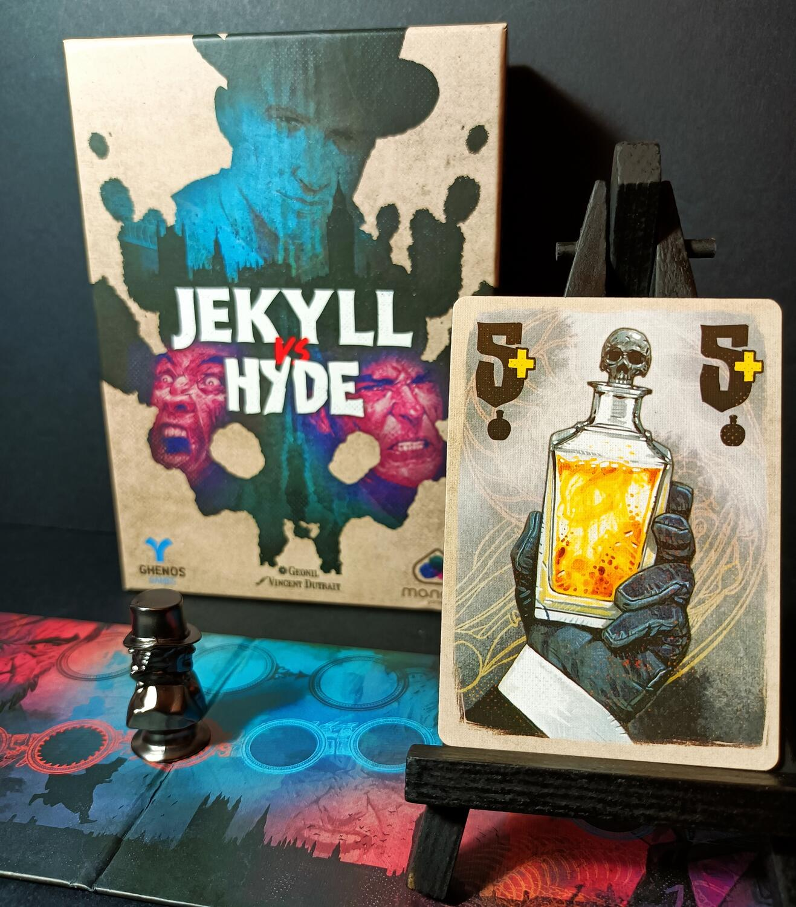
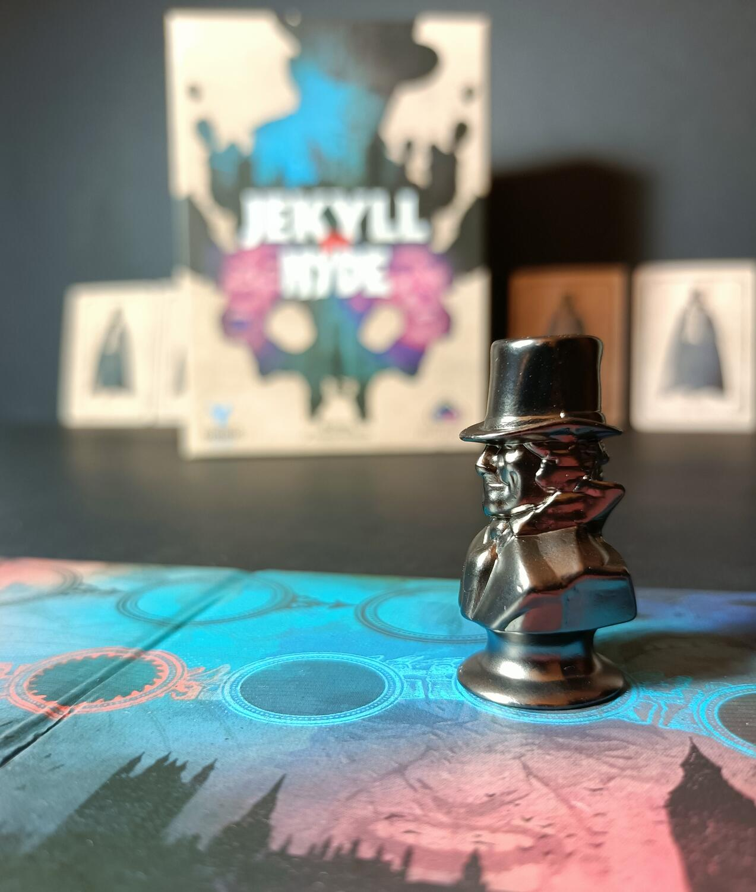

<Setting>

  “L'uomo non è in verità unico, ma duplice. Dico duplice perché lo stato della
  mia conoscenza non va oltre questo punto. Altri seguiteranno, altri mi
  sorpasseranno in questa direzione, e io posso osare prevedere che infine
  l'uomo verrà riconosciuto come un risultato di molteplici, incongrui ed
  indipendenti entità.”
   
  Jekyll vs Hyde è un gioco di carte per due giocatori basato sul famoso
  racconto <strong>    Lo strano caso del dottor Jekyll e del signor Hyde</strong>{" "}
  di Robert Louis Stevenson. I giocatori nei panni di una delle due identità
  dovranno competere nel corso di tre Round. Il Sig. Hyde dovrà prendere il
  controllo della mente del povero Dr. Jekyll, facendo leva sulle emozioni più
  recondite e spregevoli dell'essere umano: <strong>Superbia</strong>,{" "}
  <strong>Ira</strong> e <strong>Avidità</strong>. Jekyll, al contrario, avrà il
  compito di proteggere la sua identità e di tenere sotto controllo le sue
  emozioni. Chi dei due avrà la meglio?

</Setting>

<Rules>

  Jekyll vs Hyde è un gioco di prese per due giocatori che si sviluppa del corso
  di 3 Round. Durante questi Round, se il giocatore che veste i panni di Hyde
  riesce a portare <strong>l'indicatore identità</strong> sullo spazio in fondo
  al tracciato avrà vinto la partita, al contrario, se Jekyll riuscirà a
  controllare le sue emozioni e soggiogare il perfido Hyde senza che lui arrivi
  in fondo al tracciato, vincerà lui la partita.  
  La preparazione consiste nel distribuire <strong>dieci</strong> carte ciascuno
  e poi posizionare l'indicatore identità sullo spazio più a destra del tracciato.{" "}
   
  In Jekyll vs Hyde, a turno, partendo dal primo, i giocatori dovranno giocare
  una carta:
  <ul>
    <li>      Se il primo giocatore gioca una <strong>carta colorata</strong>, l'altro
      dovrà giocare una carta dello stesso colore o una Pozione. Se non ha una
      carta dello stesso colore potrà giocare una qualsiasi altra carta.</li>
    <li>      Se il primo giocatore gioca una <strong>carta Pozione</strong>, egli dovrà
      chiamare un colore. L'altro giocatore dovrà giocare una carta del colore
      scelto, anche se avesse una Pozione. Se non ha una carta di quel colore,
      potrà giocare qualsiasi altra carta.</li>
  </ul>
  <strong>A questo punto si confronteranno le carte:</strong>
  <ul>
    <li>      Se le carte hanno lo stesso colore, la carta con il numero più alto vince</li>
    <li>      Se le carte hanno colori differenti, la carta con il colore più forte
      vince</li>
    <li>      Se uno dei due giocatori ha giocato una carta Pozione, risolvete prima
      l'effetto e poi il numero più alto vince (esempio 3+ è più alto di 3).</li>
  </ul>
  La <strong>classifica di forza</strong> dei tre colori è data dall'ordine di
  giocata di essi. Il colore della prima carta giocata nel Round sarà il più
  debole e così via.  
  Gli effetti delle Pozioni, che si differenziano in base all'altra carta giocata,
  permettono di azzerare la classifica di forza dei colori, scambiare carte e addirittura
  rubare una Presa all'avversario. Quando un giocatore vince una mano, prende entrambe
  le carte giocate e crea un mazzetto coperto, esso sarà la <strong>    pila delle sue Prese</strong>. Terminate le carte in mano, i giocatori confronteranno il numero di
  Prese fatte più alto con quello più basso, <strong>    la differenza tra i due</strong> farà avanzare il segnalino dell'identità. Se alla fine di uno dei tre
  Round il segnalino arriverà alla fine del tracciato Hyde avrà vinto, in caso contrario
  sarà Jekyll il vincitore.

</Rules>

<Feedback>

  Jekyll vs Hyde era un gioco che aspettavo davvero da tantissimo tempo. Mi
  aveva già incuriosito dal regolamento e da alcune illustrazioni trovate su
  internet, ma una volta avutolo tra le mani ha superato qualsiasi mia
  aspettativa. Davvero un gioiello per due giocatori. Ma andiamo con ordine.
   
  Partiamo dai componenti: <strong>semplicemente magnifici</strong>. Le carte
  sono stupendamente illustrate e di ottima fattura; il tabellone ha una grafica
  accattivante e tematica e non posso non menzionare il segnalino identità in{" "}
  <strong>ferro</strong>, con la doppia faccia di Jekyll e Hyde. Semplicemente
  fantastico.
   
  Jekyll vs Hyde è un gioco da tavolo con un regolamento abbastanza immediato,
  non semplice a primo impatto, ma già dopo la prima partita si saranno apprese
  tutte le strategie e combinazioni possibili. Le partite non durano molto,
  circa venti minuti, andando ad accorciarsi con l'esperienza dei giocatori.
  Tempi morti, quasi inesistenti, anche se in alcuni casi prendersi qualche
  secondo in più per decidere la carta da giocare sarà cruciale. Infatti, Jekyll
  vs Hyde non è un gioco semplice da padroneggiare. Le strategie che si dovranno
  adottare in base al ruolo di Jekyll o Hyde sono molto{" "}
  <strong>differenti</strong>. Jekyll dovrà tenere sotto controllo le Prese,
  cercando di non creare troppo distacco. Al contrario, Hyde, potrà sia giocare
  a vincere che a perdere, in base alle carte che avrà in mano ad inizio Round.
  Già dalle prime partite, inoltre, apprenderete che la forza dei colori è un
  elemento chiave in questo gioco, principalmente per Hyde.
   
  Per concludere, Jekyll vs Hyde a mio avviso è un <strong>must-have</strong>.
  Un titolo per due giocatori che ha scalato rapidamente la classifica dei miei
  giochi preferiti di questa tipologia. Elegante, con una forte interazione,
  rapido e allo stesso tempo con una profondità strategica e semplicità davvero
  unici. Che altro posso dirvi, non fatevelo scappare!

</Feedback>

