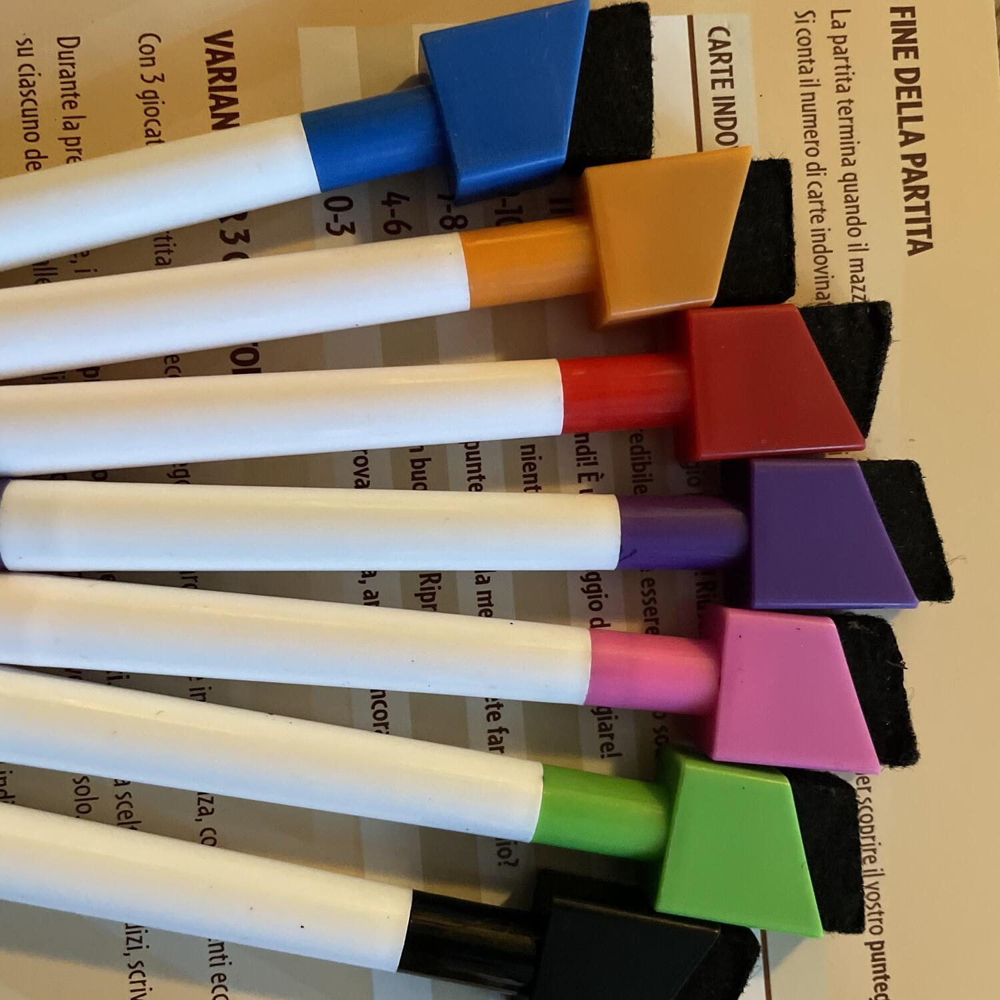

<Setting>

  Avete mai visto <strong>L'Eredità</strong> su Rai1? Avete presente la{" "}
  <strong>ghigliottina</strong>? Sapete cos'è Just one.

</Setting>

<Rules>

  Preparate un mazzetto con 13 carte Mistero, queste carte contengono 5 parole
  ognuna; poi decidete chi sarà il giocatore attivo.
   
  Tutta la partita verte su 4 fasi, che continueranno a intervallarsi fino alla
  fine:
   
  <ol>
    <li>      <strong>Scelta della parola mistero</strong>: il giocatore attivo
      posiziona sul proprio cavalletto una carta Mistero, in modo che tutti gli
      altri giocatori vedano cosa c'è scritto. Successivamente, sceglie un
      numero da 1 a 5 per indicare agli altri giocatori la parola che dovrà
      indovinare.</li>
    <li>      <strong>Scelta degli indizi</strong>: senza mettersi d'accordo e senza
      comunicare, tutti i giocatori non attivi scriveranno una parola sul
      proprio cavalletto (con limitazioni simili a quelle del Taboo), che
      permetterà al giocatore attivo di indovinare la parola mistero. Ad
      esempio, se la parola in questione è "Cavallo", si può scrivere "Equino"
      oppure "Troia".</li>
    <li>      <strong>Confronto degli indizi</strong>: quando tutti i giocatori hanno
      scritto i loro indizi, il giocatore attivo chiude gli occhi. Nel
      frattempo, gli altri giocatori girano i cavalletti e confrontano i loro
      indizi. Tutti gli indizi identici o non validi vengono annullati.</li>
    <li>      <strong>Risposta</strong>: il giocatore attivo apre gli occhi e cerca di
      indovinare la parola Mistero aiutandosi con gli indizi rimanenti. Ha
      diritto a <strong>una sola risposta</strong>. Possono esserci tre
      tipologie di risposta: quella giusta, quella sbagliata e il "passo". Se la
      risposta è corretta, si prende la carta e si posiziona nel "mazzo dei
      successi"; se la risposta è sbagliata o "passo", si posiziona nel "mazzo
      dei fallimenti"; inoltre, se la risposta è sbagliata, questa si sposta
      assieme ad un'altra dal mazzo di pesca.</li>
  </ol>
  Si prosegue così, continuando a cambiare il giocatore attivo finché ci sono carte
  da poter pescare. Quando queste sono finite, la partita termina e si contano le
  carte nel "mazzo dei successi". Più carte ci saranno, migliore sarà il nostro punteggio.

</Rules>

<Feedback>

  Avete presente quando vi svegliate alle 7 di mattina, carichi per andare a
  fare una grigliata assieme ai vostri amici e non vedete l'ora di rilassarvi e
  di intavolare tanti bei giochi da arrivare a casa storni? E avete presente il
  momento in cui vi ricordate, alle 7:01, che ai vostri amici non piace giocare
  perché "è troppo complicato" o "non c'ho sbatta, zio"?
   
  Just one è la soluzione. È{" "}
  <strong>    il gioco perfetto per incuriosire le persone e farle giocare per ore, senza
    che si rendano conto che stanno davvero giocando</strong>
  .  
  Just one sono due regole in croce per ore di risate e momenti imbarazzanti, di
  "dai che è facile, ce la fai" e di "oh, l'ultima e si va, ok?!?" (anche se poi
  non è mai l'ultima).
   
  Non c'è molto altro da aggiungere su questo gioco: si parla di un mazzo di
  carte, di 7 cavalletti e di 7 pennarelli perennemente scarichi. Si parla di un
  gioco che <strong>ha vinto davvero tanti premi</strong> (tra cui lo Spiel des
  Jahres nel 2019) e di un gioco che{" "}
  <strong>non potete non aver provato</strong>. 
  Just one non è nulla di profondo, non è probabilmente il gioco che vi meritate,
  ma è sicuramente quello di cui avete bisogno per portare i vostri amici sulla via
  della perdizione.

</Feedback>

