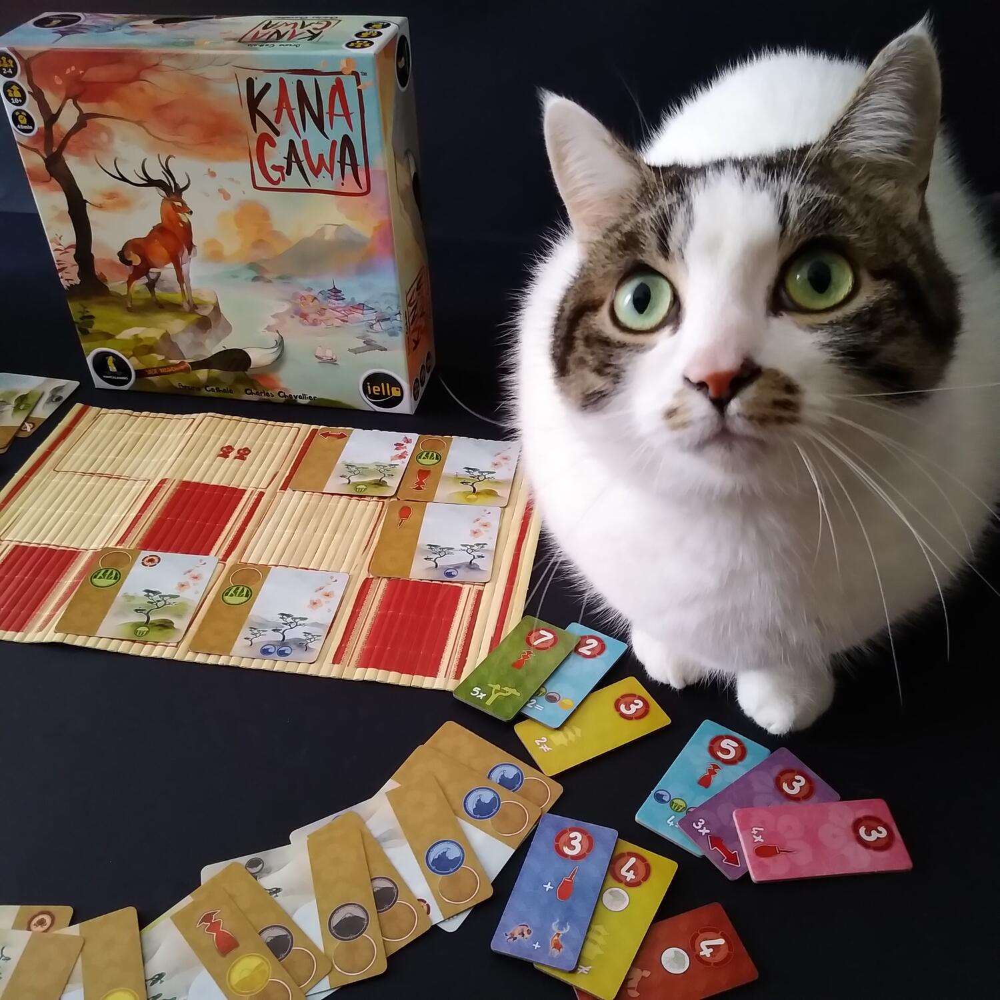
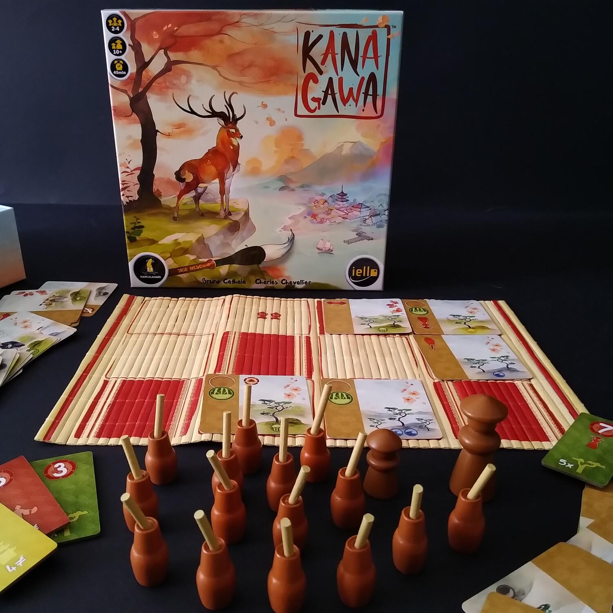

<Setting>

  Durante il periodo Edo, la capitale del Sol Levante ha dato i natali ad un
  grande artista, prolifico ed eccentrico, le cui opere sono divenute famose in
  tutto il mondo: Katsushika Hokusai. In <em>Kanagawa </em>(titolo che ci
  ricorda la più famosa delle<em> Trentasei vedute del Monte Fuji</em>,{" "}
  <em>La grande onda di Kanagawa</em>) i giocatori vestiranno i panni dei
  discepoli del grande Hokusai e si sfideranno tra loro per realizzare il
  dipinto più bello, seguendo le orme del maestro.
   
  &nbsp;
   

</Setting>

<Rules>

  Il setup è molto immediato: si dispone la Plancia Scuola al centro del tavolo,
  si ordinano le tessere Diploma per colore e punteggio e si forma un mazzo
  mischiando le carte Lezione. Infine si distribuiscono due pedine Pennello e
  una tessera iniziale a ciascun “pittore”.
   
  Il gioco si svolge in vari round, ognuno dei quali prevede determinate
  azioni:&nbsp;
   
  <ul>
    <li>      <strong>Seguire gli insegnamenti del Maestro</strong>: il primo giocatore pesca tante carte Lezione quanti sono i giocatori e le posiziona nella prima riga della Plancia Scuola.</li>
    <li>      <strong>Espandere le proprie conoscenze</strong>: il giocatore passa il turno e non pesca carte&nbsp;</li>
    <li>      <strong>Mettere in pratica le proprie conoscenze</strong>: il giocatore sceglie una colonna di carte Lezione e le gioca<ul><li>          nel verso del disegno, per continuare il proprio Dipinto e prendere, se possibile, un Diploma</li><li>          nel verso della tavolozza di colore, per migliorare il proprio Studio</li></ul></li>
    <li>      <strong>Nuova Lezione</strong>: se altri giocatori sono ancora attivi nel round in corso, il primo giocatore aggiunge altre carte alla Plancia Scuola.</li>
  </ul>
      Il gioco finisce quando il mazzo si esaurisce oppure quando un giocatore
      gioca la sua undicesima carta Dipinto: il vincitore sarà colui che avrà
      accumulato più punti.

</Rules>

<Feedback>

  Ad una prima occhiata, il contenuto della scatola di <em>Kanagawa </em>  potrebbe sembrare fin troppo minimal.
   
  In realtà i pochi componenti sono studiati in maniera molto accurata: parlo della
  Plancia Scuola realizzata con una tovaglietta di bamboo, come delle pedine in legno
  e le carte Lezione, dalla grafica suggestiva e rilassante, che riprendendo soggetti
  della tradizione nipponica in un gradevole stile acquerellato.
   
  Il gameplay è piuttosto lineare, ma le strategie per guadagnare punti non sono
  così scontate: bisogna programmare ogni mossa sperando di anticipare gli altri
  giocatori e avere anche molta fortuna nel pescare le carte giuste per poter continuare
  il proprio Dipinto nel modo migliore possibile.
   
  <em>Kanagawa </em>è un titolo adatto a famiglie e nuovi giocatori, che saranno
  certamente affascinati dai colori e dalle immagini che si integrano in maniera
  armonica a creare un unico dipinto.&nbsp;
   

</Feedback>
