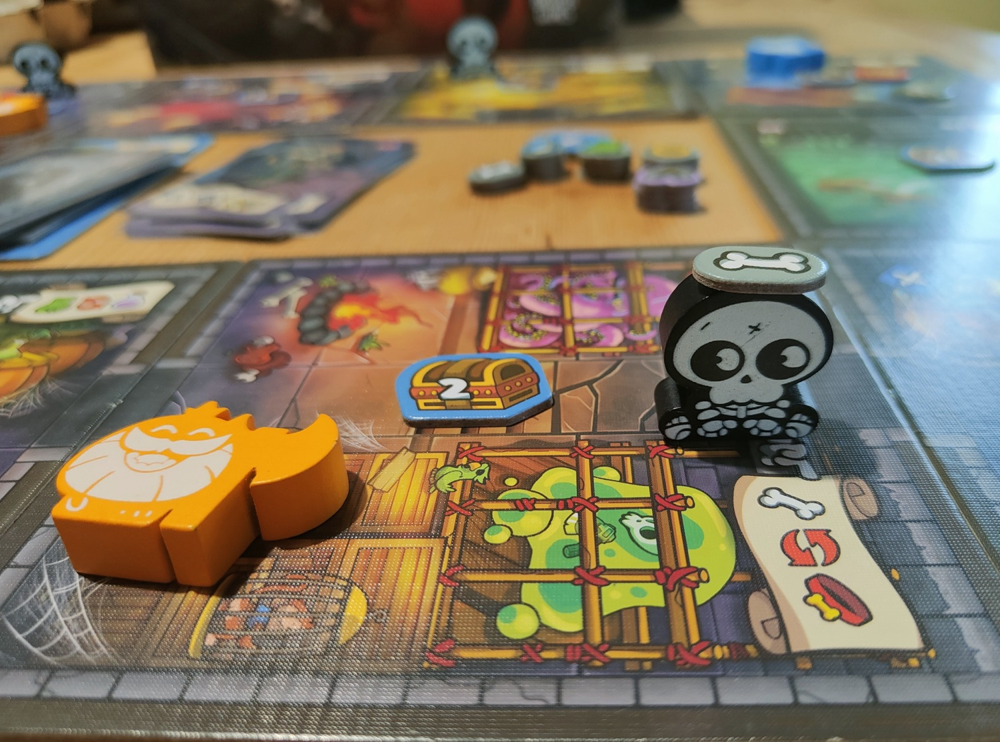
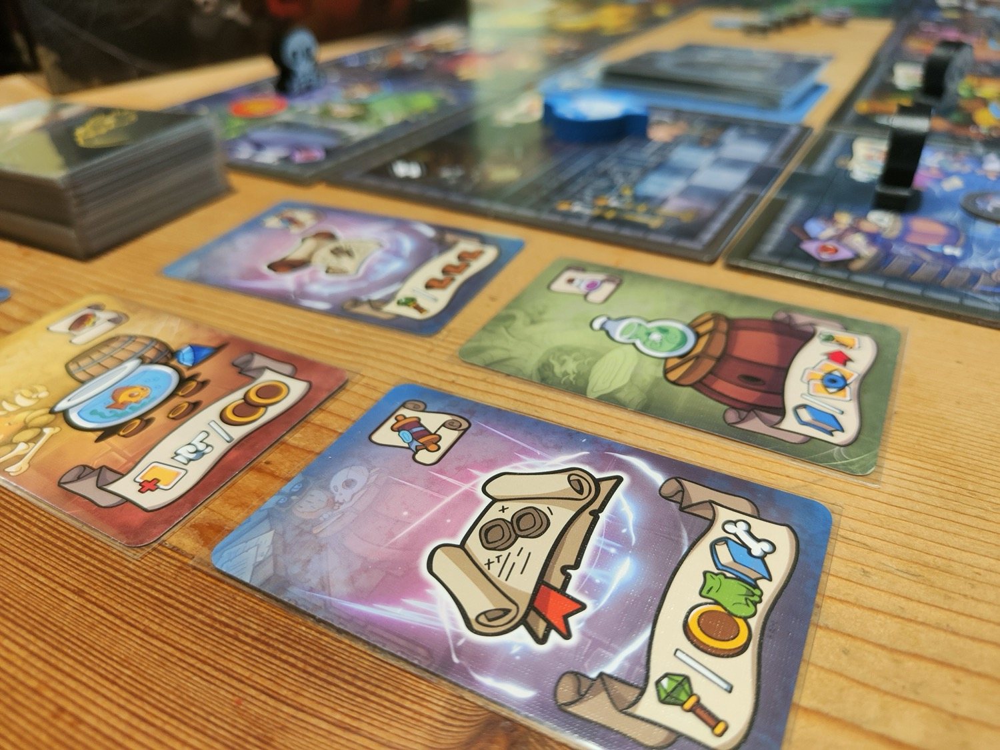
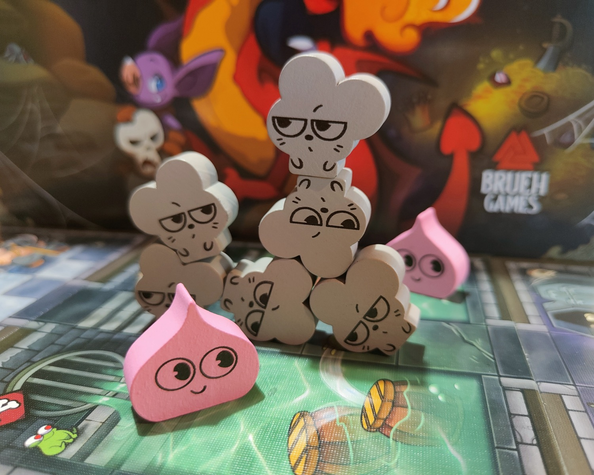

<Setting>

  <strong>Essere un mostro</strong> è una vera rogna. Che tu sia temuto, odiato o semplicemente schifato, una cosa è quasi certa: nella migliore delle ipotesi sarai il<strong> cattivo della storia</strong>, nella peggiore ricoprirai il ruolo di semplice <strong>carne da macello</strong> che si frappone tra l'eroe di turno e un mostro più temibile di te. 
Potresti quindi decidere di ritirarti in un umido dungeon assieme ad altri illustri esponenti della tua specie sciagurata e lasciare che <em>le tue toste giornate trascorrano così</em>, rimirando i <strong>tesori faticosamente accumulati</strong> durante la tua discutibile carriera. Una vita tutto sommato tranquilla: certo, la <strong>Draghessa </strong>che sonnecchia nella stanza del tesoro è una coinquilina piuttosto irascibile, i <strong>Topi </strong>si moltiplicano ogni volta che distogli lo sguardo e i <strong>Fantasmi </strong>non hanno ben chiaro il concetto di privacy, ma nel complesso potrebbe andare peggio. 
Non fosse che il peggio è già alla porta e ha assunto la forma dei <strong>soliti eroi</strong> in cerca di fama, gloria e – inserire imprecazione – i sopracitati tesori-faticosamente-accumulati. 
E non vorrai certo lasciarglielo fare, no? 

</Setting>

<Rules>

 In <em>Keep the Heroes Out!</em> siamo chiamati, in veste di adorabili mostriciattoli, a <strong>difendere il dungeon</strong> che chiamiamo “casa” dai ripetuti assalti di una gilda di eroi bramosa di fortuna. 
Le<strong> nove fazioni giocabili </strong>(dieci con la mini-espansione di <em>Cthulhu</em>, che con il prezzemolo condivide sia il colore che l'onnipresenza) presentano un mazzetto di carte dedicato, un numero variabile di unità e un'abilità speciale. 
Dopo aver generato il dungeon secondo le regole di setup dello scenario scelto, il gioco procede <em>alternando il turno di un singolo giocatore alla fase di attivazione dei nemici</em>. La partita termina se si riesce a sopravvivere all'assalto degli eroi fino a <em>esaurire due volte il loro mazzo <strong>di generazione (<em>bene</em>) o se i suddetti eroi riescono nell'intento di</strong> rubare lo scrigno</em> che si trova nella stanza del tesoro (<em>meno bene</em>). 
Durante il turno si <strong> gioca un qualsiasi numero di carte</strong> dalla propria mano risolvendone le azioni (un’iconografia chiara e funzionale rende il gioco <strong>indipendente dalla lingua</strong>!). In questo modo si possono <strong>muovere </strong>i meeple dei mostri all'interno del dungeon, <strong>attaccare </strong>gli eroi, <strong>attivare gli effetti</strong> di stanze specifiche o <em>evocare </em>nuove unità. Dopo che il giocatore di turno ha terminato le mosse e ripristinato la propria mano di carte, bisogna <strong>pescare e risolvere dal mazzo degli eroi</strong> un numero di carte determinato dalla difficoltà impostata per la partita.
Ogni carta evoca due unità <em>di una delle quattro classi di eroi</em> all'interno delle <strong>stanze contrassegnate </strong>con una specifica icona. A seconda della classe, gli eroi eseguono la loro abilità speciale di evocazione per poi attivarsi e <strong>svolgere un'unica azione</strong> a testa, dopo la quale diventano <strong>esausti</strong>. Se la stanza è <strong>vuota</strong>, si muovono automaticamente fino a trovarne una che <strong>contenga un mostro o uno degli scrigni</strong> disseminati nel dungeon (dando priorità al raggiungimento di quello presente nella stanza del tesoro). Se c'è un <strong>mostro </strong>lo <strong>attaccano</strong>. Se c'è uno <em>scrigno privo di difese</em> cercano di prenderlo<strong>: se il numero di eroi attivi nella stanza è</strong> pari o superiore al numero stampato sullo scrigno (da 1 a 4) riescono a <strong>razziarlo con successo</strong>, altrimenti diventano esausti e<strong> si fermano ad aspettare</strong> l'arrivo di altri compagni. Se incontrano altri eroi esausti, <strong>li riattivano</strong>. 
Se alla fine della loro fase gli eroi non sono ancora riusciti a depredare lo scrigno presente nella stanza del tesoro,<em> il turno passa</em> al giocatore successivo. 
Da segnalare la seducente meccanica della <strong>prigione</strong>: una volta per turno è possibile <em>pescare una carta dal mazzo degli eroi e sbattere in cella il personaggio corrispondente, poi poi pescare tre carte dal proprio mazzo</em> personale liberamente utilizzabili fin da subito. Un'apparente win-win situation, se non fosse che se l'eroe casualmente selezionato per la vacanza dietro le sbarre dovesse essere un <strong>mago</strong>, questi spalancherebbe le porte della prigione con un simpatico incantesimo <strong>liberando nel dungeon tutti gli eroi </strong>faticosamente ingabbiati fino a quel momento – con conseguenze probabilmente catastrofiche. 

</Rules>

<Feedback>

Luís Brueh è praticamente una <em>one man band</em> e, oltre ad essere <strong>sviluppatore</strong> ed <strong>editore</strong> del gioco, è anche l'<strong>autore delle splendide illustrazioni</strong> che, oltre ad immergerci nel suo coloratissimo, cartoonesco e morbido mondo fantasy, hanno ben pochi rivali quando si tratta di essere meramente funzionali: anche rigiocando a distanza di mesi, l’iconografia resta immediatamente riconoscibile. Tutti gli altri giochi indipendenti dalla lingua dovrebbero decisamente prendere esempio (vero <em>Tiny Epic Dungeons</em>?). Anche la scelta di usare dei<em> meeple di legno stampati</em> (ciccionissimi e bellissimi) è decisamente azzeccata, adattandosi al mood estetico del gioco molto meglio delle solite miniaturone opulente da dungeon crawler. 
Insomma, non serve girarci troppo intorno: <em>Keep the Heroes Out!</em> è uno di quei giochi così belli da vedere da spingere all'acquisto aprioristico e compulsivo.
Fortunatamente stiamo parlando di un prodotto che è bello pure da giocare, a patto di volerci investire quella manciata di partite necessarie ad assimilare le meccaniche e capire come sfruttarle a proprio favore. È pur sempre un gioco che sa essere<strong> molto punitivo</strong>, e bastano un paio di scelte sbagliate e un po' di sfortuna per tramutare una tranquilla scampagnata in un incubo di carne e acciaio. Lasciate un solo eroe a poltrire indisturbato nella stanza sbagliata e vi troverete ad assistere impotenti a un incontrollabile <em>effetto valanga</em>. 
Ma se all'inizio gli assalti degli eroi sembrano casuali, ingestibili ed estremamente feroci, ben presto viene alla luce il cuore di <strong>puzzle </strong> del gioco: le <strong>combinazioni </strong>tra tipo di stanza e classe di eroe sono limitate e via via sempre più <em>prevedibili</em>, quindi anche se non è possibile disinfestare l'intero dungeon si possono concentrare gli sforzi sulle aree statisticamente più vulnerabili e<em>la discreta quantità di alea</em> risulterà progressivamente molto meno invasiva di quello che potrebbe sembrare dalle prime partite.
Questo richiede anche che al tavolo ci sia un certo bilanciamento in termini di <strong>esperienza </strong>e <em>attitudine</em>, perché trattandosi di un <Link to='/mechanisms/cooperativo'>cooperativo</Link> ad <em>informazione completa </em>non c'è nessuna meccanica che impedisca ad un eventuale giocatore esperto con velleità da<em> alpha player</em> di imporre la propria strategia. 
Gira molto bene in <Link to="/mechanisms/solitario/">solitario</Link>, anche se ovviamente ci sono mostri più autosufficienti di altri, e a differenza di molti altri cooperativi può essere affrontato utilizzando <em>una sola fazione</em>. Le partite a <strong>quattro giocatori </strong>invece risultano inevitabilmente più <strong>caotiche </strong>rispetto alle altre configurazioni, perché prima di avere nuovamente il controllo sulle proprie creature la situazione può <em>cambiare in modo drastico</em>. 
Le varie fazioni, oltre ad essere molto diverse da giocare, sono tematizzate molto bene, dagli <strong>Slime </strong>che possono dividersi in due quando vengono colpiti, agli <strong>Scheletri </strong>che tramutano i cadaveri dei nemici in altri non-morti. 
Il <em>manuale</em> risulta <strong>molto chiaro</strong> al momento della lettura, e sul retro è presente un comodo <strong>diagramma di flusso</strong> che schematizza perfettamente  la<strong> routine degli eroi</strong> e l'<strong>ordine di priorità</strong> secondo cui agiscono. Una volta al tavolo, però, potrebbero crearsi alcune situazioni un po' <strong>ambigue</strong>: per fortuna l'autore è chiaramente innamorato della sua creatura ed è attivissimo nei vari forum, quindi <strong>tutti i dubbi verranno prontamente risolti</strong> dalla più autorevole delle fonti. Ciò che davvero mi ha fatto penare è l'abilità di evocazione della <strong>Ranger</strong>: vi basti sapere che quello che fa è scoccare una freccia nella stanza adiacente ma solo se tale stanza si trova sul percorso più breve per raggiungere la stanza del tesoro, quindi i mostri che non si trovano su questo percorso vengono bellamente ignorati. Parole apparentemente prive di significato, forse addirittura <em>parole dure e di un uomo davvero strano</em>, ma sono sicuro che vi saranno utili se mai doveste intavolare il gioco. Mi ringrazierete. Forse.
I singoli scenari presenti possono essere affrontati anche in una<strong> modalità campagna </strong>, durante la quale è possibile <strong>sbloccare alcuni bonus </strong>da sfruttare nella stessa. 
Sono già presenti un paio di <strong>espansioni</strong>, non imprescindibili perché il gioco resta grossomodo lo stesso ma comunque interessanti da avere. Una aggiunge unicamente il già citato personaggio giocabile di <strong>Cthulhu</strong>, che se viene colpito si mette semplicemente a dormire – d'altronde è un Antico Immortale – e si insinua nei torbidi sogni dei nemici costringendoli ad <strong>attaccarsi l'un l'altro</strong>. L'altra pimpa il gioco base con i bellissimi <em> meeple di legno degli eroi</em>, altrimenti rappresentati da semplici gettoni di cartone, e introduce la modalità <em>uno-contro-tutti</em> con la possibilità di<strong> giocare nei panni degli eroi</strong> stessi (calcando una mano che <em>po' esse fero</em> in presenza di giocatori scafati o <em>po' esse piuma</em> se la tavolata è un po' più casual). 
E ora torno a farmi rodere il fegato dall'hype per l'uscita non proprio imminente della mega-espansione che raddoppierà il numero di fazioni giocabili e dimezzerà il mio tempo libero. 

</Feedback>

