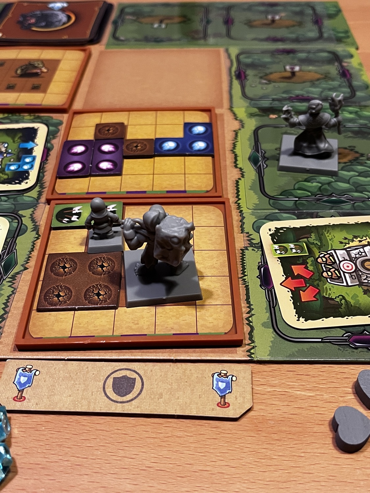
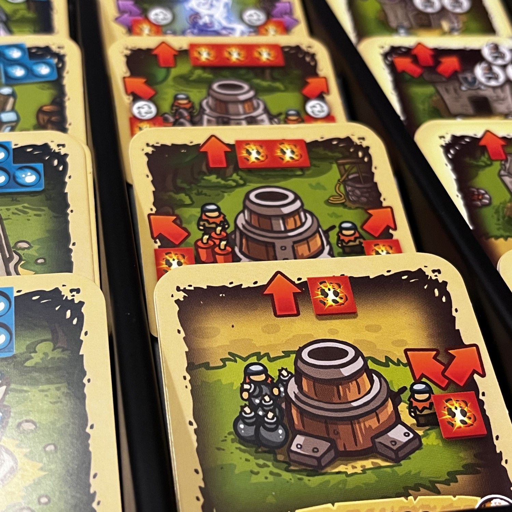
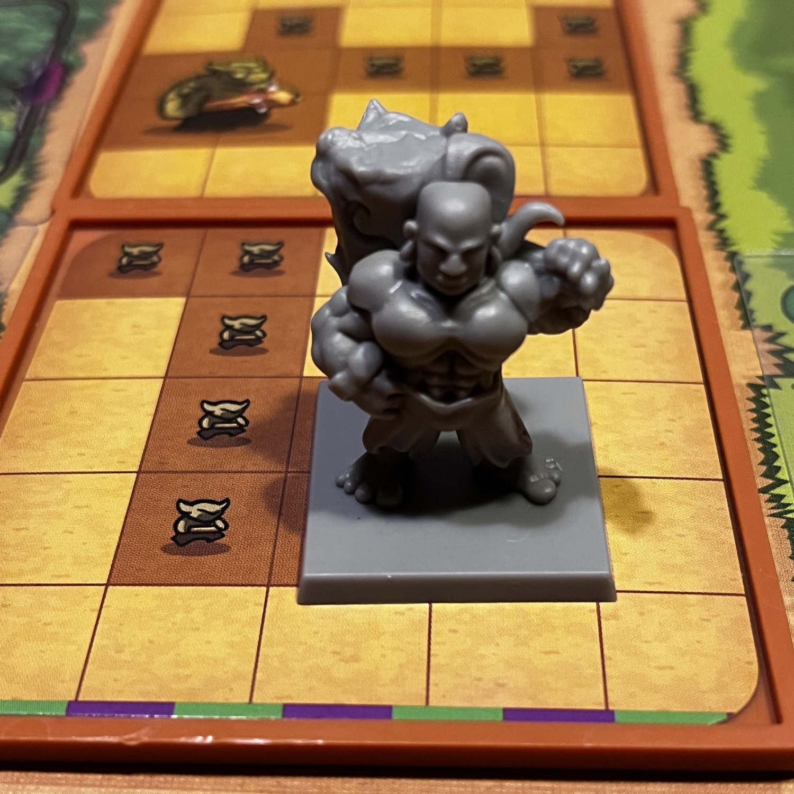

<Setting>

  In un mondo in cui lo spazio-tempo è stato lacerato e potenti creature stanno arrivando da altre epoche, sta a voi, gli eroi del regno, cercare di fermare le ondate nemiche e di chiudere i portali.   Riuscirete a proteggere i vostri cari e a comandare le vostre truppe o soccomberete alle forze nemiche?

</Setting>

<Rules>

  In <em>Kingdom Rush: Rift in Time</em> i giocatori hanno due principali componenti da tenere sotto controllo: il proprio eroe e le torri in loro dotazione.   Durante il round i giocatori, simultaneamente, dovranno decidere come posizionare il proprio eroe e queste torri per coprire tutti gli spazi sulle tessere nemiche. Sì, avete letto bene: le orde nemiche sono rappresentate con delle tessere contenenti degli avversari, da coprire letteralmente con il vostro eroe, con le vostre abilità speciali o con i proiettili lanciati dalle torri: il tutto (salvo la miniatura del vostro eroe che è un solido 2x2 di plastica) ha le forme più disparate!  
  I buoni, in questo gioco, infatti, “sparano” dei polimini di varia dimensione con lo scopo di coprire gli avversari! Ogni orda nemica coperta darà un cristallo, con i cristalli si potranno comprare torri sempre più potenti, e così via, fino a quando, di solito, l’ultimo portale del round viene chiuso o il regno soccombe sotto i colpi delle forze nemiche.

</Rules>

<Feedback>

  Kingdom Rush è un mondo che viene da lontano, da un gioco per smartphone prodotto dalla Ironhide Game Studio: la <Link to="/publishers/lucky-duck-games">Lucky Duck Games</Link> ha fatto una delle migliori trasposizioni di un videogioco in un gioco da tavolo al momento, a mio parere. Ha i suoi difetti? Certamente. Come <Link to="/mechanism/cooperativo">Cooperativo</Link> soffre decisamente della sindrome dell’Alpha Player (il giocatore antipatico che può comandare dall’inizio alla fine il tavolo) e di un setup e de-setup lunghi, a causa dei molti pezzi in movimento. Inoltre, le carte Portali (l’obiettivo di uno scenario la maggior parte delle volte) hanno delle regole bizzarre e decisamente punitive, tra cui quella di distruggere le vostre costose torri, che sembrano essere state rese complicate senza un motivo vero. L’esistenza dei portali è una scelta puramente del gioco da tavolo, in quanto nella versione per smartphone lo scenario finirà molto più linearmente alla fine di tutte le orde dei nemici! 
Una meccanica decisamente interessante riguarda il fatto che per potenziare le torri, fonte principali dei danni a forma di polimini in questo gioco, bisognerà rinunciare ad una propria torre e passarla ad un altro giocatore, che la userà potenziata dal round successivo!  
Un gioco che ogni amante dei cooperativi dovrebbe avere l’occasione di provare e, per quanto sia limitato a 10 scenari nella sua versione base, non pecca certo di rigiocabilità. E poi… completare le sfide più difficili vi darà parecchio filo da torcere!

</Feedback>

