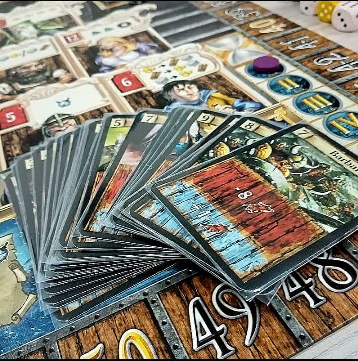
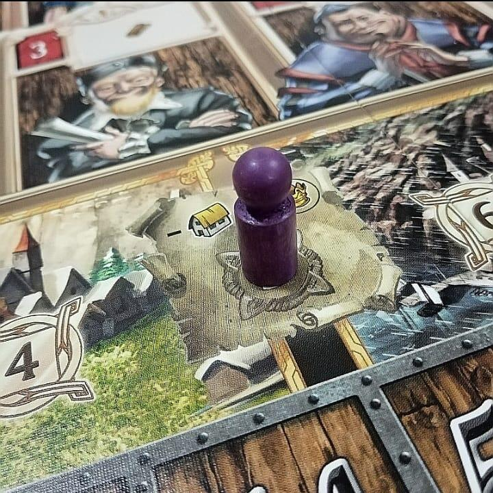
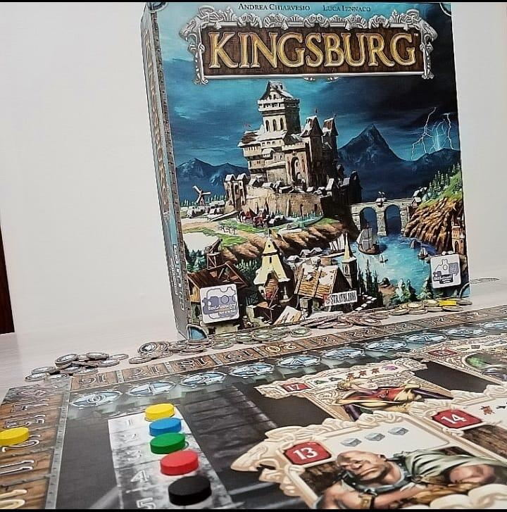

<Setting>

  Il Re Tritus, sovrano del regno di Kingsburg, sta inviando i propri funzionari
  più fidati a governare le terre di confine conquistate di recente.
   
  Il compito di ogni governatore è quello di rendere prosperose le “giovani”
  province del regno perché proteggano i confini reali.
   
  I giocatori saranno chiamati ad erigere edifici produttivi, armerie e
  accademie belliche, monumenti e cattedrali, edifici commerciali e mercati;
  ogni edificio tra i 20 disponibili apporta significative migliorie alla
  strategia dei tempi a venire.
   
  Importante compito è poi quello di fortificare le difese ed addestrare
  l’esercito per prepararlo alle invasioni dell’inverno che, con estrema
  puntualità, vedrà i combattenti di ogni provincia di confine impegnati a
  difendere le terre del Re Tritus.
   
  Chi riuscirà a governare con il pugno di ferro e una strategia infallibile?

</Setting>

<Rules>

  L’obiettivo del gioco è totalizzare il maggior numero di punti vittoria a fine
  partita, costruendo edifici, respingendo in battaglia gli eserciti invasori,
  ma soprattutto influenzando i consiglieri del Re.
   
  Una partita a Kingsburg si articola in 5 “anni”, durante i quali si svolgono 8
  fasi: 4 di esse rappresentano le stagioni dell’anno, le altre 4 gli eventi che
  si svolgono prima di ogni stagione.
   
  L’influenza sui consiglieri reali è rappresentata dal posizionamento dei dadi
  giocatore sulle diverse zone della plancia. Tramite questa meccanica, ogni
  giocatore può (ad esempio) aumentare la forza del suo esercito, sbirciare la
  carta del prossimo nemico per prepararsi meglio alla battaglia, raccogliere
  materie prime e risorse, costruire edifici.
   
  Ogni Stagione, tranne l’inverno, prevede un evento speciale come prima fase,
  diverso di stagione in stagione e che conferisce ad un giocatore un piccolo
  vantaggio. Si procede dunque con il tiro dei dadi: in questa seconda fase ogni
  giocatore tira il proprio set di dadi a disposizione e li conserva per la fase
  successiva, ovvero quella di influenza dei consiglieri. La fase finale prevede
  la costruzione degli edifici presenti sulla plancia personale di ogni
  giocatore, se possibile.
   
  Fatto ciò per le prime tre stagioni, durante l’inverno i giocatori potranno
  solo arruolare soldati e contrastare l’esercito invasore, aiutati da un numero
  casuale ed uguale per tutti di soldati inviati dal Re.
   
  Al termine del quinto anno il giocatore con più punti vittoria è il vincitore.

</Rules>

<Feedback>

  Il gioco è oramai più che rodato: fin dalla sua uscita nel 2007 ha riempito le
  serate di gioco degli avventori al tavolo con un’ambientazione medievale
  notevolmente riuscita per un gioco “dell’epoca”. Al giorno d’oggi forse mostra
  il fianco a qualche gioco più recente e con una produzione e uno sviluppo
  migliori, ma il comparto grafico resta più che apprezzabile.
   
  Le meccaniche pulite, le regole semplici e un’iconografia perfettamente
  leggibile lo rendono un gioco dalla profondità accessibile già alle prime
  partite, anche per i giocatori più piccoli.
   
  Non sarebbe dispiaciuta un’interazione più sentita, dal punto di vista del
  gameplay, mentre da quello dei materiali va notato che purtroppo le plance
  giocatore sono di un cartoncino molto sottile, il che le rende suscettibili di
  “imbarcamento”.
   
  A chi ha affrontato diverse partite (magari con lo stesso gruppo) a lungo
  andare può soffrirne la monotonia, ma L’espansione del Regno (2009) dona al
  gioco un po’ di varietà.
   
  Recentemente è uscita anche la sua Seconda Edizione, rinnovata nelle grafiche
  e snellita di alcune regole che potevano risultare stridenti o ridondanti.
   
  Resta il fatto che una partita a Kingsburg non si rifiuta mai, perché il poco
  impegno richiesto ripaga in termini di soddisfazione.

</Feedback>

