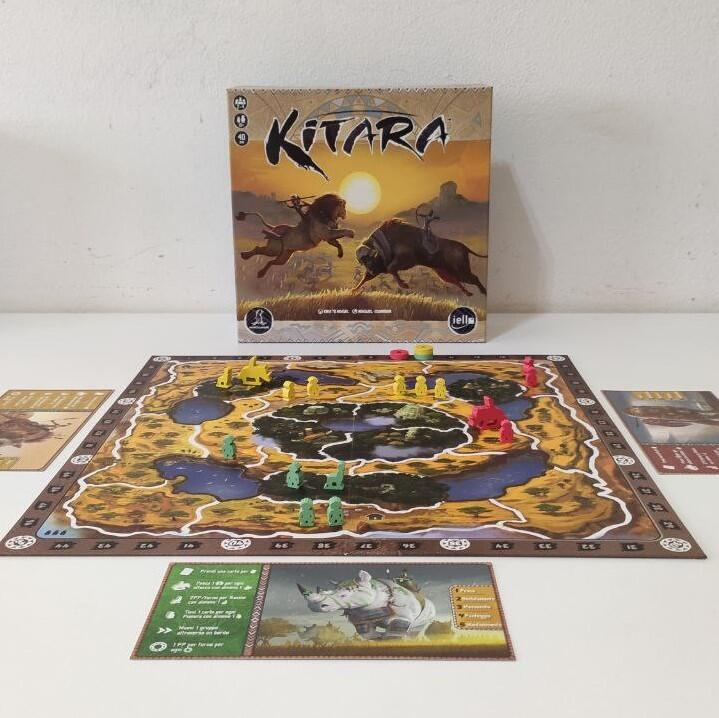
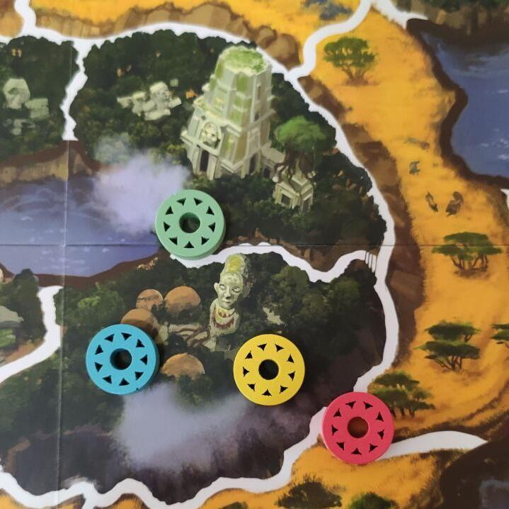

<Setting>

  Ci troviamo nell'immensa regione dei Grandi Laghi africani, attorno ai quali
  un tempo prosperava il leggendario impero di Kitara. Con il passare delle
  generazioni, l'impero è andato sgretolandosi, risultando diviso in piccoli
  regni in costante conflitto tra di loro.
   
  Il tuo compito è riportare Kitara alle antiche glorie, unificando sotto il tuo
  vessillo tutti i regni formatisi dalla sua frammentazione. Ma i tuoi avversari
  non ti renderanno le cose facili.

</Setting>

<Rules>

  In base al numero di giocatori, viene scelta una delle tre mappe disponibili.
  Si sceglie uno dei due mazzi di carte regni e si mescolano singolarmente i
  mazzetti numerati da 1 a 5, che sono poi impilati in ordine crescente: da
  questo set si estrarranno le prime sei carte che comporranno il mercato.
   
  Ogni giocatore inizia la partita con una scheda personaggio riassuntiva, una
  pedina segnapunti, una carta regno numerata 0 e tre guerrieri, che pone su una
  regione iniziale della mappa. Il primo giocatore riceve l'apposito segnalino,
  quindi dà inizio alla partita.
   
  Una partita di Kitara si gioca in turni individuali, questi ultimi divisi in
  fasi che prevedono un'azione corrispondente. Le azioni sono scelte sulla base
  delle carte regno che vengono acquisite ogni turno, che hanno effetti sia
  immediati che progressivi.
   
  All'inizio del turno, il giocatore sceglie una delle carte regno disponibili
  dal mercato; quindi, in base alla carta appena acquisita, distribuisce sulla
  mappa un eventuale numero e tipo di pedine dalla sua riserva; con le pedine
  può compiere fino a tanti movimenti quante sono le icone movimento indicate
  sulle sue carte regno; dopo aver ottenuto i punti, bisogna “mantenere” le
  carte regno, cioè scegliere quali tenere e quali scartare.
   
  Il gioco prevede tre tipi di pedine: Guerriero, Animale-Guida ed Eroe. I
  Guerrieri servono a “mantenere” le carte regno: per ogni spazio Savana
  occupato da un Guerriero si può tenere una carta regno alla fine del turno.
  Gli Animali-Guida fanno punti se alla fine del turno si trovano su uno spazio
  Rovina. Gli Eroi permettono di pescare dei gettoni-punti da un sacchetto, se
  vengono utilizzati per muovere un attacco.
   
  Ognuna di queste pedine può essere utilizzata per occupare le regioni libere
  della mappa ed eventualmente attaccare le fazioni avversarie. Con un punto
  azione di movimento è possibile prendere un gruppo di pedine presenti in una
  stessa regione e spostarle in una adiacente. Se quest'ultima è occupata da un
  avversario, è possibile respingere le sue pedine nella regione alleata più
  vicina, qualora si conduca un attacco con un numero di pedine superiore.
   
  La fine della partita viene innescata dall'estrazione della prima carta regno
  numerata 5: si completa il round in corso e se ne gioca un ultimo, di modo che
  tutti i giocatori abbiano eseguito lo stesso numero di turni; quindi si
  contano i punti ottenuti durante il corso della partita. Il giocatore con più
  punti sarà il nuovo imperatore di Kitara!

</Rules>

<Feedback>

  L'editore originale lo definisce un gioco di strategia dinamico, e credo che
  non ci siano parole migliori per descriverlo. A dispetto dell'ambientazione e
  dell'estetica, Kitara è uno strategico molto pulito e ben limato.
   
  Grazie ad un semplice ma intelligente core loop (acquisto una carta, gioco le
  pedine, muovo le pedine), Kitara riesce a combinare l'esperienza serrata di un
  eurogame con l'immediatezza di un astratto e con la pulsione e l'interazione
  di un wargame, condendo il tutto con una varietà che non sa (quasi) mai di
  fortuna nuda e cruda. Da questo punto di vista, è un gioco che può
  accontentare i più diversi gusti del pubblico.
   
  L'aspetto più pregevole di Kitara è sicuramente il suo alto livello
  d'interazione, che lo rende un gioco dove non è mai detta l'ultima parola e in
  cui arraffare tanti punti in un round può metterti in una posizione debole in
  seguito. Si gioca sempre tenendo in mente che tipo di vantaggio si offre agli
  avversari e, non di rado, la partita termina con uno scarto di pochi punti tra
  le diverse posizioni della classifica. Questa caratteristica da sola vale la
  metà del gioco.
   
  Anche la scatola, visto il suo contenuto, risulta piacevolmente compatta, e i
  componenti sono di ottima fattura, considerata la fascia di prezzo.
   
  Altri elementi, d'altro canto, risultano un po' più tiepidi, come ad esempio
  l'ambientazione mozzafiato e le epiche illustrazioni, a fronte dei quali però
  il gameplay e i materiali risultano decisamente astratti nell'esperienza del
  gioco. Pur rimanendo fedele alla sua essenza di eurogame, il team dietro allo
  sviluppo del gioco avrebbe potuto osare un po' di più, banalmente anche solo
  inserendo una modalità di gioco “avanzata” che lo rendesse un titolo un po'
  più tematico, o impiegando più illustrazioni, ad esempio sulle carte.
   
  Un aspetto che invece è una vera stonatura è il funzionamento delle pedine
  Eroe, che permettono di arraffare gettoni con punti diversi anche più volte
  durante lo stesso turno, quasi in un movimento “a cascata”. Anche la meccanica
  stessa del sacchetto sa un po' troppo di lotteria per un gioco dalle strutture
  così meticolose. Sarebbe stato interessante, ad esempio, se i gettoni avessero
  fornito delle azioni “spendibili” e/o avessero potuto sbloccare le abilità
  delle fazioni, che invece sono (in maniere un po' deludente) perfettamente
  simmetriche tra di loro.
   
  C'è però da dire, in ultima istanza, che la sua insindacabile solidità rende
  il nucleo di Kitara un fertile punto di partenza per lo sviluppo di modalità
  di gioco o espansioni, sia pure fan made. Parliamo di asimmetria tra le
  fazioni ma anche di creazioni di nuovi mazzi, nuove azioni, nuove pedine,
  nuove mappe, e chi più ne ha più ne metta. Sicuramente il gioco meriterebbe
  più supporto dall'editore, ma nonostante tutto, almeno per il momento, rimarrà
  nella mia collezione.

</Feedback>

