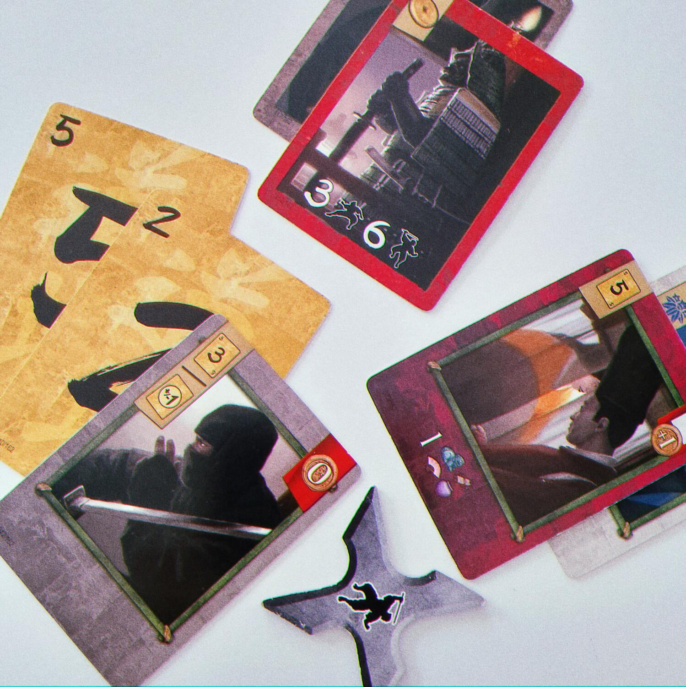
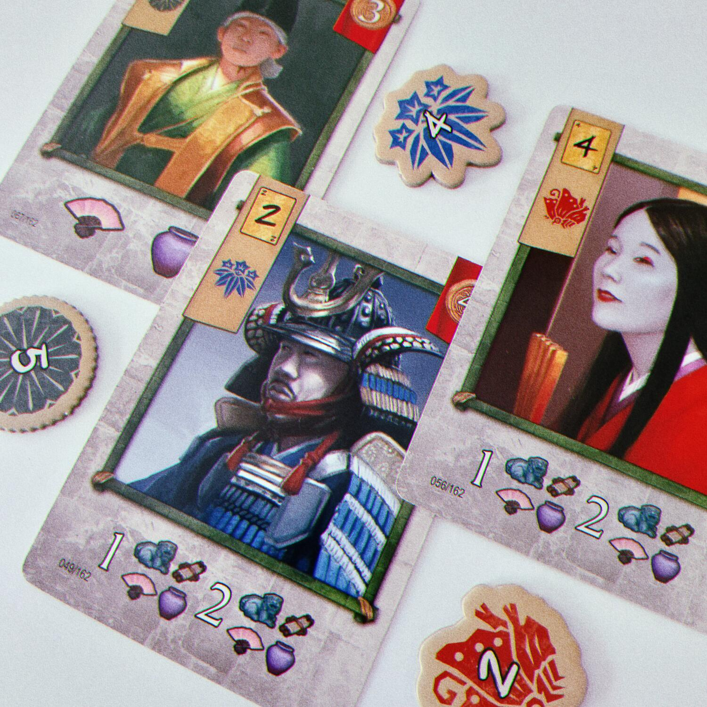
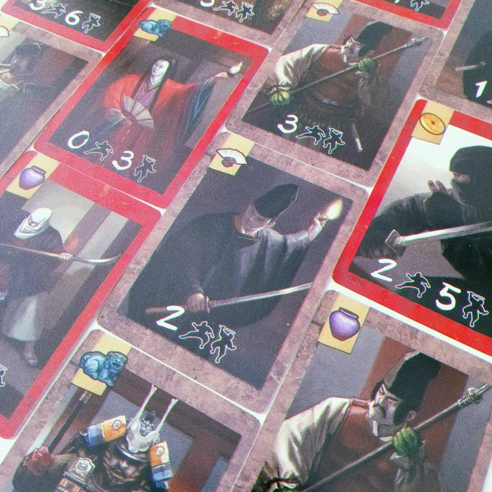

<Setting>

  <strong>XII secolo, Sol Levante</strong>. La guerra Genpei si è appena
  conclusa e i clan nobiliari sembrano aver accettato il dominio dei Minamoto.
  Un’intera epoca è al tramonto, e si inizia ad intravedere un’alba di gloriosi{" "}
  <strong>samurai</strong>. Dopo esserti sporcato le mani in sanguinose
  battaglie, credi di meritare un po’ di riposo. Ma il potere militare è
  instabile e i clan ti ordinano di{" "}
  <strong>attaccare il palazzo dello shogun</strong>, dove dovrei farti strada
  con forza e furtività tra le guardie. Affila il tuo kodachi e{" "}
  <strong>preparati all’assalto!</strong>
   

</Setting>

<Rules>

  In <em>Kodachi </em>ciascun giocatore riceve un mazzetto di carte numerate dal
  quale estrarrà ogni turno una <strong>mano di 5 carte</strong> che dovrà usare
  per condurre un assalto al palazzo.
   
  Al grido di “banzai!” si estraggono le carte in cima al mazzo delle guardie e
  a quello del palazzo: la prima rappresenterà la{" "}
  <strong>guardia da sconfiggere</strong>, la seconda la{" "}
  <strong>ricompensa da riscattare</strong>. Dopo la prima estrazione, il
  giocatore di turno decide se condurre un assalto usando la{" "}
  <strong>Forza </strong>oppure la <strong>Furtività</strong>: dovrà cioè
  scartare una carta dalla propria mano il cui valore sia rispettivamente
  superiore o inferiore (ma mai uguale) al valore della guardia estratta. Una
  volta sconfitta la guardia, ci si può fermare oppure proseguire l’assalto, ma
  non sarà possibile cambiare stile di combattimento finché il giocatore non
  deciderà di fermarsi e riscuotere le ricompense delle guardie (lasciandone una
  a terra): si estrae quindi una nuova coppia di carte guardia-palazzo, e si
  ripete il procedimento. Se il giocatore si trova davanti a una guardia che non
  può sconfiggere, il suo assalto è fallimentare e perderà tutte le ricompense
  accumulate, che saranno raccolte dagli altri giocatori.
   
  Con le ricompense accumulate è possibile comprare le carte palazzo rivelate
  durante il turno: possono farlo sia il giocatore di turno che abbia concluso
  con successo l’assalto, sia, in senso orario, gli altri giocatori che abbiano
  deciso di non raccogliere le ricompense rimaste a terra.{" "}
  <strong>Le carte palazzo</strong> così acquistate andranno aggiunte alla mano
  e infoltiranno le fila del <strong>mazzo del giocatore</strong>, aiutandolo in
  battaglia e/o garantendogli punti vittoria. Tra queste carte ci sono anche i
  dignitari, il cui acquisto permette di ottenere un emblema del clan
  corrispondente, che fornirà ulteriori punti.
   
  Alla fine del turno, dopo aver acquistato le carte, il giocatore può
  ottimizzare la propria mano, scartando carte e pescandone fino ad averne
  cinque.
   
  La partita termina quando tutti i 9 emblemi sono stati riscossi o quando un
  giocatore ne ha ottenuti 4. Si sommano i punti ottenuti tramite gli emblemi e
  le carte. Chi avrà totalizzato la somma più alta vincerà!
   

</Rules>

<Feedback>

  <em>Kodachi </em>è un filler che{" "}
  <strong>non attira molto l’attenzione</strong> nel vasto panorama del suo
  genere. Ha una scatolina modesta che contiene qualche gettone di cartone e dei
  mazzetti di carte, queste ultime con un retro dal progetto grafico che è più
  vecchio che vintage. Tuttavia, superata la prima impressione, è impossibile
  non notarne i pregi anche più superficiali, come le illustrazioni di Drew
  Baker (<em>Star Wars</em>, <em>Legend of the Five Rings</em>) o il regolamento
  asciutto e agevole, o ancora il prezzo più che accessibile.
   
  Ma il vero punto di forza di <em>Kodachi </em>sono le sue{" "}
  <strong>meccaniche perfettamente combinate</strong>. Parliamo di
  deck-building, push-your-luck e gestione risorse: tutti elementi familiari che
  convergono <strong>senza forzature</strong> in un gioco dal{" "}
  <strong>flusso incalzante</strong> che sembra qualcosa di assolutamente
  inedito.
   
  Già al primo turno si riesce ad acquisire familiarità con le strategie che
  possono essere approntate per ottimizzare il potenziale della mano di carte
  che si ha a disposizione. E sebbene la ripida curva di apprendimento e le
  meccaniche ripetitive, il gioco <strong>non stanca</strong>, perché ogni turno
  è diverso dagli altri grazie alla combinazione (quasi) imprevedibile di carte
  che verranno estratte. Le carte palazzo poi fanno molta gola, e a volte si
  vorrebbe trovare proprio quella risorsa in più che mancherebbe per acquistare
  una carta potente, e irrimediabilmente si finisce per “sballare” e dover
  rinunciare a tutto. Dopo qualche partita si comincerà ad imparare quali mani
  vale la pena giocare e quali invece è meglio risistemare.
   
  Nonostante l’interazione tra giocatori sia tutta indiretta, il gioco è
  coinvolgente e i turni degli avversari possono diventare occasioni ghiotte: si
  spera sempre che l’audacia degli altri sia più grande di quello che possono
  permettersi.
   
  Dulcis in fundo, ha una <strong>scalabilità</strong> che pochissimi titoli
  possono vantare: funziona benissimo a qualsiasi player count, anche se forse
  in 4 qualche giocatore impaziente potrebbe soffrire i tempi morti in attesa
  del suo turno.
   
  Difetti? Mi piace pensare che non ne abbia, ma purtroppo qualcosina in più si
  poteva fare. A livello di produzione, ho già citato il progetto grafico,
  troppo old school, e una scatola così compatta che è impossibile tenervi le
  carte imbustate (il che è un problema, vista la frequenza con cui vanno
  mescolate). Potrebbe essere un neo anche la durata, che in alcune partite si
  protrae oltre i 45 minuti, superando i tempi del filler.
   
  Ma se si riesce a chiudere un occhio su queste grinze, si ha davanti{" "}
  <strong>    un gioco potenzialmente immortale, facile da insegnare, adattato a
    molteplici situazioni, economico ed estremamente portatile</strong>
  , e soprattutto in grado di esplorare <strong>livelli di profondità</strong> che
  potrebbero soddisfare anche i giocatori più incalliti.
   

</Feedback>

