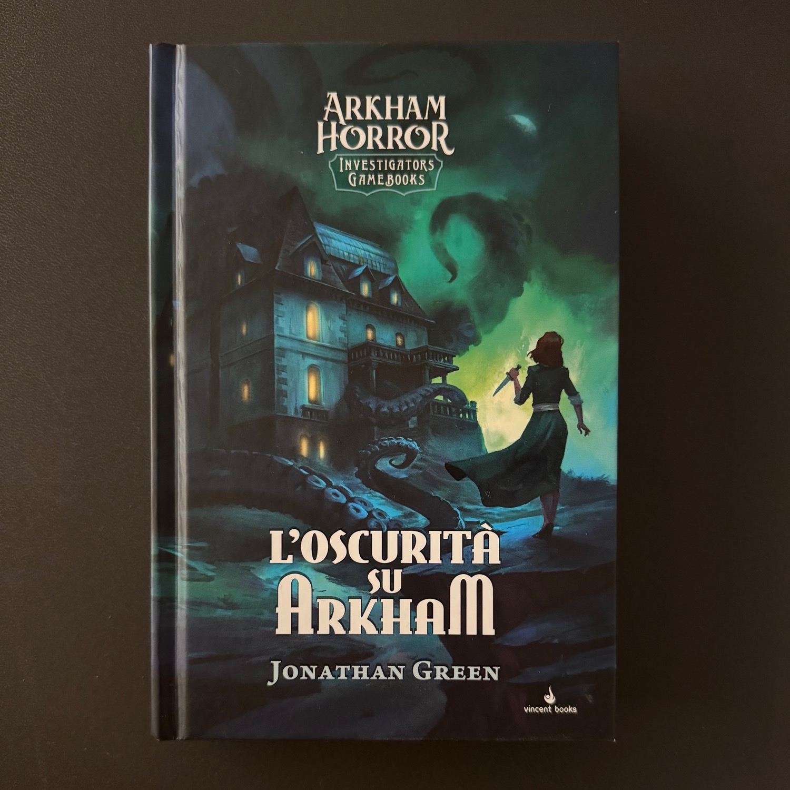
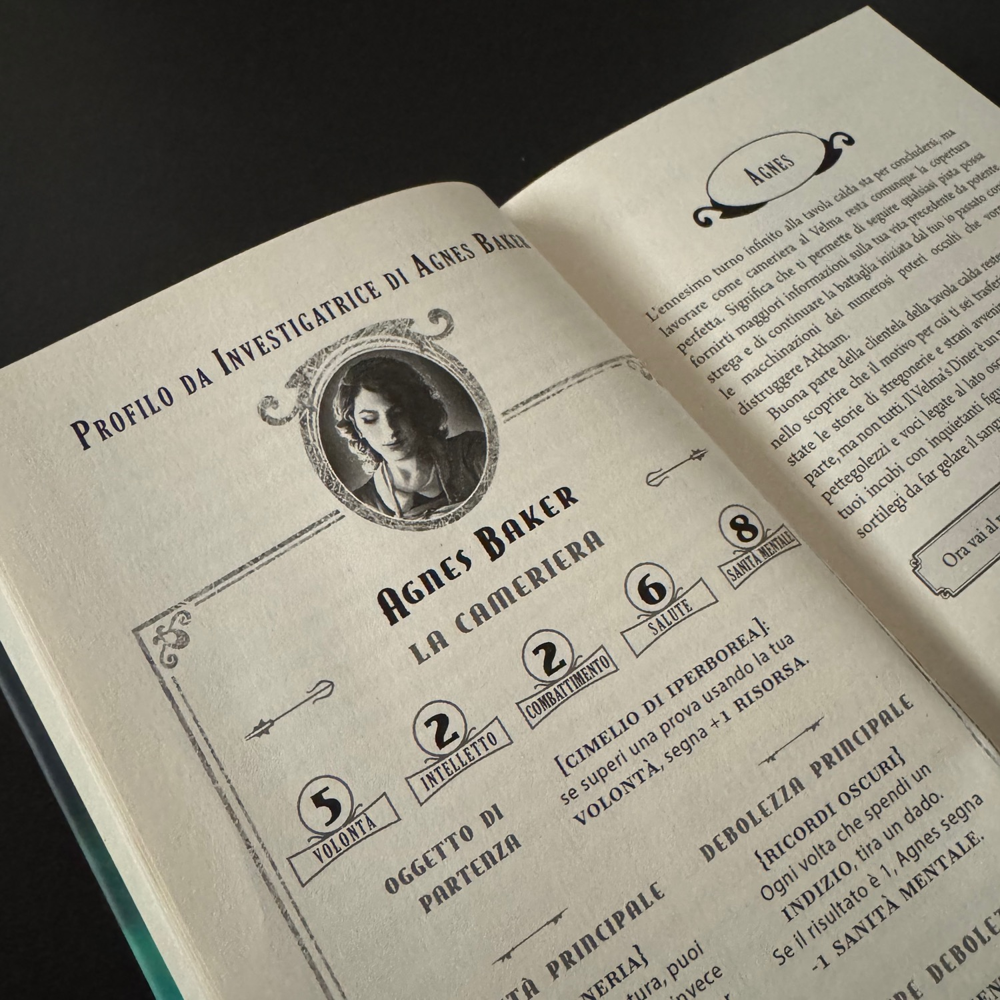
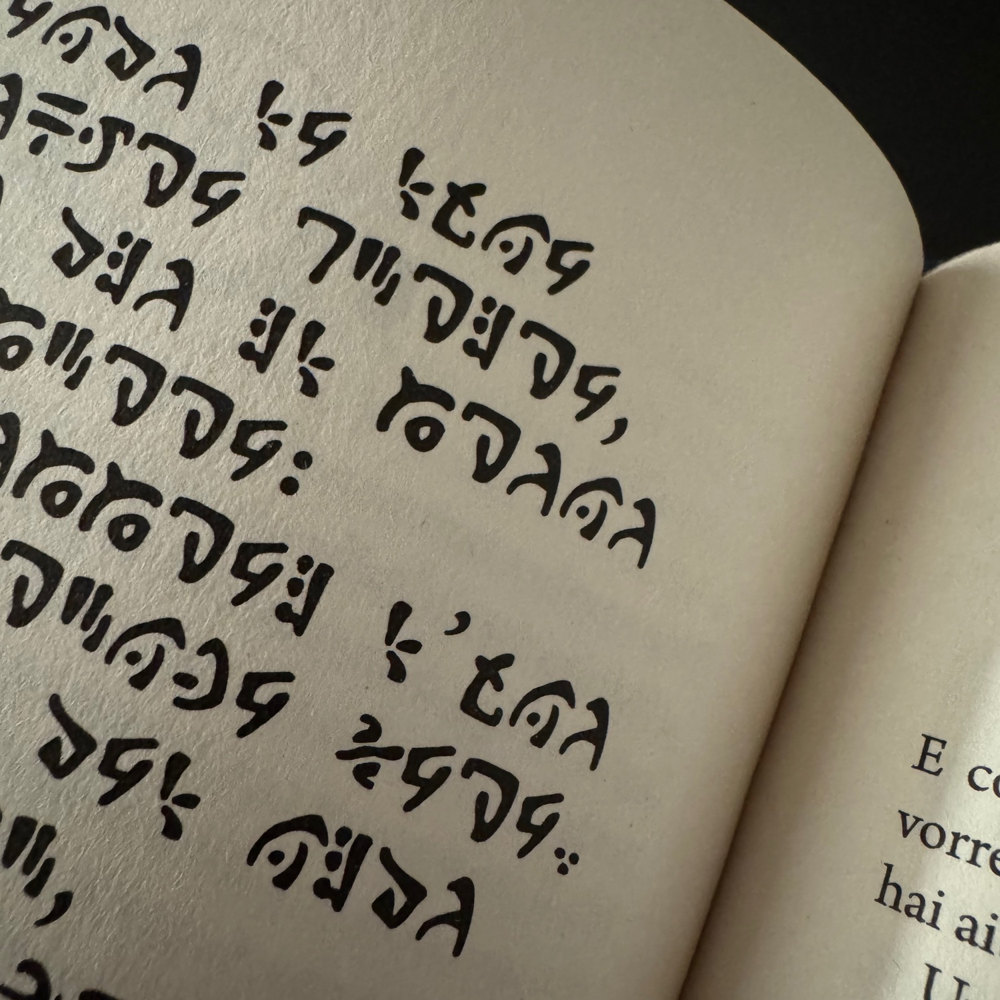

<Setting>

Gli <strong>Investigatori di Arkham</strong> sono chiamati a intervenire dopo la morte enigmatica di un illustre professore, per portare alla luce gli oscuri segreti che si celano dietro la sua fine.

Nel tuo ruolo di Investigatore, scegli come agire e costruisci alleanze lungo il cammino, mentre cerchi di individuare il responsabile prima che colpisca di nuovo. Tuttavia, Arkham è un luogo intriso di misteri: nell’ombra agiscono forze determinate a mantenere la verità nascosta e a dare inizio a una nuova era di tenebra e distruzione, pronta a travolgere il mondo.

Riuscirai a fermarle prima che sia troppo tardi?

</Setting>

<Rules>

In L’oscurità su Arkham inizi scegliendo uno dei tre Investigatori disponibili: <strong>Agnes Baker</strong>, <strong>Rex Murphy</strong> o <strong>Nathaniel Cho</strong>. Ognuno ha valori diversi per <strong>Vita</strong>, <strong>Sanità Mentale</strong>, <strong>Volontà</strong>, <strong>Intelletto</strong> e <strong>Combattimento</strong>, che servono a superare le prove psicologiche, gli enigmi investigativi e gli scontri fisici che incontrerai nel corso dell’avventura. Tutto è tracciato sulla scheda dell’Investigatore, insieme agli indizi, agli oggetti e alle parole chiave raccolti lungo il percorso.

Le <strong>sfide</strong> si risolvono lanciando <strong>uno o più dadi</strong> e confrontando il risultato con il valore dell’abilità richiesta. Riuscire nella prova ti permette di proseguire senza conseguenze, mentre un fallimento può comportare danni, la perdita di risorse o sviluppi narrativi più complessi.&nbsp;

Tra le risorse da monitorare c’è anche il <strong>Destino</strong>, un valore che cresce di pari passo&nbsp; con la rivelazione dei misteri di questa avventura. Più basso è questo valore, meglio è per l’umanità; più alto è, più le creature e gli Antichi che infestano Arkham acquisiscono vantaggio, causando la progressiva degenerazione della città e del mondo circostante.

A mano a mano che avanzi, raccogli <strong>indizi</strong> e <strong>risorse</strong>, elementi che ti aiutano a capire cosa sta realmente accadendo, e a superare ostacoli o nemici. Il libro richiede di prestare attenzione ai dettagli, <strong>prendere appunti</strong> e spesso annotare <strong>parole chiave</strong>: armarsi di fogli e penne è praticamente obbligatorio per non perdere traccia degli enigmi e delle connessioni tra gli eventi.

Il sistema, pur semplice, tiene costantemente alta la tensione: ogni scelta può avere conseguenze immediate o a lungo termine, e riuscire a gestire i tuoi valori, le prove e le risorse è essenziale per sopravvivere e portare avanti l’indagine in un’Arkham sempre più oscura e minacciosa.

</Rules>

<Feedback>

L’oscurità su Arkham è il <strong>primo volume</strong> della nuova serie <strong>Arkham Horror Investigators Gamebooks</strong>, una linea di librogame che esplora le ambientazioni esoteriche e oscure tipiche di Lovecraft e in generale della letteratura weird.

<strong>I personaggi e l’ambientazione</strong> sono gli stessi dell’universo Fantasy Flight: conoscere già certe figure o luoghi dall’esperienza pregressa di <Link to="/reviews/arkham-horror-lcg">Arkham Horror LCG</Link> mi ha permesso di partire con emozioni già consolidate, ma il libro riesce comunque a <strong>sorprendere</strong> grazie ai molteplici percorsi e alle scelte narrative. Non si sa mai dove si arriverà: ogni decisione può cambiare il corso della storia, e spesso sono rimasto sorpreso dagli sviluppi.

Il libro propone percorsi alternativi e raccogliere oggetti, indizi e risorse è fondamentale per scoprire tutti i dettagli dell’indagine. <strong>Non ho esplorato tutti i percorsi</strong> (sono davvero tantissimi) ma sono comunque riuscito ad arrivare fino alla fine della storia ottenendo quattro stelle (su cinque credo), con un po’ di fortuna in qualche lancio di dadi. La lettura più lunga mi ha occupato per <strong>3-4 ore</strong>, e alcuni capitoli, come il 140, possono risultare più tediosi a tal punto da sognarseli la notte, dato che richiedono di ricominciare e riprovare a completare il nostro destino. Il lato positivo, però, è che così si possono provare i diversi Investigatori senza seguire, per forza, gli stessi passi della partita precedente.&nbsp;

Un dettaglio da non trascurare è la copertina italiana, realizzata da <strong>Alberto Dal Lago</strong>: diversa da quella originale inglese, conferisce al volume un’impronta unica e molto evocativa, perfettamente in linea con l’atmosfera oscura e misteriosa del libro.

In sintesi, L’Oscurità su Arkham è <strong>un’avventura oscura e intelligente</strong>, che stimola curiosità e tensione in egual misura, e che non delude chi cerca un’esperienza di gioco narrativa ricca e ben strutturata. Armatevi di penna e blocco per appunti: Arkham è pronta a mettere alla prova il vostro ingegno e il vostro coraggio.

E occhio agli insetti.

</Feedback>

