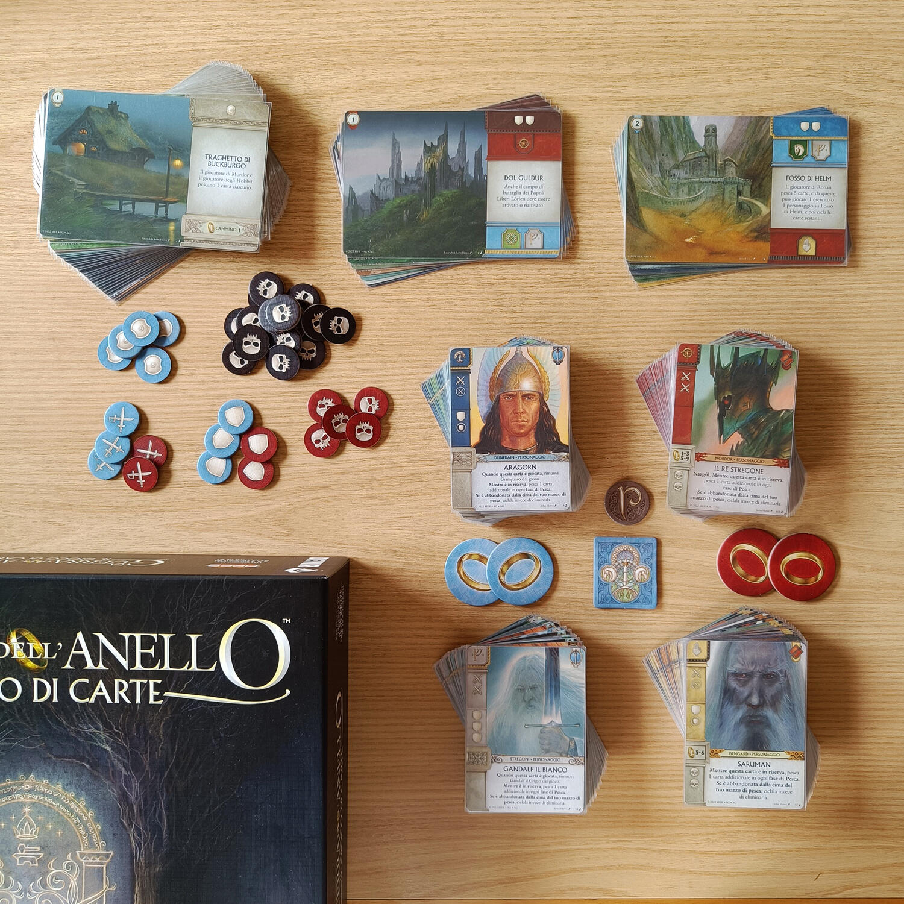
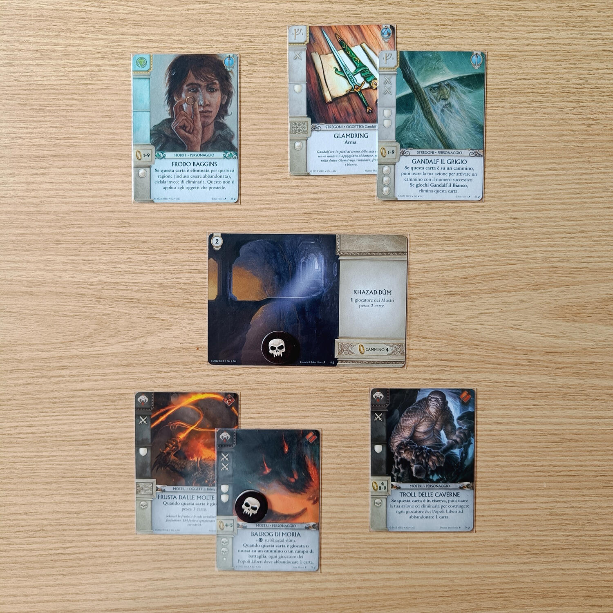
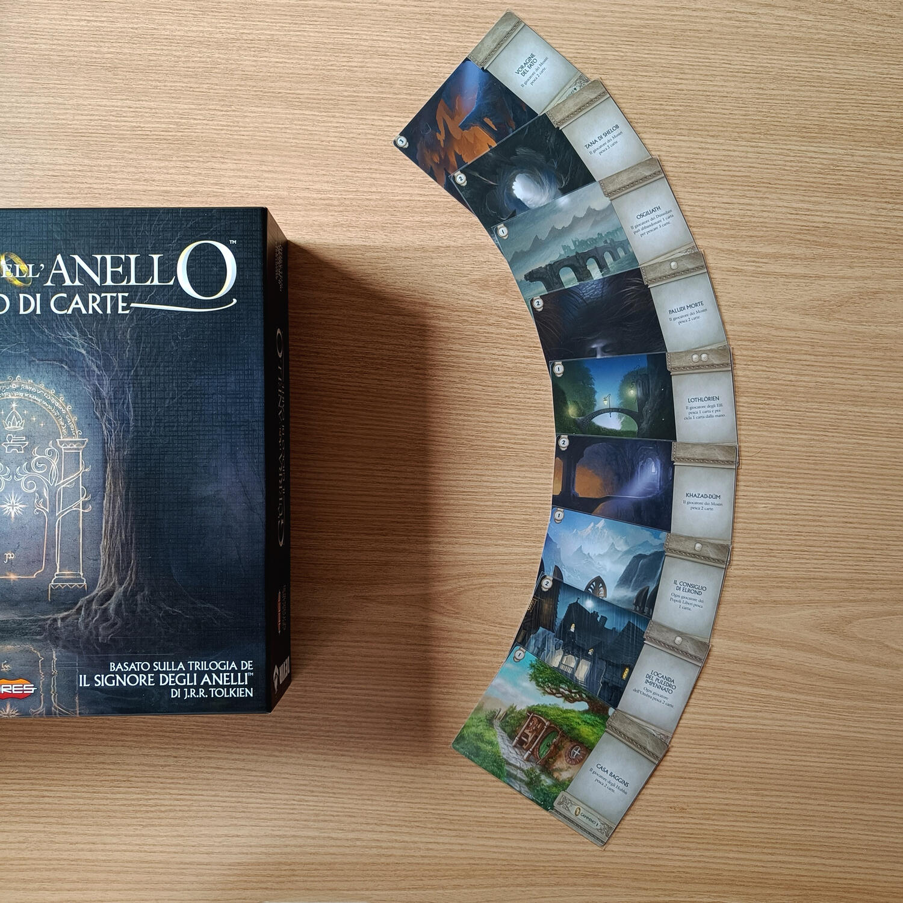

<Setting>

  “Un Anello per domarli, un Anello per trovarli, un Anello per ghermirli e nel
  buio incatenarli”: probabilmente vi basterà questa frase per capire che con
  “La Guerra dell’Anello – Il Gioco di Carte” rivivremo le vicende della
  trilogia de “Il Signore degli Anelli” (ne avete mai sentito parlare?), il
  capolavoro del fantasy scritto da J.R.R. Tolkien.
   
  È importante precisare che il riferimento per Ian Brody, autore del gioco,
  sono stati i libri, e non il celeberrimo adattamento cinematografico di inizio
  anni 2000, che inevitabilmente nella sua trasposizione ha portato
  all’eliminazione di qualche dettaglio che invece nella “Guerra dell’Anello –
  Il Gioco di Carte” è presente.
   
  Il gioco ci porterà a guidare una delle due fazioni, i Popoli Liberi o le
  Forze dell’Ombra, rispettivamente per la salvezza o il predominio sulla Terra
  di Mezzo, che si sfideranno sui diversi campi di battaglia e sulle tappe del
  cammino che hanno condotto Frodo dalla Contea fino al cuore di Monte Fato per
  la distruzione dell’Unico Anello. Basterà il coraggio dei Dunedain, degli Elfi
  e degli Hobbit, guidati da Aragorn e Gandalf, o la corruzione portata dai
  Nazgul e le forze di Saruman riusciranno alla fine a prevalere?

</Setting>

<Rules>

  “La Guerra dell’Anello – Il Gioco di Carte” è un gioco per 4 giocatori (anche
  se sono presenti delle varianti per 2 e 3 giocatori), dove due squadre
  composte da due giocatori (i Popoli Liberi o le Forze dell’Ombra) si
  combatteranno su varie tappe del “cammino” (il percorso intrapreso dagli
  Hobbit per distruggere l’Unico Anello) e sui diversi campi di battaglia.
   
  Ogni giocatore controllerà un mazzo differente di 30 carte, comprendenti carte
  evento, personaggio, oggetto o esercito delle diverse fazioni protagoniste de
  Il Signore degli Anelli, ovvero:
  <ul>
    <li>Hobbit/Stregoni/Nani/Rohan;</li>
    <li>Mordor;</li>
    <li>Dunedain e Elfi;</li>
    <li>Saruman.</li>
  </ul>
  La partita sarà suddivisa in round, ciascuno dei quali terminerà quando ogni
  giocatore deciderà di passare durante il proprio turno. All’inizio del round
  verranno estratti una tappa del cammino, che salirà progressivamente da un
  livello 1 ad un livello 9, e un campo di battaglia, dei Popoli Liberi o
  dell’Ombra, a seconda del giocatore che inizia quel round.
   
  Le carte che verranno giocate dalla mano di ciascuno potranno essere
  posizionate su uno di questi cammini e campi di battaglia oppure nella propria
  riserva.
   I giocatori, durante il proprio turno, dovranno svolgere una tra sette azioni:
  <ul>
    <li>      giocare una carta (tutte caratterizzate da un particolare effetto) dalla
      mano, “ciclando” un’altra carta (ovvero mettendo la carta in una pila di
      scarti che poi torneranno in gioco);</li>
    <li>      muovere un personaggio dalla riserva su un cammino o campo di battaglia;</li>
    <li>“ciclare” una carta dalla mano;</li>
    <li>eliminare due carte dalla mano per pescare una carta;</li>
    <li>risolvere l’azione di una carta;</li>
    <li>      usare il segnalino Anello (unico per giocatore e usabile una sola volta
      durante la partita) per pescare due carte;</li>
    <li>passare.</li>
  </ul>
  Quando tutti i giocatori passano, il round termina e vengono risolti i combattimenti
  sui cammini o sui campi di battaglia: ogni carta schierata ha dei punteggi di attacco
  (“corruzione” nel caso dei cammini) e di difesa, e chi prevale si aggiudica quella
  zona e i relativi punti vittoria.
   
  La partita termina quando viene risolto la tappa 9 del cammino oppure non appena
  una delle due squadre guadagna 10 punti di vantaggio sull’altra. Vince ovviamente
  la squadra che ha accumulato più punti vittoria.

</Rules>

<Feedback>

  Può un semplice gioco di 120 carte riprodurre un’intera saga di centinaia di
  pagine? Forse questo è un obiettivo per definizione impossibile, ma “La Guerra
  dell’Anello – Il Gioco di Carte” ci va molto vicino. Siamo rimasti
  impressionati dalla qualità di questo gioco, che ci ha stupito per l’attenta
  aderenza al tema e per come riesca a far rivivere in così poche carte tutta
  l’epica saga de Il Signore degli Anelli, con un gameplay avvincente e
  profondo, nonostante un regolamento non troppo complesso.
   
  Il gioco è abbastanza stretto, con un mazzo di sole 30 carte: ogni giocatore
  sarà continuamente costretto a scegliere di scartare una carta per giocarne
  un’altra. La forte asimmetria dei mazzi (comunque tutti ben bilanciati) porta
  necessariamente a dover affinare il gioco di squadra con il proprio compagno:
  la capacità di pianificare, giocando o sacrificando “dolorosamente” le carte
  giuste al momento opportuno, sarà fondamentale per vincere.
   
  Trenta carte per ogni mazzo sembrano poche ma, poiché sono tutte diverse fra
  loro, la variabilità che portano è ampia: considerando i 14 campi di battaglia
  diversi e le 27 tappe del cammino (tre per ciascuno dei 9 livelli), di cui
  solo una parte vengono usati in partita, la rigiocabilità offerta è molto
  alta, anche se inevitabilmente la storia ripercorsa sarà sempre quella de Il
  Signore degli Anelli.
   
  I materiali (161 carte e 41 segnalini di cartone), forse quantitativamente
  poco proporzionati rispetto al prezzo proposto (attualmente 50€), presentano
  una grafica di qualità, con le illustrazioni dei fratelli Howe ed altri
  illustratori (e sono tutte dei piccoli capolavori!): questo, unito ad un
  gameplay eccellente, compensa il numero dei componenti.
   
  Sebbene il gioco nasca per 4 giocatori, la modalità a 2 ci è sembrata molto
  ben riuscita, mentre quella a 3 sembra poco adatta e un po’ “appiccicata”.
   
  Difetti? Abbiamo faticato a trovarne: se vi piacciono i giochi di carte o il
  Signore degli Anelli, questo gioco è un piccola perla e un “must have”.

</Feedback>

