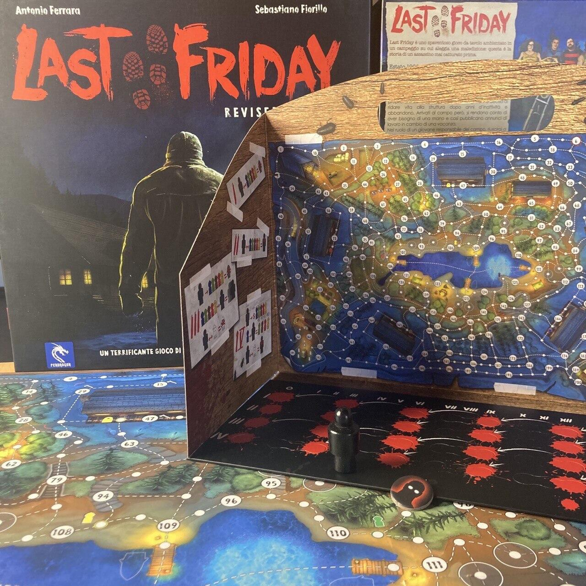

<Setting>

  Last Friday nasce dall'ossessione che Antonio Ferrara, l'autore del gioco, ha
  per la storia della saga di Venerdì 13.
   
  “Da piccolo, dice l'autore, ho visto tutti i film e mi sono innamorato della
  situazione angosciante in cui un gruppo di ragazzi si ritrovano bloccati in un
  campeggio tra le colline sulle sponde di un lago inseguiti da un assassino mai
  morto. L'idea che il corpo di Jason non fosse mai stato ritrovato e la
  leggenda che narra della sua vendetta per l'uccisione della madre da parte di
  uno dei responsabili del campo estivo mi hanno conquistato così tanto che ho
  costruito un rudimentale gioco da tavolo (quello che poi, tanti anni dopo,
  sarebbe diventato Last Friday) usando dei cartoni da imballaggio e dei
  personaggi della Playmobil. Il tabellone lo disegnai a mano con dei pennarelli
  ed era talmente grande che occupava tutta la stanza.”
   
  L'ambientazione horror è tangibile e ti pervade durante tutto il gioco; che si
  abbia visto il film o meno, si viene automaticamente catapultati lungo le
  sponde afose del campeggio.

</Setting>

<Rules>

  Durante la partita i giocatori dovranno scoprire se effettivamente al campo si
  nasconde qualcosa di anomalo mentre il maniaco si aggirerà tra i bungalow e
  dovrà eliminarli tutti, in modo che il campeggio non venga riaperto mai più.
   
  Le parti avranno a disposizione quattro round che chiameremo capitoli; ogni
  chiusura di capitolo dà il via al successivo, ma visto che ognuno di essi ha
  regole proprie, può essere giocato singolarmente seguendo direttive
  specifiche.
   
   
  <strong>CAPITOLO I:</strong> L'arrivo a Camp Apache
   
  La preparazione è molto semplice: ogni campeggiatore posiziona la sua pedina sul
  pallino bianco bordato del proprio colore; poi il maniaco sceglie in segreto una
  delle sue caselle di partenza e disporrà in modo casuale i segnalini welcome (quelli
  con la tenda) sui tondini a loro destinati.
   
  Durante i quindici turni, prima i campeggiatori e poi il maniaco si muoveranno
  sui tracciati indicati sulla mappa; i campeggiatori dovranno scovare tra i segnalini
  le chiavi dei cinque bungalow, arrivare ad essi, aprirli (ogni chiave apre il bungalow
  del colore corrispondente) ed entrarci mettendosi così in salvo dal maniaco, che
  invece dovrà inseguirli e ucciderli tutti. Durante i movimenti, se il maniaco oltrepassa
  o viene oltrepassato da un campeggiatore, questi ci lascerà le penne e verrà eliminato
  dal gioco.
   
  Importante ricordarsi che i movimenti del maniaco sono segreti: solo ogni tre turni
  svelerà la posizione in cui si trovava tre turni prima (esempio: al 3 turno il
  maniaco dovrà svelare la sua posizione al turno 0, quindi alla partenza)
   
   
  <strong>CAPITOLO II:</strong> L'inseguimento
   
  Questo capitolo inizia esattamente com'è terminato il precedente e, se ci sono
  state delle vittime, queste verranno sostituite da ignari campeggiatori appena
  giunti a Camp Apache.
   
  Vigeranno le stesse regole di movimento e la durata sarà sempre di quindici
  turni, che però vedranno i protagonisti in ruoli invertiti: saranno infatti i
  campeggiatori a dare la caccia al maniaco che, muovendosi all'albeggiare, ogni
  tre turni dovrà svelare loro la sua posizione REALE!
   
  Se, durante un movimento, il maniaco oltrepassa o verrà oltrepassato da un
  campeggiatore si considererà ferito e il capitolo viene concluso con la
  vittoria dei campeggiatori.
   
  Il campeggiatore che ferisce il maniaco diventerà il Predestinato.
   
   
  <strong>CAPITOLO III:</strong> La vendetta
   
  Il maniaco dovrà inseguire e catturare il Predestinato, che dovrà fare di tutto
  per sfuggirgli; gli altri campeggiatori dovranno proteggere il Predestinato mettendo
  i bastoni tra le ruote al maniaco.
   
  In questo capitolo gli omicidi del maniaco avvengono nello stesso modo del capitolo
  I, con la differenza che, quando ad oltrepassarlo è un campeggiatore, questi non
  muore e il maniaco dovrà rivelarsi. Se però ad oltrepassare il maniaco è il Predestinato,
  questi sarà catturato e il maniaco avrà vinto.
   
   
  <strong>CAPITOLO IV:</strong> Scontro Finale
   
  Il Predestinato sopravvissuto, aiutato dai compagni, dovrà eliminare il
  maniaco, il quale invece dovrà nascondersi tra le ombre e sopravvivere fino al
  sopraggiungere della notte.
   
  La parte interessante di questo capitolo è che il maniaco non potrà
  oltrepassare le pedine dei campeggiatori, che potranno così circondarlo senza
  lasciargli scampo e vincere la partita!
   
   E <strong>l'espansione</strong>?!
   
  Dice Antonio: “L'espansione Ritorno a Camp Apache nasce dall'esigenza di
  rendere ancora più adrenalinico il gioco; introduce un nuovo maniaco,
  personaggi speciali e nuove modalità di gioco, come il movimento in
  contemporanea di tutti i giocatori, eliminando i turni. Inoltre, ad un certo
  punto il campeggio prenderà fuoco, riducendo il campo d'azione dei
  personaggi.”

</Rules>

<Feedback>

  Questo è stato il primo gioco che ho giocato la prima sera della mia prima
  Lucca Comics, quindi ci sono davvero molto legata e ricordo ancora
  perfettamente l'euforia di quei momenti. Ad alimentare l'affetto c'è poi un
  apprezzamento particolare per l'ambientazione horror che si percepisce
  tantissimo e per l'adrenalina che si crea non sapendo dove si nasconde il
  maniaco, che te lo fa giocare tutto d'un fiato.
   
  Anche le meccaniche di gioco sono degne di nota perché, nonostante la
  semplicità delle regole e la durata non eccessiva di ogni capitolo, rendono
  l'avventura davvero molto avvincente.
   
  Uno dei suoi punti forti poi è sicuramente l'alternanza, di capitolo in
  capitolo, dei turni di gioco, che aiuta a rendere Last Friday molto
  bilanciato, così come gli obbiettivi delle parti che si evolvono facendo
  aumentare il pathos.
   
  Quanto all'espansione, posso dire che è uno di quei casi in cui la sua
  presenza esalta alla grande il gioco base; non è essenziale per avere
  un'esperienza di gioco soddisfacente, ma lo diventa quando le esigenze del
  giocatore sono alte e si ricerca un'immersività totale.

</Feedback>

