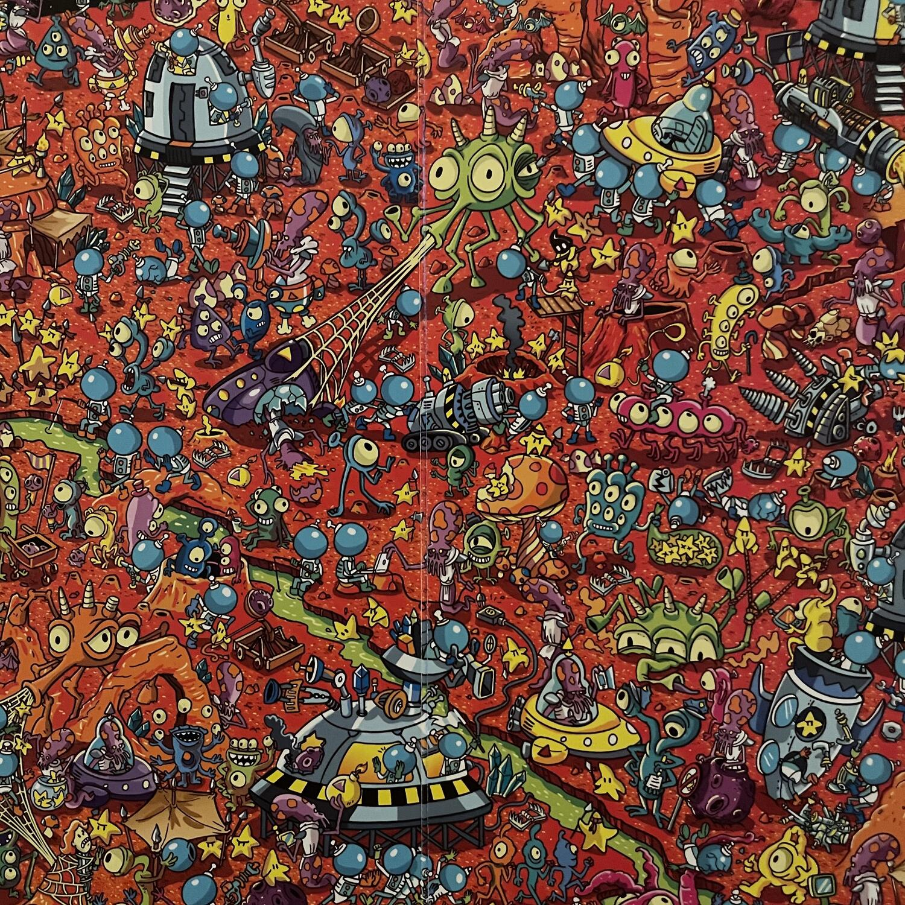
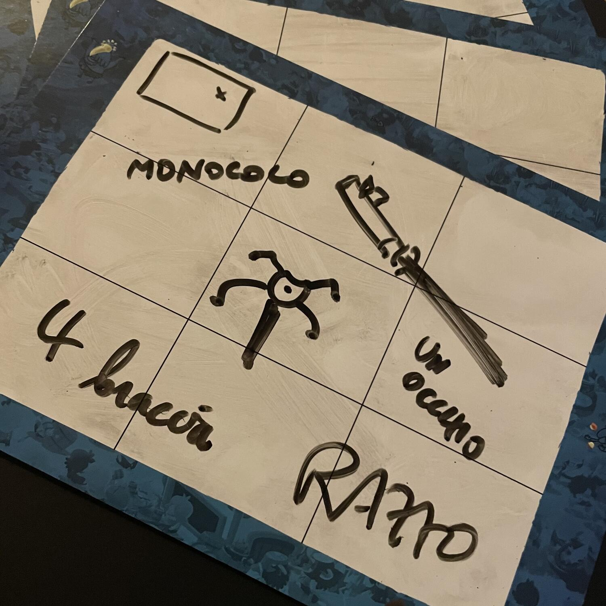

<Setting>

  È stato appena commesso un <strong>crimine</strong>! La vittima{" "}
  <strong>non è in grado di parlare</strong>, ma può scrivere e disegnare… e
  aiutare così gli ispettori a indovinare <strong>chi è il colpevole</strong> in
  mezzo alla folla immensa! Fate attenzione: il fuggitivo farà di tutto per
  coprire le proprie tracce. Riuscirete a fermarlo prima dell’
  <strong>ultimo messaggio</strong>?

</Setting>

<Rules>

  Prima di iniziare, i giocatori si dividono i{" "}
  <em>    <strong>ruoli</strong></em>  : uno interpreterà la <strong>Vittima</strong>, uno il <strong>    Criminale</strong> e i restanti gli <strong>Investigatori</strong>. Una volta determinati
  i ruoli, si sceglierà una delle <em>    <strong>6 scene del crimine</strong></em>: l’<strong>Illustrazione</strong> integrale sarà collocata davanti a
  Vittima e Criminale, mentre davanti agli Investigatori sarà collocata la
  stessa immagine, divisa però in 4 fogli. I due gruppi di giocatori saranno
  separati dallo <strong>Schermo</strong>. Il Criminale sceglierà, a questo
  punto, un personaggio dell’illustrazione: esso dovrà essere identificato dagli
  Investigatori con l’aiuto della Vittima entro <strong>4 round</strong>.
  Durante ogni round, la Vittima lascerà <strong>Indizi</strong> su una{" "}
  <em>    <strong>lavagnetta</strong></em>  , disegnando o scrivendo, ma avendo cura di non disegnare o scrivere più volte
  lo stesso elemento della scena in riquadri diversi; allo scadere del tempo concesso
  dalla <strong>Clessidra</strong>, il Criminale potrà cancellare un certo numero
  di riquadri (in ordine decrescente da 5 a 2 nei 4 round). Dopo che il Criminale
  avrà <strong>Cancellato le proprie tracce</strong>, la lavagnetta parzialmente
  cancellata passerà agli Investigatori, i quali dovranno collaborare per <strong>    risalire all’identità del Criminale</strong>, a partire dagli Indizi lasciati dalla Vittima. Quando gli Investigatori
  riterranno di poter identificare il Criminale, lo indicheranno sull’Illustrazione:
  se avranno indovinato, la partita finirà con la vittoria congiunta di Investigatori
  e Vittima, altrimenti si comincerà con un nuovo round. Se alla fine del quarto
  round gli Investigatori non avranno individuato il colpevole, sarà il Criminale
  a vincere.

</Rules>

<Feedback>

  Last Message è un <strong>Party Game atipico</strong>: si rivelerà
  coinvolgente e accattivante per tutti i tipi di giocatori, grazie alla
  distribuzione di ruoli che richiedono diversi approcci e "specializzazioni". I
  sei disegni, illustrati da quattro artisti diversi, sono capaci di calare i
  giocatori in <strong>ambientazioni immersive</strong> e seguono il classico{" "}
  <strong>    stile alla <em>Where’s Wally</em>(o <em>Waldo</em>)</strong>
  , in cui l’illustrazione è stipata di personaggi intenti a compiere una gran quantità
  di attività, con l’accorgimento che molti di loro presentano <strong>    dettagli ricorrenti</strong>: colori, oggetti, posture mirano tutti a confondere le acque, in modo
  da non facilitare troppo la vita al team investigativo.  
  Per quel che riguarda il <strong>flusso di gioco</strong>, da un turno
  all’altro le <strong>strategie</strong> messe in campo dalla Vittima dovranno
  per forza di cose <strong>adeguarsi alla mente criminale</strong> contro cui
  compete, ma dovranno anche <strong>tener conto del tipo di</strong>{" "}
  <strong>ragionamenti</strong> che faranno gli Investigatori. Quanto al
  Criminale, le cose per lui potranno complicarsi verso gli ultimi due round,
  quando non potrà più cancellare molti riquadri; per questo, dovrà{" "}
  <strong>sfruttare ogni minima carenza di affiatamento e sintonia</strong> tra
  la Vittima e gli Investigatori, ricorrendo parallelamente a{" "}
  <strong>opportune strategie di cancellazione</strong>: per portare gli
  avversari fuori strada potrà perfino avere senso, in certe circostanze,
  lasciare dettagli cruciali in bella vista, cancellando quelli più
  insignificanti, allo scopo di creare dei vuoti apparentemente molto
  significativi in altri punti della lavagnetta. Il gioco dà il meglio di sé in
  gruppi nei quali la lucidità della Vittima si confronta con la mente diabolica
  del Criminale: la <strong>sfida intellettuale</strong> è principalmente
  affidata a loro.
   
  La presenza delle <strong>Varianti</strong> consentirà da un lato di
  bilanciare la partita in base al gruppo di gioco e dall’altro di aumentare la{" "}
  <strong>longevità</strong> del titolo,{" "}
  <strong>potenzialmente infinita</strong> in ragione della gran quantità di
  personaggi e (se giocate la Variante Livello 3, Trova l’Arma) oggetti
  selezionabili; le sole 6 Illustrazioni presenti nella scatola, tuttavia,
  potrebbero rendere l’esperienza di gioco un po’ stantia dopo diverse partite.
  <strong>Avvertenza</strong>: può stimolare reazioni criminali, tenere fuori dalla
  portata di chi, pur di vincere, interpretando la Vittima, si lascerà scappare inopportuni
  commenti sulla qualità dell’indagine degli Investigatori.
   

</Feedback>

