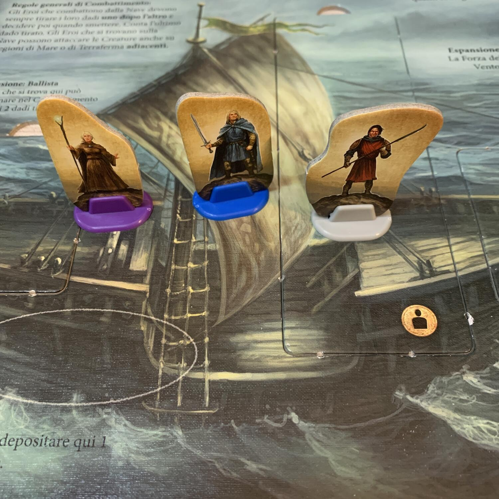

<Setting>

  Hadria è sotto attacco! Gli eroi di Andor che hanno aiutato il principe a
  recuperare il suo regno, sconfiggendo il drago, sono chiamati dopo diversi
  anni di pace a solcare le onde dei mari settentrionali per incontrare la
  Visione e scoprire come aiutare il regno di Hadria.
   
  Tante sono le creature che popolano i mari più profondi: TROLL DEL MARE, ARROG
  e NERAX metteranno gli eroi a dura prova, mentre diversi gruppi di Gor
  attendono sulla terraferma...
   
  Come se non bastasse, MERRIK il cartografo è sparito o, peggio, è stato
  rapito! Solo col suo aiuto gli eroi sapranno come uscire vivi dalle insidie
  delle torbide acque del nord e a dominare il mare tempestoso a loro vantaggio.
   
  Quale minaccia si nasconde dietro lo stato di caos in cui il regno di Hadria è
  caduto? Sarà per colpa di un nuovo nemico che si accinge a colpire il reame e
  minare la pace già di per sé vacillante, oppure sarà una vecchia conoscenza
  degli eroi che sta mettendo a dura prova il popolo del mare?
   
  Salvare Hadria e capire chi è che sta seminando il panico non sarà facile, ma
  è l’unica cosa giusta da fare!

</Setting>

<Rules>

  Questo secondo capitolo della celebre saga di “Le Leggende di Andor” conserva
  la maggior parte delle meccaniche già introdotte nella scatola base: uso di
  ore del giorno per eseguire azioni, combattimento con lancio dei dadi,
  segnalino narratore che scandisce gli eventi della leggenda… Tuttavia, alcune
  regole vengono modificate e ne vengono introdotte di nuove: il gruppo ora si
  sposta via mare controllando la miniatura della NAVE, i giocatori possono
  decidere di scendere sulla terraferma e muoversi a piedi, viaggiare da
  un’isola all’altra del reame e risalire a bordo della nave stessa. Al riquadro
  alba, dopo lo spostamento delle creature, viene aggiunta l’azione RELITTI che
  rischierà di mettere in crisi gli eroi con malus inaspettati. Viene aggiunto
  anche il riquadro dei PUNTI GLORIA, ovvero un tracciato dove il segnalino
  BARDO terrà conto dei punti gloria guadagnati per le uccisioni dei nemici e
  soprattutto della perdita di punti gloria dovuti ai troppi nemici che si
  affollano sulla terraferma alla fine di ogni round (come scandito dal riquadro
  alba).
   
  Lo scheletro del flusso di gioco è il medesimo, ma nelle 4 leggende che
  contiene questa scatola viene implementata una nuova meccanica di pickup and
  delivery, ovvero la possibilità di collezionare alcuni oggetti come
  CONCHIGLIE, TRONCHI DI LEGNO e FERRO da portare in un determinato luogo sul
  tabellone per ricevere come ricompensa una combinazione qualsiasi tra Punti
  Gloria, Punti Volontà o Monete. È interessante anche lo SCHEMA DELLA NAVE che
  aggiunge un bonus per ogni parte della nave che viene acquistata al porto
  cittadino (ad esempio l’albero maestro raddoppia i movimenti della nave
  stessa). Il movimento di quest’ultima è regolato di turno in turno da apposite
  CARTE VENTO (tra le quali si nascondono anche TEMPESTE) che indicano sulla
  rosa dei venti il corrispettivo numero di caselle utili per muoversi via mare.

</Rules>

<Feedback>

  Viaggio Al Nord è una buona sfida per gli amanti della serie di giochi da
  tavolo ambientati nelle terre di Andor. La difficoltà medio-bassa del titolo
  ormai è risaputa; tuttavia la ventata di innovazione delle nuove meccaniche
  implementate in un sistema di gioco rodato alla perfezione è vincente. 4
  leggende invece che 5 sono poche per ambientarsi nel nuovo mondo: avremmo
  preferito trovarne almeno una in più per sfruttare al meglio anche la parte di
  tabellone che mostra il regno di Hadria innevato, prevista solo per l’ultima
  leggenda. Il combattimento non cambia granché, solo i nemici sono diversi ed
  offrono una diversa difficoltà (a parte i Gor che ritroviamo anche in questo
  secondo capitolo). L’impressione, di primo acchito, dovendo gestire
  maniacalmente non solo le ore e le azioni, ma anche il tracciato dei Punti
  Gloria, le ricompense e le espansioni della nave, è di avere davanti un
  Euro-game travestito da American.
   
  Solo dopo la prima leggenda però si manifesta il vero e proprio scopo di
  questa seconda scatola-espansione: quello di riprendere il filo narrativo del
  gioco base raccontando la storia successiva al primo episodio ambientato nelle
  terre di Andor e arricchirla con particolari differenti, il più possibile
  innovativi.
   
  La quantità di segnalini, e più in generale di materiale da utilizzare nella
  campagna, è aumentata considerevolmente, addirittura alcuni dei segnalini in
  cartone (come quello della spada di fuoco e del martello) non li abbiamo
  proprio incontrati. Questo aspetto infastidisce un po’: è un vero peccato
  avere del materiale incluso nella scatola e non poterlo utilizzare, a causa
  delle diverse scelte imposte soprattutto dall’ultima leggenda, che porta a
  dover percorrere una strada piuttosto che un’altra e quindi a dover scegliere
  alcune carte leggenda e scartarne altre.

</Feedback>

