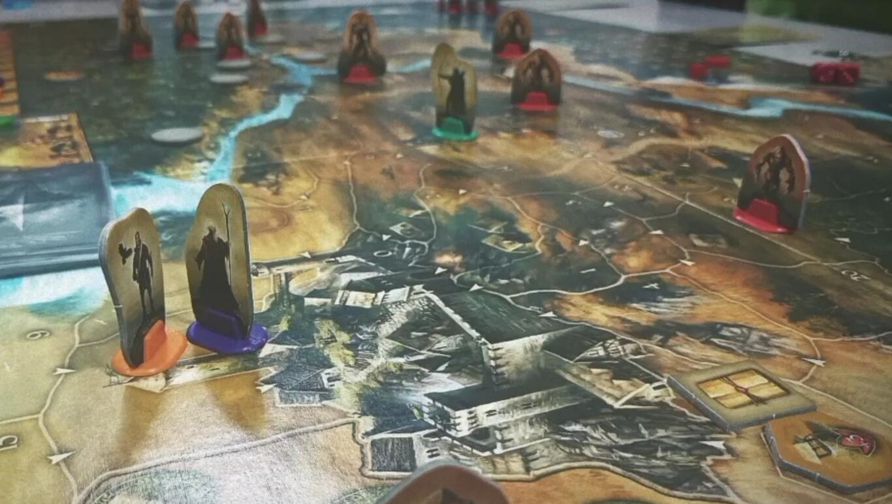
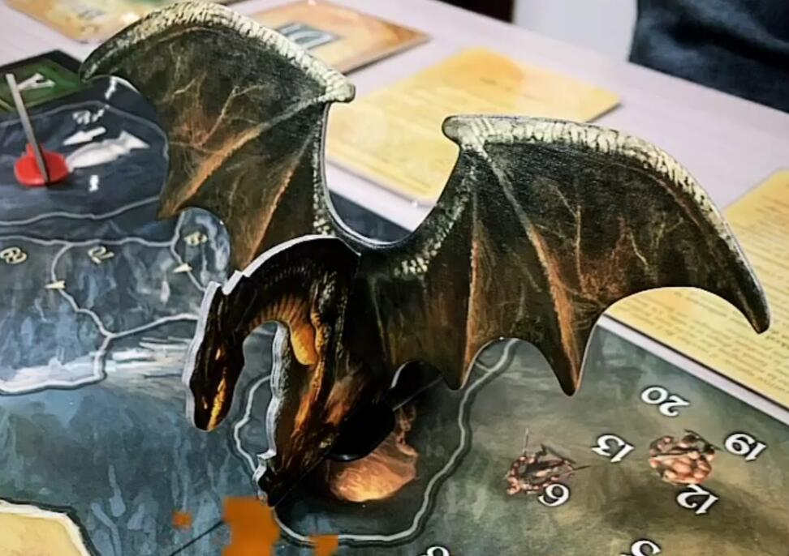

<Setting>

  La terra di Andor è in pericolo! Solo una manciata di eroi si frappone tra le
  forze del male guidate dal drago Tarok, atavico nemico del regno di Andor, ed
  il castello, consolidata magione baluardo della luce del vecchio re Brandur.
  Le lande desolate si stanno pian piano popolando dei servi più fidati del
  male: Gor, Skrall, Wardrak e Troll saranno i nemici che il gruppo di eroi si
  troverà ad affrontare nel corso delle LEGGENDE narrate.
   
  Un giorno Kram il nano delle miniere, Chada l'arciera di Bosco Vigile, Thorn
  il paladino di Rietland ed Eara la maga del Nord, vennero contattati tramite
  una missiva urgente che li pregava di presentarsi al cospetto del re di Andor.
  L'oggetto del colloquio col sovrano fu la difesa del castello e, solo più
  tardi… la distruzione del male!
   
  Mentre il male raccoglieva sempre più seguaci al proprio seguito, come il
  potente Mago Nero e lo Skrall arroccato sulla torre, al servizio del bene
  invece si poteva annoverare la presenza dei nani della maniera, di Reka la
  strega e Ganz il mercante.
   
  Il primo colpo alle forze del bene che Tarok ordinò ai suoi adepti fu quello
  di attaccare il castello con lo scopo di farlo cadere… Inutile dire che gli
  eroi reclutati lo difesero con tutte le proprie forze e vinsero la prima di
  una lunga serie di battaglie.
   
  Ma questo è solo l'inizio della LEGGENDA e di come la pace tornò a regnare
  nelle terre di ANDOR… Sta a voi scrivere il seguito !

</Setting>

<Rules>

  Obiettivo del gioco è quello di soddisfare i criteri di vittoria che vengono
  presentati grazie alla lettura delle carte Leggenda. Le Leggende Di Andor è
  infatti composto da 5 LEGGENDE (di fatto scenari), in ognuna delle quali si
  narrano le gesta eroiche di un gruppo di personaggi che cerca di proteggere il
  castello e sconfiggere il temibile drago; la narrazione di ogni LEGGENDA è
  affidata ad un mazzo di carte apposito. Il gioco è basato sul conteggio delle
  ORE spese per eseguire azioni; le azioni MUOVERSI di una regione, COMBATTERE
  per un round e RESTARE FERMO costano tutte un'ora di tempo. Dopo il setup di
  base descritto dalla carta LISTA DI CONTROLLO e dopo aver letto eventuali
  carte specifiche di Leggenda, il round di gioco inizia col turno del primo
  giocatore, indicato dalle carte scenario, e poi a seguire ogni giocatore
  esegue il proprio turno a giro fino a che ognuno avrà consumato completamente
  le proprie ore a disposizione. Una volta terminato il round dei giocatori
  finisce il GIORNO ed inizia la fase ALBA, durante la quale accadono eventi
  casuali narrati dal mazzo evento, si muovono ed agiscono le creature ostili ed
  il segnalino NARRATORE avanza sul tracciato leggenda: quando questo segnalino
  raggiunge la lettera N la leggenda termina immediatamente.
   
  Il COMBATTIMENTO avviene tramite lo spareggio del lancio dei “dadi attacco” a
  disposizione di ogni personaggio e dei nemici al netto dei modificatori
  specifici (PUNTI FORZA di ogni soggetto coinvolto nel combattimento).
  Importanti sono anche i PUNTI VOLONTÀ che riguardano sia la vita del
  personaggio (quando ridotti a zero il personaggio non muore, ma torna in gioco
  con 3 PUNTI VOLONTÀ e 1 PUNTO FORZA in meno), sia un elemento di “sacrificio”
  per ottenere ore aggiuntive spendibili in azioni.

</Rules>

<Feedback>

  Le Leggende di Andor è un must dei giochi da tavolo fantasy: chi almeno una
  volta non l'ha giocato o anche solo sentito nominare?
   
  Come tutti i giochi a campagna ha ovviamente un limite nella rigiocabilità:
  certo, può essere rigiocato con personaggi diversi (la sola scatola base ne ha
  4), ma c'è anche da tempo in commercio l'espansione NUOVI EROI che aumenta un
  po' la varietà, anche se non come dovrebbe… Ecco perché negli anni sono corse
  in aiuto due nuove espansioni con nuove regole e nuovi scenari.
   
  Il reparto grafico è ben fatto: i suoi 10 anni di età iniziano a farsi sentire
  al pari di altri giochi del genere, ma questo non è un limite insormontabile
  per chi cerca divertimento e collaborazione in un party ben organizzato… Ben
  organizzato, sì, perché c'è davvero bisogno di tanta organizzazione al tavolo
  per superare ogni sfida che il gioco presenta: infatti, le ore a disposizione
  sono poco più che una manciata e spesso e volentieri non bastano per
  completare gli obiettivi con una certa serenità: la vittoria è spesso sul filo
  del rasoio e questo aspetto ci piace!
   
  Il gameplay è semplice e pulito, non lascia spazio a strane interpretazioni:
  le regole sono chiare e concise.
   
  Si sarebbe potuto fare certamente di più per quanto riguarda l'obiettivo di
  Leggenda, a mio avviso un po' ripetitivo: “difendi il castello dall'orda di
  GOR, SKRALL e TROLL, sconfiggi il mago nero senza che il castello cada nelle
  mani del nemico, trova la strega tra la nebbia e abbatti lo SKRALL DELLA
  TORRE” ecc ecc… insomma quasi sempre un arraffa ciò che puoi, poi uccidi in
  giusta misura (troppe morti inutili fanno avanzare rapidamente il segnalino
  narratore e la partita potrebbe finire prematuramente).
   
  Unica nota dolente, forse dettata dalla mia estrazione AMERICAN e dell'età
  anagrafica del gioco: Gli STANDEE al posto di potenziali bellissime MINIATURE…
  ma questo comunque non inficia la godibilità del titolo… Bravo ANDOR, ancora
  sul pezzo…voto D-I-E-S-C-I (in realtà 7).

</Feedback>

