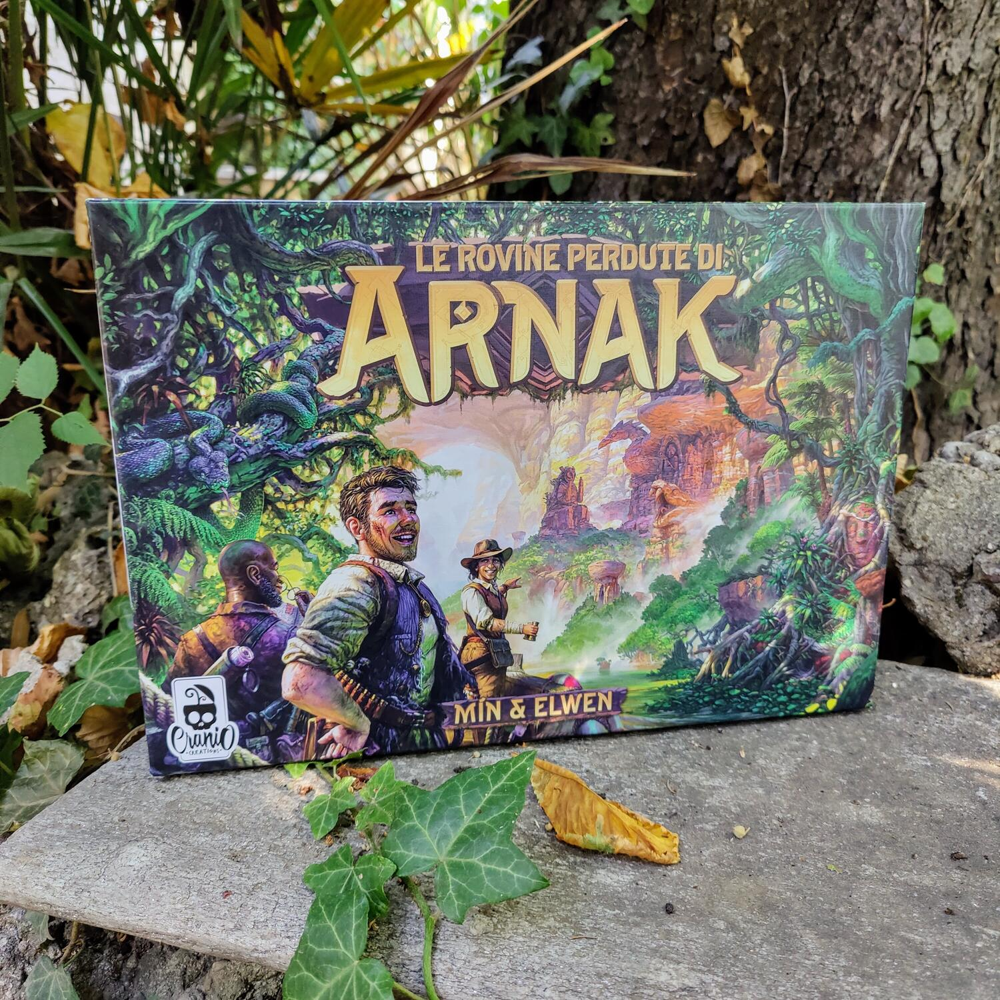
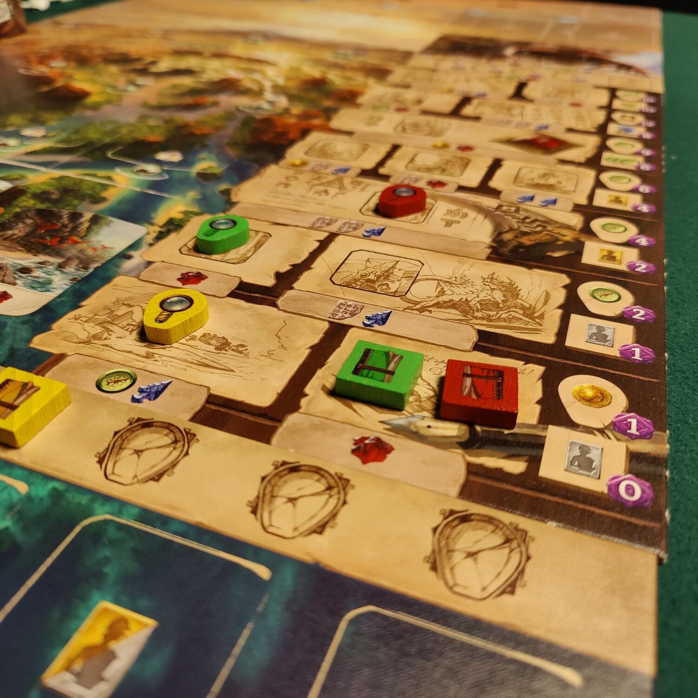

<Setting>

  Chi non ha mai immaginato di indossare i panni di Indiana Jones e addentrarsi negli oscuri meandri della foresta
  tropicale alla ricerca del tempio antico e di tutti i suoi segreti? In <strong>Le rovine Perdute di Arnak</strong>{" "}
  sarete alla guida di una vera e propria spedizione con il compito di decifrare i segreti di un'antica civiltà
  sviluppatasi nell'inesplorata isola di, indovinate un po', Arnak. Dovrete scegliere con cura gli oggetti con cui
  equipaggiarvi, decidere quali siti dell'isola visitare, sconfiggere malefici guardiani ed infine studiare tutti gli
  indizi forniti dai frammenti di storia per trovare la posizione del misterioso tempio perduto. Dovrete fare presto, o
  le spedizioni avversarie avranno la meglio sui vostri progetti, rubandovi onore e gloria. Basta chiacchiere, è ora di
  partire!

</Setting>

<Rules>

  Ci sono molti modi differenti per fare punti vittoria durante l'esplorazione, ma quelli veri, quelli che daranno una
  bella base al vostro risultato finale, si guadagnano lungo il tracciato della ricerca. La sua scalata rappresenta
  l'ascesa verso la conoscenza e la scoperta dell'esatta ubicazione del tempio: più in alto vi spingerete, più punti
  vittoria vi verranno assegnati. Le risorse del gioco sono 5: <strong>le monete</strong>, necessarie per acquistare gli
  oggetti; <strong>le bussole</strong>, necessarie per viaggiare e scoprire artefatti; <strong>le tavolette</strong>,
  antichi resti utili per decifrare e usare gli artefatti; <strong>le punte di freccia</strong>, armi e rifornimenti
  necessari per sconfiggere i guardiani; <strong>i gioielli</strong>, veri e propri talismani, difficili da trovare ma
  essenziali per completare lo studio di Arnak.  
  Il gioco si svolge in 5 round, all'interno dei quali ogni giocatore può effettuare un numero indefinito di turni utilizzando
  le 5 carte pescate dal proprio mazzo. Ogni turno sarà composto da un'azione principale, obbligatoria, e da un numero illimitato
  di azioni gratuite. Una volta terminato il proprio ventaglio di azioni possibili, perché avete terminato le carte o perché
  non avete più risorse da usare, si effettua l'azione di passare, procedendo verso il round successivo.  
  Le azioni principali sono 7:
  <ul>
    <li>      <strong>Scavare presso un sito</strong>, inviando uno dei 2 ricercatori e raccogliendo le risorse mostrate dal
      luogo</li>
    <li>      <strong>Scoprire un nuovo sito</strong>, spendendo bussole ma ricavando maggiori punti vittoria e risorse...
      risvegliando anche il guardiano</li>
    <li>      <strong>Sconfiggere un guardiano</strong>, pagando le risorse mostrate dalla tessera e guadagnando 5 punti
      vittoria</li>
    <li>      <strong>Comprare una carta</strong>, da aggiungere al vostro mazzo</li>
    <li>      <strong>Giocare una carta</strong>, calarla dalla vostra mano risolvendone gli effetti</li>
    <li>      <strong>Ricercare</strong>, avanzare lungo il tracciato di ricerca, pagando le risorse necessarie</li>
    <li>      <strong>Passare</strong>, dichiarare concluso il vostro round.</li>
  </ul>

</Rules>

<Feedback>

  <strong>Le rovine perdute di Arnak</strong> è un gioco davvero ben riuscito, per ambientazione, bilanciamento e
  regolamento. È presente la versione in solitario, se soffrite troppo lo spirito di competizione, o semplicemente se
  volete prendere la mano con il gioco in tutta tranquillità. Inoltre, la doppia versione della plancia di gioco dona
  una notevole profondità al titolo, permettendovi di passare alla versione avanzata una volta che sarete diventati
  esperti esploratori!  
  È sempre un piacere intavolare una partita e sfidare gli amici a trovare ogni volta il giusto compromesso tra rapidità
  e pianificazione. Alcune azioni, se effettuate troppo presto, vi daranno maggiori risorse ma vi obbligheranno a chiudere
  prima il vostro round; d'altra parte una tattica troppo attendista rischierà di farvi perdere le scelte migliori sul tabellone.
  È altresì richiesta una marcata capacità di adattamento: le partite giocate in 4 giocatori diventano, in gergo, un po'
  strettine, e vi sarà molto utile tenere pronto il famoso piano B, ma anche quello C e quello D... Il Piano E invece lo
  conoscono davvero in pochi...  
  Fate attenzione ai giocatori che passano 10 minuti a vagliare tutte le possibili implicazioni di una mossa. Una
  partita con loro alzerà di netto la media di 30 minuti a giocatore, rischiando la paralisi d'analisi.  E
  adesso... buona ricerca...

</Feedback>
