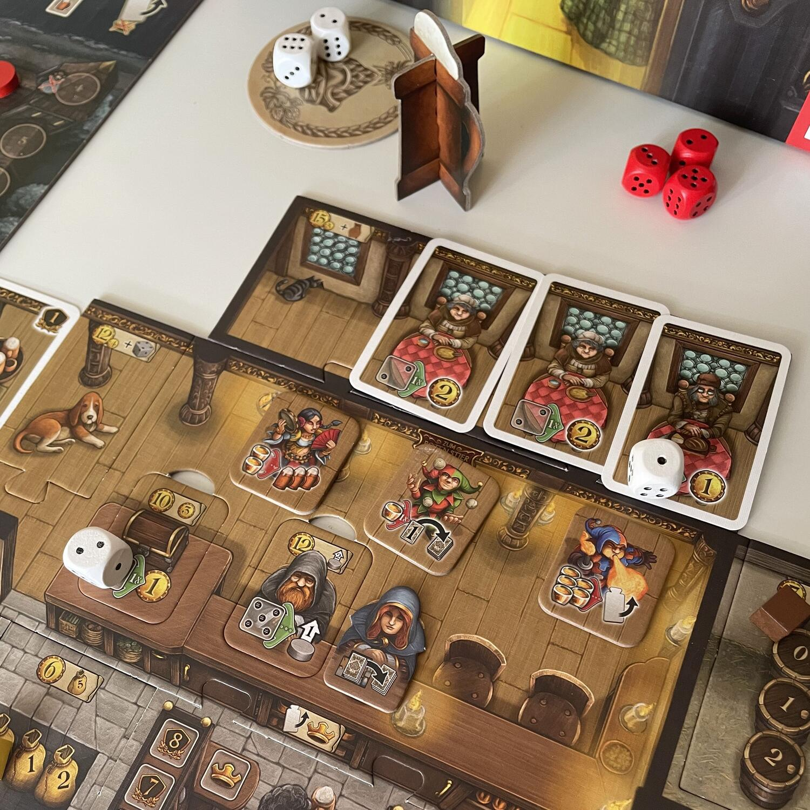
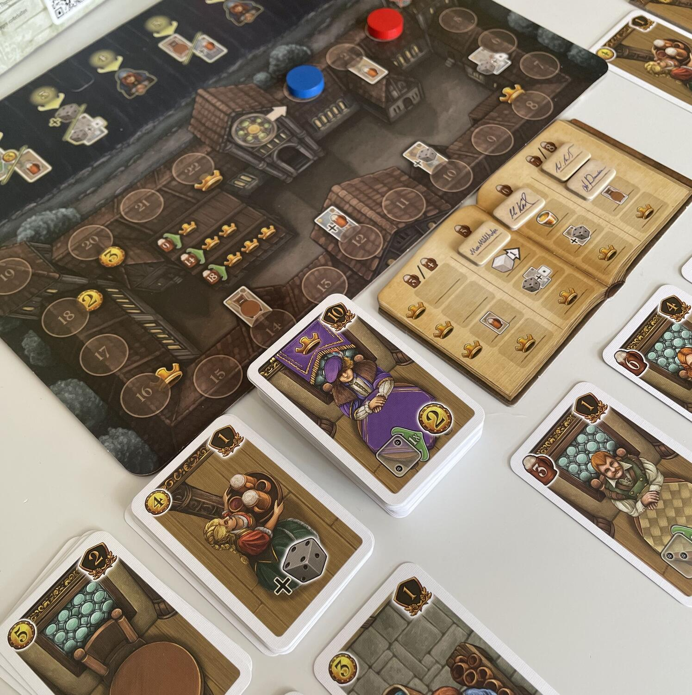

<Setting>

  È scesa la notte nel villaggio e la taverna ha aperto le proprie porte.
   
  Nei panni del gestore della taverna, lo scopo del giocatore sarà quello di
  accaparrarsi più clienti possibili, soprattutto nobili che faranno guadagnare
  più soldi e prestigio.
   
  Produci la birra migliore e in quantità sufficienti per tutti i tuoi clienti.
   
  Dovrai anche essere abile a far fruttare i soldi guadagnati per poter assumere
  nuovi aiutanti e per migliorare i tuoi servizi.
   
  Sarai in grado di far fruttare le tue risorse nel miglior modo possibile?

</Setting>

<Rules>

  Durante gli otto turni di gioco è possibile accumulare punti vittoria grazie
  alle due meccaniche principali: la gestione dadi e il deck building.
   
  Accumulando risorse (dobloni e birra) sarà possibile acquistare nuove carte
  per aumentare le potenzialità e i punti del proprio mazzo.
   
  Il turno, che prevede sette fasi, inizia con l'arrivo dei clienti alla
  taverna: tutti i giocatori girano le proprie carte fino a che tutti i tavolini
  presenti non si riempiono con le carte degli ospiti.
   
  Successivamente si effettua la fase del draft di dadi, dopo averli lanciati.
  Ogni giocatore avrà quindi a disposizione quattro dadi più quelli
  eventualmente ottenuti dalle carte cameriera pescate nella fase precedente.
   
  Prima di effettuare le azioni, i giocatori simultaneamente pianificano le loro
  mosse, posizionando i dadi nelle aree corrispondenti sulla propria plancia di
  gioco. Fatto questo, partendo dal primo giocatore ognuno effettuerà, a turno,
  tutte le azioni pianificate.
   
  Le azioni principali sono la produzione di birra (con la quale si potranno
  guadagnare nuovi clienti e nobili da aggiungere al proprio mazzo di carte) e
  servire i clienti presenti nella nostra taverna che ci faranno guadagnare
  dobloni. Con questi sarà poi possibile acquistare nuove carte da giocare
  oppure migliorare un'area della nostra plancia di gioco.
   
  La particolarità di questo gioco è, infatti, la plancia modulare che permette
  di ottenere così miglioramenti permanenti, come per esempio il dado aggiuntivo
  della cameriera e la possibilità di modificare il risultato del dado grazie
  all'aiuto del lavapiatti.
   
  A fine turno tutte le carte utilizzate vanno scartate e si passerà al
  giocatore successivo.
   
  Nel gioco sono inoltre presenti cinque diversi moduli che aggiungono nuove
  azioni, nuovi modi di ottenere nobili e nuovi bonus.
   
  Alla fine dell'ottavo turno basterà contare tutti i punti presenti sulle carte
  del proprio mazzo e il giocatore con più punti sarà proclamato il miglior
  gestore delle taverne!

</Rules>

<Feedback>

  La gestione dadi è una delle mie meccaniche preferite, quindi non potevo
  lasciarmi sfuggire Le Taverne di Valfonda.
   
  Sin dalla prima partita il gioco scorre abbastanza bene. I cinque moduli
  permettono una grande variabilità senza aumentare la difficoltà complessiva,
  per cui è possibile sin da subito utilizzarli tutti.
   
  Anche se non apprezzo la meccanica di draft in due giocatori, il gioco gira
  bene sia in due che in quattro.
   
  Nonostante ogni turno sia composto da sette fasi, il downtime è abbastanza
  basso grazie alla presenza di più azioni giocate simultaneamente.
   
  L'ambientazione si sente abbastanza, soprattutto grazie alle immagini e alla
  possibilità di migliorare la plancia.
   
  Per quanto riguarda i materiali, invece, purtroppo devo dire che nonostante i
  cartoncini siano abbastanza spessi e non si rovinino facilmente, alcuni pezzi
  della plancia non combaciano. Questo però potrebbe essere un difetto di
  qualche copia e non di tutte. Inoltre all'interno della scatola i materiali
  non hanno uno scomparto adatto per una organizzazione ordinata.
   
  Il gioco è altamente rigiocabile, molto scorrevole e adatto a tutti, quindi
  caldamente consigliato.

</Feedback>
