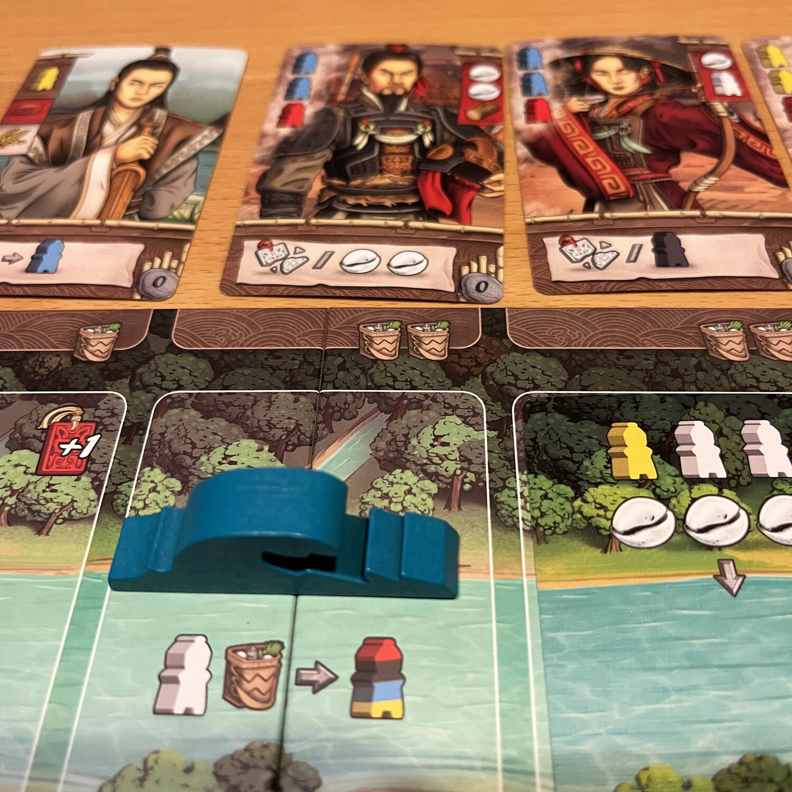
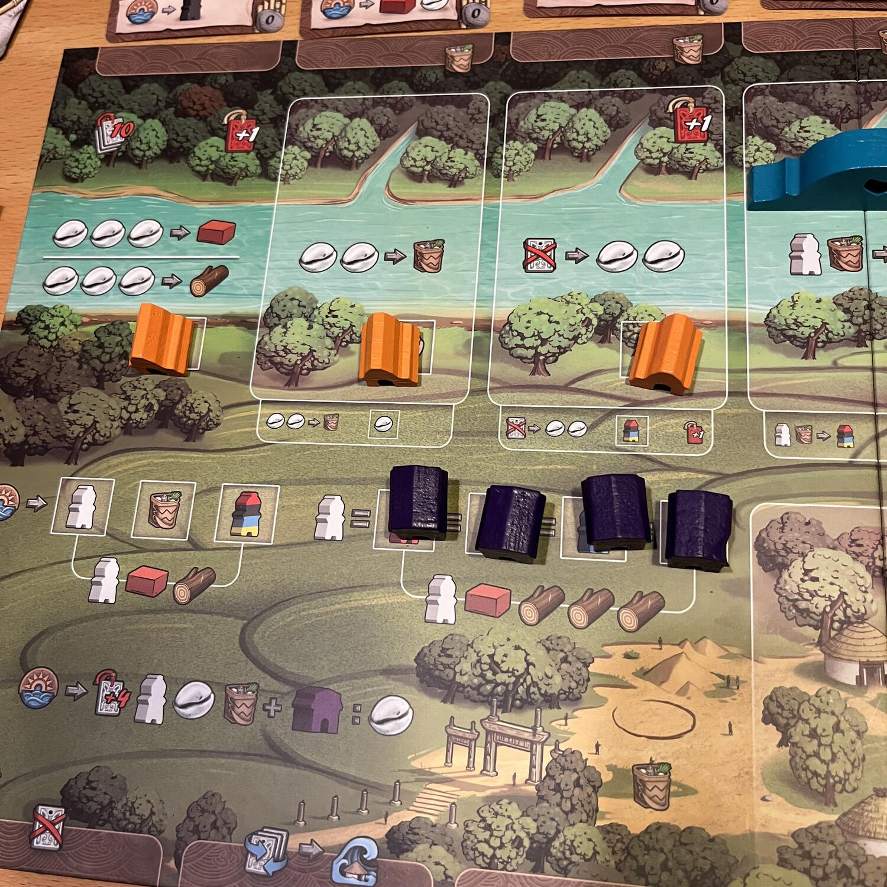
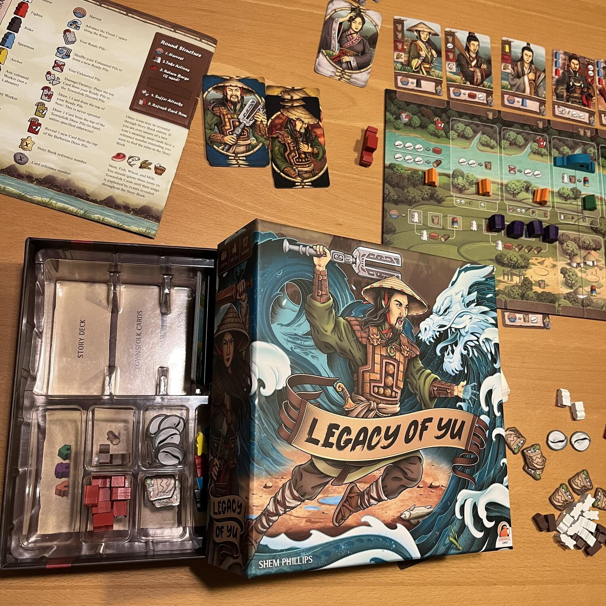

<Setting>

  Durante il regno di Yao, l’antica Cina è afflitta da inondazioni. Yao incarica
  Gun di risolvere la situazione, ma dopo nove anni di insuccessi Gun viene
  licenziato. Yu prende il suo posto e, imparando dagli errori di Gun,
  costruisce una serie di canali per deviare il fiume in piena verso campi e
  corsi d'acqua minori.  E mannaggia quanto sarà difficile gestire questi
  canali mentre i barbari ti attaccano…

</Setting>

<Rules>

  Legacy of Yu è una campagna resettabile divisa su più partite. Ogni partita si
  struttura su più round divisi in turni.  
  All'inizio del turno, si ottiene un’entrata: quattro carte dal mazzo, un meeple
  bianco generico, una provvista per l'acquisto di abitanti del villaggio e la lotta
  contro i barbari, una conchiglia e eventuali altre risorse sbloccate da edifici
  come fattorie, avamposti e capanne. La quantità di edifici che puoi costruire dipende
  dai punti resi disponibili durante lo scavo del canale. Gli edifici offrono bonus
  temporanei e reddito passivo ogni round, mentre lo scavo del canale è il percorso
  verso la vittoria e l’evitamento della sconfitta…  
  Per vincere devi scavare sei volte, massimo una volta per round, ma sarà
  sempre più difficile, poiché i barbari aumenteranno con il tempo. Sconfiggerli
  sarà possibile con la giusta combinazione di lavoratori, ma sarà anche
  possibile corromperli temporaneamente (anche se a caro prezzo). Sconfiggere i
  barbari premierà con un bonus, mentre se si sceglierà di non corromperli,
  beh…rimuoveranno abitanti dal mazzo!  
  Ogni partita avrà delle aggiunte, che si vinca o si perda; delle tartarughe dorate
  con un numero sulle carte vi guideranno a che passi leggere sul libro delle storie
  e vi guideranno per tutta la campagna con aggiunte, sia bonus che malus, fino a
  che non si troverà la tartaruga che sancisce la fine del tutto.

</Rules>

<Feedback>

  Legacy of Yu è un gioco strano. Gioco solitario a campagna, resettabile.
  Nessuno sticker o segno permanente. Volete ricominciare? Sistemate il mazzo
  della storia con le carte in ordine crescente e il gioco è pronto per
  ripartire.  È un bel piazzamento lavoratori nello stile della{" "}
  <Link to="/publishers/garphill-games">Garphill games</Link>, con un bel
  sistema di costruzione del motore di gioco ecc ecc, ma alla fine, purtroppo, è
  un po’ ripetitivo.
   
  Perdere a Legacy of Yu è facile: non costruire i canali abbastanza
  velocemente, avere troppi barbari in gioco o non avere più un mazzo!  
  Molto punitivo, tutto ruota attorno alla gestione (si spera nel migliore dei modi)
  delle sfortune che vengono tirate addosso al giocatore, magari in partite con il
  senno di poi ugualmente non vincibili. In partita che si ha la sensazione essere,
  a volte, su canali (<em>non commentate</em>). <strong>    Ad alcuni può piacere?</strong> Sicuramente! La campagna è perfettamente godibile e il gioco a fine partita,
  sia in caso di vittoria, sia in caso di sconfitta, vi avrà divertito, ma altri
  si potrebbero annoiare, vista la ripetitività di fondo che le aggiunte del libro
  delle storie non riescono e non vogliono mai totalmente colmare, pur aggiungendo
  nuove e affascinanti meccaniche.

</Feedback>

