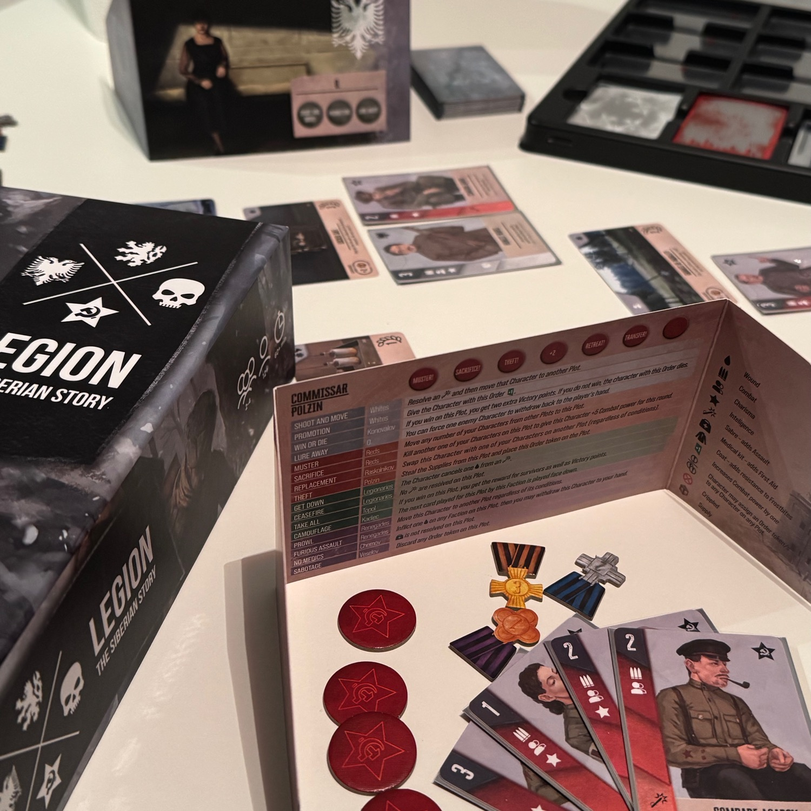
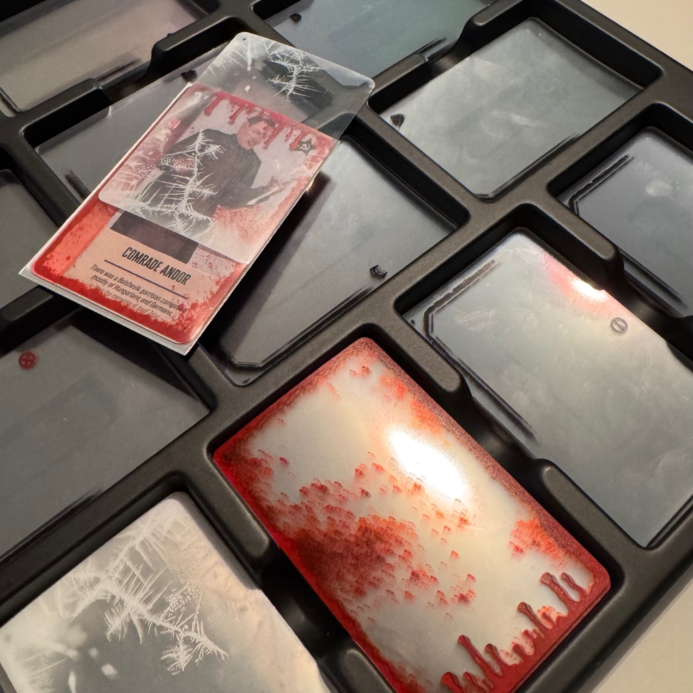
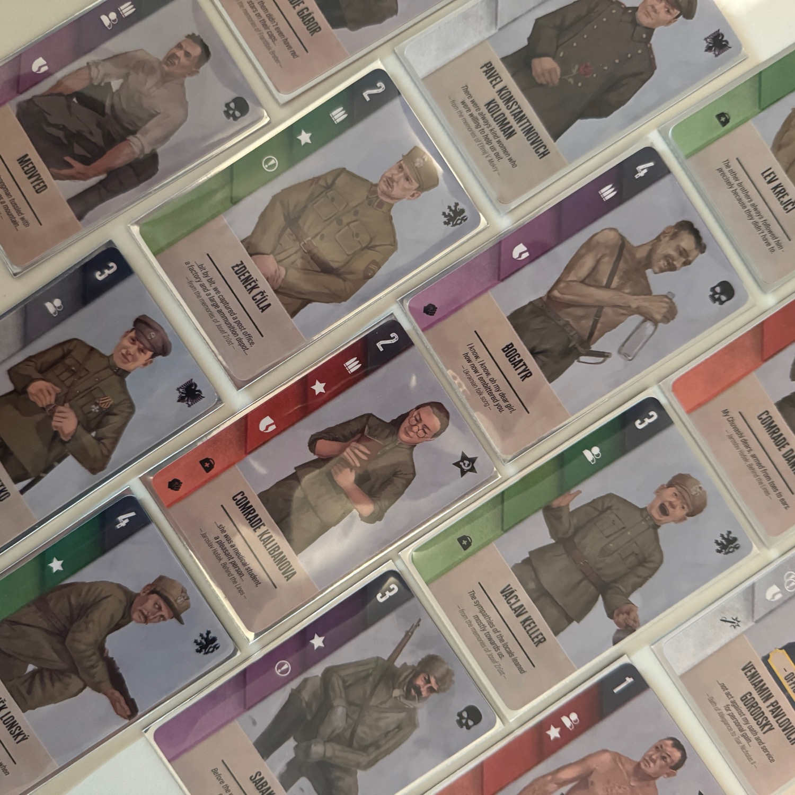

<Setting>

  Nella <strong>Siberia</strong> del 1918, l’inverno avvolge ogni cosa come una morsa di ferro. È un mondo spezzato, dove la <strong>guerra civile</strong> ha frammentato le alleanze e le fedeltà, e le pianure desolate risuonano di conflitti sanguinosi tra fazioni rivali. Qui, lontano da tutto, la Legione Cecoslovacca è intrappolata in una terra straniera, combattendo non solo contro i bolscevichi ma anche contro bande di predoni, guerriglieri e contro la natura stessa. Il loro obiettivo è sfuggire a questo inferno di ghiaccio e tornare a casa, ma ogni passo è reso difficile dal gelo, dalla fame e dai nemici che li circondano. 
  Tra i soldati aleggia una costante incertezza. Ogni sguardo verso <strong>l'orizzonte bianco</strong> è una promessa di pericolo; ogni compagno potrebbe non sopravvivere al giorno successivo. Ma c’è anche un'ostinata determinazione che spinge i legionari a continuare. Gli uomini stringono tra le mani le poche armi e provviste rimaste, consapevoli che ogni errore potrebbe essere fatale. In questo scenario disperato, la speranza è un filo sottile, alimentato solo dal desiderio di sopravvivere e di non abbandonare i propri compagni in questa terra gelida e dimenticata.

</Setting>

<Rules>

  In Legion: the Siberian Story, i giocatori comandano un'unità militare e devono sopravvivere a <strong>quattro round</strong>, accumulando Punti Vittoria per ottenere la vittoria finale. Ogni round è composto da quattro fasi principali: 
  <ol>
    <li><strong>Reclutamento ed Equipaggiamento</strong>: i giocatori scelgono i loro personaggi e possono <strong>equipaggiarli con oggetti</strong> (armi, kit medici, cappotti) per potenziare le loro abilità.</li>
    <li><strong>Marcia</strong>: a turno, i giocatori <strong>inviano i loro personaggi</strong> su specifiche "trame", dove potranno combattere per ottenere Punti Vittoria. I personaggi devono avere le abilità richieste per accedere a ciascuna trama.</li>
    <li><strong>Ordini e Risoluzione degli Assalti</strong>: i giocatori utilizzano i loro ufficiali per assegnare <strong>ordini ai personaggi</strong>. Gli ordini, risolti in base a un ordine di turno, possono potenziare i combattenti, ritirare truppe o infliggere danni ai nemici.</li>
    <li><strong>Risoluzione della Trama</strong>: si calcola la <strong>potenza di combattimento</strong> di ciascuna fazione per determinare i vincitori delle trame. I vincitori guadagnano punti vittoria; i perdenti possono ottenere rifornimenti se hanno personaggi sopravvissuti.</li>
  </ol>
  Alla fine di ogni round, i personaggi sopravvissuti tornano al giocatore, mentre i feriti vanno nel cimitero. Si cambiano sia la passiva di turno che le trame in gioco e si prosegue con il prossimo round. La partita termina al quarto round, e il giocatore con più punti vince.

</Rules>

<Feedback>

  Legion: the Siberian Story è un gioco di <Link to="/mechanisms/maggioranze">maggioranze</Link> con un bel <strong>gimmick</strong> (un dettaglio volto a catturare l'attenzione del giocatore, senza però avere una reale funzione meccanica): il fatto di <strong>sovrapporre carte trasparenti a quelle del nostro soldato</strong> per migliorarlo, ferirlo o gelarlo. Per ottenere questo effetto, si inseriranno tutte queste carte nella stessa bustina, come in <Link to="/reviews/canvas/">Canvas</Link>. 
  Come negli altri giochi di maggioranze, la partita si gioca sul filo del rasoio e ogni carta che si va a giocare avrà un peso nella risoluzione a fine round per definire chi vincerà quella trama. In questo titolo, la cosa interessante è che <strong>vincere non è sempre la cosa che si vuole</strong>. Infatti, se da un lato vincere una trama porterà punti vittoria dall’altro annullerà la possibilità di ottenere risorse con le quali, successivamente, andare a migliorare le proprie schiere o a riabilitare gli ordini disponibili. 
  La rigiocabilità è abbastanza alta, in quanto il setup è casuale e ci sono tante trame da scoprire nel susseguirsi delle partite.  
  Il gioco gira senza intoppi, e si riesce a capire il flusso sin dal primo turno; ma è in due giocatori che il <strong>gioco splende</strong>, facendovi immergere in una guerra fredda di piccoli bluff e di scommesse con il proprio coraggio. Come nella maggior parte dei titoli che gioco, anche questo è caratterizzato da <strong>molta asimmetria</strong> dettata dai poteri che ogni fazione può esercitare attraverso i propri comandanti: conoscere tutte le abilità sarà una marcia in più per poter leggere il gioco prima che venga rivelato!  
  Un altro dettaglio che mi ha sorpreso di questo gioco è la produzione: <strong>i due inserti sono spaziali</strong> e troverete già <strong>le bustine all'interno della scatola</strong> (altrimenti sarebbe difficile giocarci). Queste ultime, però, sarebbe stato meglio se fossero state in grado di contenere ulteriori carte trasparenti; dopo la quarta, lo spazio era davvero limitato (anche se è successo una volta su molte partite). 
  Considerando che non sono solito giocare giochi di maggioranze, il gimmick che hanno deciso di introdurre con questo titolo mi ha sorpreso, mi ha invogliato a provarlo e mi ha fatto venire voglia di giocarlo molte volte!

</Feedback>

