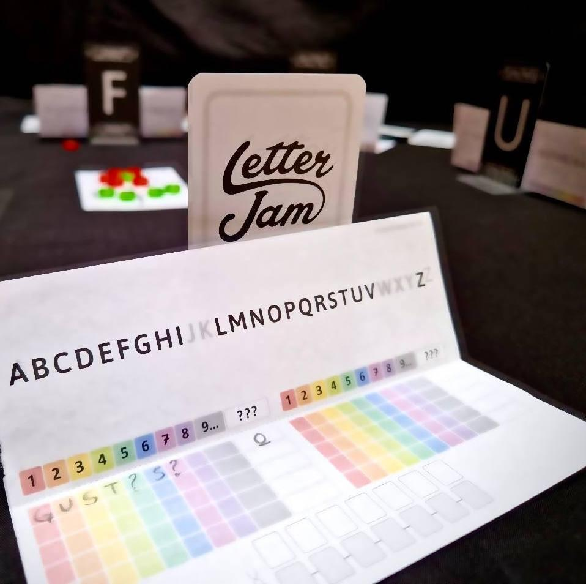
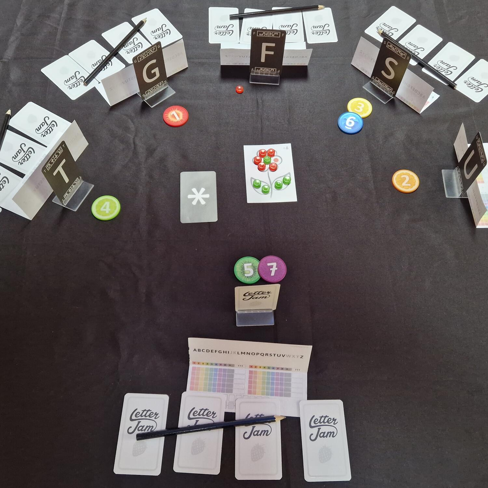

<Setting>

  Cercate un gioco collaborativo, con molte lettere, coinvolgente e deduttivo?
  Letter Jam è tutto questo, con materiali colorati e stranamente appetitosi
  e... no: prima che lo chiediate, la marmellata non c’entra nulla…

</Setting>

<Rules>

  I giocatori ricevono un mazzetto di carte, con il quale ognuno dovrà creare
  una parola da cinque lettere. Ogni parola verrà passata, coperta, a un altro
  giocatore che, durante il gioco, avrà il compito di indovinarla. Ogni
  giocatore dovrà poi rivelare agli altri, rendendola visibile su un apposito
  supporto, una lettera della parola che ha ricevuto, in modo che sia visibile a
  tutti, meno che a se stesso. Verrà quindi scelto, di comune accordo, un
  suggeritore tra i partecipanti, il cui compito sarà quello di comporre una
  parola a partire dalle lettere visibili degli altri giocatori e la carta jolly
  (*), valida come qualsiasi lettera, numerando le lettere con degli appositi
  gettoni colorati. In seguito, ogni giocatore la cui lettera è parte della
  parola formata dal suggeritore, prende nota della parola seguendo i gettoni,
  provando, quindi, a dedurre la sua lettera. Il ruolo del suggeritore spetterà
  a tutti i giocatori almeno una volta per partita e occorrerà non sprecare
  questa opportunità, dato che il numero di suggerimenti che si possono dare è
  limitato e se ne deve tenere traccia attraverso dei gettoni. Dopo che tutti i
  suggerimenti sono stati dati, i giocatori cercano di anagrammare le lettere
  che hanno ottenuto per formare la parola che dovrebbe coincidere con quella
  che il compagno ha fornito loro a inizio partita.
   

</Rules>

<Feedback>

  Letter Jam è uno di quei giochi che riempie le serate con gli amici e la
  famiglia, data la sua semplicità e l’ottima scalabilità. A prescindere dal
  numero di giocatori, saranno sempre ben visibili cinque lettere con le quali
  comporre il suggerimento, evitando, dunque, di doversi trovare necessariamente
  in un determinato numero di persone per giocare.
   
  Durante la partita non si respira l’aria caciarona come in{" "}
  <Link to="/reviews/what-do-you-meme">What Do You Meme</Link>; sono più
  frequenti momenti di intensa riflessione per cercare di fornire la parola più
  lunga, con più lettere ripetute, che aiuti più compagni e che… non usi il
  jolly!
   
  Letter Jam è un titolo che non deluderà: sin dalla prima apertura, scorrendo
  il mazzo, è possibile notare la cura per i dettagli; per non parlare del
  messaggio nascosto sulla fragola in copertina: riuscire a trovarlo non è
  affatto semplice, ma una volta trovato vi strapperà sicuramente un sorriso!

</Feedback>

